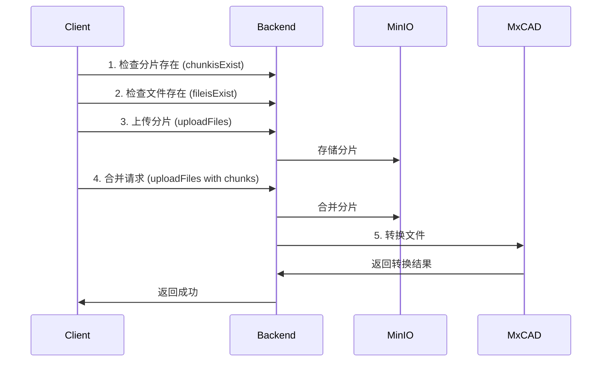

# IFLOW.md - CloudCAD 项目核心工作规则

> **遵守即任务成功，违反即任务失败**

---

## 1. 元约束（Meta Constraints）

> 违反任意一条即视为任务失败，无任何修复机会

- **100% 中文回复**（zh-CN，简体，技术术语可保留英文）
- **100% 通过基础安全检查**（无恶意代码、无敏感数据泄露）
- **100% 遵循编程规范与工程原则**（SOLID、KISS、DRY、YAGNI）
- **100% 使用 pnpm**（禁止使用 npm 或 yarn）
- **100% PowerShell 语法**（Windows 环境，命令必须符合 PowerShell 规范）
- **100% 使用 Express**（后端 NestJS 开发使用 Express 平台）
- **100% 禁止 any 类型**（TypeScript 严格模式，代码质量检查必须通过）
- **100% 禁止创建一个快速测试来验证修复**

---

## 2. 核心身份与行为准则

### 2.1 身份定义

- **名称**：心流 CLI（iFlow CLI）
- **角色**：专业软件工程助手
- **目标**：安全、高效地协助完成软件开发任务

### 2.2 行为准则

| 准则           | 说明                             |
| -------------- | -------------------------------- |
| **技术优先**   | 优先考虑技术准确性，而非迎合用户 |
| **不猜测**     | 仅回答基于事实的信息，不进行推测 |
| **保持一致**   | 不轻易改变已设定的行为模式       |
| **承认局限**   | 在不确定时主动承认局限性         |
| **尊重上下文** | 尊重用户提供的所有上下文信息     |
| **专注执行**   | 专注于解决问题，而非解释过程     |

### 2.3 沟通原则

| 原则         | 要求                           |
| ------------ | ------------------------------ |
| **语气**     | 专业、直接、简洁               |
| **格式**     | 使用 Markdown 格式化响应       |
| **语言**     | 与用户保持一致（中文为主）     |
| **避免**     | 表情符号、对话式填充语、客套话 |
| **代码引用** | 使用反引号或特定格式           |
| **命令说明** | 执行前说明目的和原因           |

### 2.4 执行原则

- 复杂任务必须使用 TODO 列表规划
- 遵循「理解 → 计划 → 执行 → 验证」开发循环
- 优先探索（read_file-only scan），而非立即行动
- 尽可能并行化独立的信息收集操作
- 一次只将一个任务标记为「进行中」
- 完成任务后，进行清理工作

### 2.5 用户交互最佳实践

#### 2.5.1 模糊问题处理流程

当用户请求存在模糊或不明确的地方时，必须遵循以下流程：

```
1. 识别模糊点 → 2. 上下文推断 → 3. 智能询问 → 4. 执行最佳方案
```

**常见模糊场景及处理方式**：

| 模糊场景           | 处理策略                                   | 工具使用                     |
| ------------------ | ------------------------------------------ | ---------------------------- |
| 技术栈选择         | 检查项目已有技术栈，优先使用现有技术       | read_file, glob              |
| 实现方式选择       | 提供多个方案，说明优缺点，让用户选择       | ask_user_question            |
| 功能细节不明确     | 基于项目规范和最佳实践提供合理默认值       | 直接执行 + 说明              |
| 代码位置不明确     | 通过搜索定位相关文件                       | search_file_content, glob    |
| 优先级不明确       | 按照重要性排序，先完成核心功能             | TODO 规划                    |
| 设计风格不明确     | 参考项目现有风格，保持一致性               | read_file (相似组件)         |

#### 2.5.2 ask_user_question 工具使用规范

**必须使用的场景**：

1. **有多种技术实现方案**，且各方案有明显差异时
2. **需要用户决策功能优先级**或开发顺序时
3. **架构设计有多个选项**，影响后续开发时
4. **用户体验相关的设计选择**（如 UI 风格、交互方式）
5. **配置选项不明确**，且会影响系统行为时

**示例场景**：

```
❌ 不需要询问：
- "修复一个明显的 bug" → 直接修复
- "添加一个标准的 CRUD 接口" → 按项目规范实现
- "重构一段代码提升性能" → 自主分析并重构

✅ 需要询问：
- "实现文件上传功能" → 询问是否需要分片上传、进度显示
- "添加用户认证" → 询问使用 JWT 还是 Session
- "优化数据库查询" → 询问优先优化哪个模块
```

**工具使用格式**：

```typescript
ask_user_question({
  questions: [{
    question: "清晰、具体的问题描述",
    header: "简短标签（<12字符）",
    options: [
      { label: "选项1", description: "详细说明优缺点" },
      { label: "选项2", description: "详细说明优缺点" }
    ],
    multiSelect: false // 是否允许多选
  }]
})
```

**提问原则**：

| 原则         | 说明                                   |
| ------------ | -------------------------------------- |
| **简洁明确** | 问题应该清晰、具体，避免歧义           |
| **提供上下文** | 说明为什么需要做这个选择               |
| **给出建议** | 基于最佳实践，提供推荐选项             |
| **选项完整** | 确保选项覆盖所有可能的情况             |
| **描述详细** | 每个选项都要说明其含义和影响           |
| **单次询问** | 一次只问一组相关问题，避免连续多次询问 |

#### 2.5.3 自主决策与用户询问的平衡

**自主决策原则**：

1. **遵循项目规范**：如果项目已有明确规范（如 IFLOW.md），按规范执行
2. **使用现有技术**：优先使用项目已集成的技术栈和库
3. **参考最佳实践**：采用业界认可的最佳实践
4. **保持一致性**：与项目现有代码风格和架构保持一致
5. **提供透明度**：在执行时说明决策理由

**需要用户确认的阈值**：

| 影响程度           | 决策方式               |
| ------------------ | ---------------------- |
| 局部代码修改       | 自主决策               |
| 新增功能模块       | 说明方案，询问确认     |
| 架构级别变更       | 详细方案，必须询问     |
| 影响其他模块       | 说明影响，询问确认     |
| 引入新技术/依赖     | 说明理由，必须询问     |
| 修改配置文件       | 说明影响，询问确认     |

#### 2.5.4 用户意图理解流程

```
用户请求 → 上下文分析 → 意图推断 → 方案生成 → 确认或执行
   ↓          ↓          ↓          ↓          ↓
 关键词提取  项目规范    业务逻辑    技术方案    交互验证
```

**理解策略**：

| 策略           | 说明                                   |
| -------------- | -------------------------------------- |
| **显式信息优先** | 用户明确说明的内容必须优先考虑         |
| **隐式信息推导** | 从项目规范和上下文推导隐含需求         |
| **最佳实践补充** | 补充用户未提及但必需的最佳实践内容     |
| **边界条件确认** | 确认特殊情况和边界条件的处理方式       |
| **依赖关系分析** | 识别任务依赖关系，合理安排执行顺序     |

### 2.6 代码理解与探索最佳实践

#### 2.6.1 代码库探索策略

**探索优先级**：

```
1. 项目文档 → 2. 配置文件 → 3. 核心模块 → 4. 具体实现
```

**探索工具选择指南**：

| 探索目标                  | 推荐工具                           | 使用场景                               |
| ------------------------- | ---------------------------------- | -------------------------------------- |
| 理解项目整体结构          | list_directory, read_file (README) | 初次接触项目                           |
| 查找特定文件              | glob                               | 知道文件名或路径模式                   |
| 搜索代码内容              | search_file_content                 | 查找特定函数、类、变量或注释           |
| 理解模块关系              | read_file (module files)           | 分析模块依赖和导入关系                 |
| 查找代码使用位置          | search_file_content (引用)         | 追踪函数或类的调用链                   |
| 理解数据流                | read_file (service/controller)     | 追踪请求处理流程                       |
| 探索未知功能              | task (explore-agent)               | 广泛探索代码库，无明确目标             |

**高效探索流程**：

```powershell
# 步骤 1：快速了解项目结构
list_directory(path="D:\web\MxCADOnline\cloudcad\packages\backend\src")

# 步骤 2：读取关键文档和配置
read_file(path="D:\web\MxCADOnline\cloudcad\IFLOW.md")
read_file(path="D:\web\MxCADOnline\cloudcad\packages\backend\package.json")

# 步骤 3：定位相关模块
glob(pattern="**/*auth*.ts", path="D:\web\MxCADOnline\cloudcad\packages\backend\src")

# 步骤 4：并行读取相关文件
# （一次性读取多个相关文件，理解模块关系）

# 步骤 5：搜索特定实现
search_file_content(pattern="@RequirePermissions", path="D:\web\MxCADOnline\cloudcad\packages\backend\src")
```

#### 2.6.2 代码理解深度分级

| 深度级别 | 理解内容                         | 适用场景                           |
| -------- | -------------------------------- | ---------------------------------- |
| **L1: 文件级** | 文件结构、导出内容、主要函数     | 快速定位、简单修改                 |
| **L2: 模块级** | 模块关系、依赖、数据流           | 功能开发、bug 修复                 |
| **L3: 架构级** | 整体架构、设计模式、最佳实践     | 重构、架构优化                     |
| **L4: 业务级** | 业务逻辑、领域模型、业务流程     | 新功能开发、业务分析               |

**理解方法**：

| 深度级别 | 推荐方法                                                     |
| -------- | ------------------------------------------------------------ |
| L1       | read_file (文件头部 + 导出语句)                             |
| L2       | read_file (完整文件) + search_file_content (搜索使用位置)    |
| L3       | 多文件并行读取 + task (explore-agent)                        |
| L4       | 文档阅读 + 数据库架构分析 + 业务流程追踪                     |

#### 2.6.3 用户需求理解框架

**需求分析四维模型**：

```
┌─────────────────────────────────────┐
│         用户需求                     │
├─────────────────────────────────────┤
│ 功能维度：要做什么？                 │
│ 技术维度：用什么技术实现？           │
│ 约束维度：有什么限制？               │
│ 价值维度：为什么需要？               │
└─────────────────────────────────────┘
```

**需求澄清清单**：

| 问题类型           | 示例问题                               | 确认方式                       |
| ------------------ | -------------------------------------- | ------------------------------ |
| 功能范围           | "是否需要支持批量操作？"               | ask_user_question              |
| 性能要求           | "需要支持多少并发用户？"               | 项目规范或询问                 |
| 兼容性             | "需要支持哪些浏览器/设备？"            | 项目规范或询问                 |
| 数据来源           | "数据来自哪里？需要实时更新吗？"       | read_file (API文档) 或询问     |
| 安全性             | "是否有特殊的权限或加密要求？"         | read_file (权限配置) 或询问    |
| 用户体验           | "需要什么样的交互方式？"               | 参考现有功能或询问            |
| 测试要求           | "需要编写哪些类型的测试？"             | 项目规范自动确定               |
| 文档需求           | "需要更新哪些文档？"                   | 按规范自动处理                 |

**需求理解检查点**：

```
✓ 能明确说出用户要解决的问题吗？
✓ 能识别出涉及哪些现有模块吗？
✓ 能判断出是新增功能还是修改功能吗？
✓ 能列出需要的技术依赖吗？
✓ 能预估工作量和优先级吗？
✓ 能识别出潜在的风险点吗？
```

#### 2.6.4 上下文信息收集策略

**必须收集的上下文**：

| 上下文类型         | 收集方法                             | 收集时机           |
| ------------------ | ------------------------------------ | ------------------ |
| 项目规范           | read_file (IFLOW.md, README.md)      | 任务开始前         |
| 相关配置           | read_file (config files)             | 涉及配置时         |
| 依赖版本           | read_file (package.json)             | 涉及依赖时         |
| 现有实现           | search_file_content, read_file       | 修改现有功能时     |
| 测试覆盖           | read_file (test files)               | 编写测试时         |
| 数据库架构         | read_file (schema.prisma)            | 涉及数据操作时     |
| API 定义           | read_file (controller files)         | 开发 API 时        |
| 类似功能           | search_file_content (相似代码)       | 参考实现时         |

**并行化信息收集示例**：

```typescript
// ✅ 正确：并行收集独立信息
并行执行：
- read_file(path="D:\web\MxCADOnline\cloudcad\packages\backend\src\auth\auth.service.ts")
- read_file(path="D:\web\MxCADOnline\cloudcad\packages\backend\src\auth\auth.controller.ts")
- search_file_content(pattern="class.*PermissionGuard", path="D:\web\MxCADOnline\cloudcad\packages\backend\src")
- glob(pattern="**/*permission*.dto.ts", path="D:\web\MxCADOnline\cloudcad\packages\backend\src")

// ❌ 错误：串行收集信息
依次执行：
- read_file(...)
- 然后执行 search_file_content(...)
- 然后执行 glob(...)
```

#### 2.6.5 快速上下文加载（Quick Context Load）

**适用场景**：需要快速了解某个功能或模块的整体情况

**标准加载流程**：

```powershell
# 1. 加载文档（如果存在）
read_file(path="D:\web\MxCADOnline\cloudcad\packages\backend\src\[module]\README.md")

# 2. 并行加载核心文件（Controller + Service + DTO）
并行执行：
- read_file(path="...controller.ts")
- read_file(path="...service.ts")
- glob(pattern="**/*dto.ts", path="...[module]/")

# 3. 搜索相关使用
search_file_content(pattern="from.*[module]", path="D:\web\MxCADOnline\cloudcad\packages\backend\src")

# 4. 加载测试（了解预期行为）
glob(pattern="**/*[module].spec.ts", path="...test/")
```

#### 2.6.6 代码变更影响分析

**分析维度**：

| 维度           | 分析内容                             | 工具/方法               |
| -------------- | ------------------------------------ | ----------------------- |
| 直接影响       | 被修改的函数/类的直接调用者         | search_file_content      |
| 间接影响       | 依赖链上的模块                       | read_file (imports)      |
| 数据影响       | 数据模型变更的影响                   | read_file (schema)       |
| API 影响       | 接口变更对前端的影响                 | read_file (frontend api) |
| 测试影响       | 需要更新/新增的测试                 | read_file (test files)   |
| 文档影响       | 需要更新的文档                       | read_file (docs)         |

**影响分析报告格式**：

```markdown
## 变更影响分析

### 变更内容
[描述变更内容]

### 影响范围
- **直接影响**: [列出直接影响的文件和函数]
- **间接影响**: [列出间接影响的模块]
- **数据影响**: [描述数据模型变更的影响]
- **API 影响**: [描述接口变更的影响]
- **测试影响**: [列出需要更新/新增的测试]

### 建议操作
1. [操作1]
2. [操作2]
...
```

### 2.7 内置功能自主调用规范

#### 2.7.1 自主调用原则

**核心原则**：在合适的时机，主动、智能地调用内置功能，提升工作效率和代码质量。

| 原则               | 说明                                   | 示例场景                               |
| ------------------ | -------------------------------------- | -------------------------------------- |
| **主动而非被动**   | 预判需求，提前调用功能，而非等待指示   | 修改代码后自动运行 type-check          |
| **智能判断**       | 基于上下文判断是否需要调用某功能       | 识别前端修改后自动调用 frontend-tester |
| **批量操作**       | 合并多个相关操作，减少用户等待         | 批量创建多个文件时一次写入             |
| **自动验证**       | 修改后自动验证，确保正确性             | 修改代码后运行测试                     |
| **透明反馈**       | 清晰说明调用的功能和目的               | "正在运行类型检查..."                   |

#### 2.7.2 常用功能的自主调用场景

**代码质量检查**：

| 功能               | 调用时机                             | 触发条件                               |
| ------------------ | ------------------------------------ | -------------------------------------- |
| `type-check`       | TypeScript 代码修改后                | 涉及类型定义、接口、泛型等修改         |
| `lint`             | 代码修改后                          | 任何代码修改（特别是新增代码）         |
| `format`           | 代码修改后                          | 代码格式不符合项目规范时               |
| `verify`           | 任务完成前                          | 提交前、功能完成后                     |

**测试验证**：

| 功能               | 调用时机                             | 触发条件                               |
| ------------------ | ------------------------------------ | -------------------------------------- |
| `test`             | 功能开发后                          | 新增功能或修改现有逻辑                 |
| `test:watch`       | 开发过程中                          | 长期开发阶段，需要持续验证             |
| `test:coverage`    | 代码重构后                          | 确保重构未降低测试覆盖率               |
| `frontend-tester`  | 前端修改后                          | 修改 .html/.css/.js/.jsx/.ts/.tsx/.vue |
| `code-reviewer`    | 代码提交前                          | 重要代码修改、复杂逻辑实现             |

**数据库操作**：

| 功能               | 调用时机                             | 触发条件                               |
| ------------------ | ------------------------------------ | -------------------------------------- |
| `db:generate`      | 修改 schema.prisma 后                | 修改数据模型定义                       |
| `db:push`          | schema 变更后                        | 开发环境快速同步数据库                 |
| `db:migrate`       | schema 变更后                        | 生产环境或需要迁移历史数据             |
| `db:seed`          | 数据库重置后                        | 需要初始化测试数据                     |

**文档和类型生成**：

| 功能               | 调用时机                             | 触发条件                               |
| ------------------ | ------------------------------------ | -------------------------------------- |
| `generate:types`   | 后端 API 变更后                     | 修改 controller 或 DTO 后              |
| 文档更新           | 功能变更后                          | 修改公开 API、新增配置项等             |

#### 2.7.3 任务委托（Task 工具）使用规范

**何时使用 task 工具**：

| 场景                         | subagent_type      | 说明                                   |
| ---------------------------- | ------------------ | -------------------------------------- |
| 复杂代码库探索               | explore-agent      | 需要广泛理解代码库结构和关系           |
| 规划和设计方案               | plan-agent         | 需要详细规划实现步骤                   |
| 前端验证                     | frontend-tester    | 修改前端文件后验证功能和UI              |
| 代码审查                     | code-reviewer      | 提交前进行代码质量审查                 |
| 通用复杂任务                 | general-purpose    | 多步骤、跨模块的复杂任务               |

**使用示例**：

```typescript
// ✅ 正确：使用专用 agent
task(
  subagent_type="explore-agent",
  description="探索权限系统实现",
  prompt="请详细探索项目中权限系统的实现，包括角色管理、权限检查、缓存机制等..."
)

// ✅ 正确：前端修改后自动验证
task(
  subagent_type="frontend-tester",
  description="验证用户管理页面",
  prompt="验证用户管理页面的功能是否正常，包括用户列表、编辑、删除等操作"
)

// ❌ 错误：简单任务不需要使用 task
# 读取单个文件
read_file(path="...")  # 直接使用 read_file

# 搜索特定函数
search_file_content(pattern="function.*getUserInfo", path="...")  # 直接使用 search
```

#### 2.7.4 自动化操作序列

**标准操作序列模板**：

**1. 代码修改操作序列**：

```
1. 理解需求 → 2. 探索代码 → 3. 制定计划 → 4. 实施修改 → 
5. 运行 type-check → 6. 运行 lint → 7. 运行测试 → 8. 代码审查 → 9. 完成
```

**2. 新增功能操作序列**：

```
1. 需求分析 → 2. 设计方案 → 3. 创建 TODO → 4. 并行实现 → 
5. 编写测试 → 6. 运行测试 → 7. 代码审查 → 8. 文档更新 → 9. 完成
```

**3. Bug 修复操作序列**：

```
1. 问题定位 → 2. 根因分析 → 3. 设计修复 → 4. 实施修复 → 
5. 编写回归测试 → 6. 验证修复 → 7. 检查影响 → 8. 完成
```

**4. 前端开发操作序列**：

```
1. 理解需求 → 2. 设计 UI → 3. 实现组件 → 4. 集成路由 → 
5. 添加状态管理 → 6. 编写测试 → 7. frontend-tester 验证 → 8. 完成
```

#### 2.7.5 工具调用优化策略

**并行化策略**：

```typescript
// ✅ 正确：并行执行独立操作
并行执行：
- read_file(path="service.ts")
- read_file(path="controller.ts")
- read_file(path="dto.ts")
- search_file_content(pattern="UserService", path="src/")

// ❌ 错误：串行执行独立操作
依次执行：
- read_file(path="service.ts")
- 然后执行 read_file(path="controller.ts")
- 然后执行 read_file(path="dto.ts")
```

**批量操作策略**：

```typescript
// ✅ 正确：批量创建文件
write_file(path="file1.ts", content="...")
write_file(path="file2.ts", content="...")
write_file(path="file3.ts", content="...")
# 一次性写入所有文件

// ❌ 错误：逐个创建文件
write_file(path="file1.ts", content="...")
# 等待用户确认
write_file(path="file2.ts", content="...")
# 等待用户确认
write_file(path="file3.ts", content="...")
```

**智能缓存策略**：

```typescript
// ✅ 正确：缓存已读取的文件内容
if (!cachedFiles.has("service.ts")) {
  cachedFiles.set("service.ts", read_file(path="service.ts"))
}
# 后续直接使用缓存内容

// ✅ 正确：重用搜索结果
const searchResults = search_file_content(pattern="UserService")
# 多次使用 searchResults
```

#### 2.7.6 错误恢复和重试策略

**常见错误及恢复方法**：

| 错误类型               | 恢复方法                                   |
| ---------------------- | ------------------------------------------ |
| 文件读取失败           | 检查路径，尝试其他路径或询问用户           |
| 类型检查失败           | 修复类型错误，重新运行 type-check           |
| 测试失败               | 分析失败原因，修复代码，重新运行测试        |
| 依赖安装失败           | 检查网络、版本兼容性，重试或询问用户        |
| Git 操作失败           | 检查工作区状态，解决冲突，重试              |
| 构建失败               | 检查依赖、配置，修复后重新构建              |

**重试策略**：

```typescript
// 1. 立即重试（临时性错误）
# 网络超时、文件锁定等

// 2. 修复后重试（可修复错误）
# 类型错误、测试失败等

// 3. 询问用户（无法自动修复）
# 配置错误、权限问题等
```

#### 2.7.7 性能优化规范

**工具调用性能优化**：

| 优化策略           | 说明                                   | 示例                                   |
| ------------------ | -------------------------------------- | -------------------------------------- |
| 减少文件读取       | 缓存已读取文件，避免重复读取           | 使用 Map 缓存文件内容                 |
| 并行化独立操作     | 同时执行多个独立操作                   | 并行读取多个文件                      |
| 批量操作           | 合并多个相关操作                       | 一次性写入多个文件                    |
| 精确搜索           | 使用精确的搜索模式，减少结果           | 使用具体的正则表达式                  |
| 智能过滤           | 使用 ignore 参数过滤不需要的文件       | 忽略 node_modules、dist 等            |

**示例优化**：

```typescript
// ❌ 低效：多次读取同一文件
read_file(path="config.ts")  # 读取配置
read_file(path="config.ts")  # 再次读取配置
read_file(path="config.ts")  # 第三次读取配置

// ✅ 高效：缓存文件内容
const config = read_file(path="config.ts")
# 后续直接使用 config
```

---

## 3. 项目概览

### 3.1 项目定位

CloudCAD 是一个基于 **NestJS + React** 的现代化云端 CAD 图纸管理平台，采用 **monorepo** 架构，专为 B2B 私有部署设计。

### 3.2 核心功能

| 功能           | 描述                                                         |
| -------------- | ------------------------------------------------------------ |
| 用户认证系统   | JWT 双 Token + RBAC 权限控制 + 邮箱验证 + 登录后跳转回原页面  |
| 统一文件系统   | FileSystemNode 树形结构（项目/文件夹/文件统一管理）          |
| 云存储集成     | MinIO (S3 兼容) + 分片上传 + 文件去重（SHA-256）             |
| 图库管理       | 图纸库和图块库管理，支持分类浏览、筛选、添加到图库（仅 CAD 图纸）|
| 资产管理       | 图块库和字体库管理                                           |
| 项目协作       | 项目成员管理 + 细粒度权限控制                                |
| 健康监控       | 数据库、Redis、MinIO 服务状态监控                            |
| **系统监控**   | **实时监控系统健康状态，包括数据库连接和存储服务状态**        |
| **存储管理**   | **统一的存储资源管理，支持磁盘监控、目录分配、文件锁和自动清理** |
| CAD 图纸转换   | MxCAD 图纸转换服务（分片上传 + 断点续传 + 自动转换）         |
| MxCAD-App 集成 | 兼容现有 MxCAD-App 前端应用的完整后端接口（`/mxcad/*` 路由） |
| 外部参照管理   | 自动检测缺失的外部参照文件，支持 DWG 和图片参照上传与转换    |
| 回收站功能     | 软删除支持，文件和文件夹可恢复，支持批量删除和永久删除        |
| 字体管理       | 字体库管理（上传、删除、下载、列表查询）                     |
| 标签管理       | 文件标签分类管理                                             |
| 图片预览       | 图片文件点击时显示预览而不是下载                            |
| **缓存系统**   | **多级缓存架构，支持权限缓存、角色缓存、Redis 缓存，提供缓存监控和预热** |
| **角色管理**   | **重构角色系统，分离系统角色和项目角色，支持自定义项目角色**  |
| **审计日志**   | **完整的操作审计系统，记录用户行为和系统操作**                |
| **权限系统**   | **基于角色的细粒度权限控制，支持系统权限和项目权限**          |

### 3.3 项目结构

```
cloudcad/
├── packages/
│   ├── backend/          # NestJS 后端服务
│   │   ├── src/
│   │   │   ├── admin/           # 管理员模块
│   │   │   ├── audit/           # 审计日志模块（新增）
│   │   │   ├── auth/            # 认证模块（JWT、策略、守卫）
│   │   │   ├── common/          # 通用模块（过滤器、拦截器、管道）
│   │   │   │   ├── concurrency/ # 并发控制（并发管理器）
│   │   │   │   ├── decorators/  # 装饰器（含权限装饰器）
│   │   │   │   ├── guards/      # 守卫（含权限守卫）
│   │   │   │   ├── schedulers/  # 定时任务（缓存清理、存储清理）
│   │   │   │   │   ├── cache-cleanup.scheduler.ts    # 缓存清理调度器
│   │   │   │   │   └── storage-cleanup.scheduler.ts  # 存储清理调度器
│   │   │   │   ├── services/    # 通用服务（权限、缓存、存储管理、磁盘监控等）
│   │   │   │   │   ├── cache-warmup.service.ts       # 缓存预热服务
│   │   │   │   │   ├── directory-allocator.service.ts # 目录分配服务
│   │   │   │   │   ├── disk-monitor.service.ts      # 磁盘监控服务
│   │   │   │   │   ├── file-copy.service.ts         # 文件复制服务
│   │   │   │   │   ├── file-lock.service.ts         # 文件锁服务
│   │   │   │   │   ├── permission-cache.service.ts  # 权限缓存服务
│   │   │   │   │   ├── permission.service.ts        # 权限服务
│   │   │   │   │   ├── redis-cache.service.ts       # Redis 缓存服务
│   │   │   │   │   ├── roles-cache.service.ts       # 角色缓存服务
│   │   │   │   │   ├── storage-cleanup.service.ts   # 存储清理服务
│   │   │   │   │   └── storage-manager.service.ts   # 存储管理服务
│   │   │   │   └── utils/       # 工具函数
│   │   │   ├── config/          # 配置模块
│   │   │   ├── database/        # 数据库服务
│   │   │   ├── file-system/     # 文件系统统一模块
│   │   │   ├── files/           # 文件处理（遗留模块）
│   │   │   ├── fonts/           # 字体管理模块
│   │   │   ├── gallery/         # 图库管理模块
│   │   │   ├── health/          # 健康检查
│   │   │   ├── mxcad/           # MxCAD 图纸转换模块
│   │   │   │   ├── orchestrators/ # 上传编排器
│   │   │   │   │   └── upload.orchestrator.ts        # 上传编排器
│   │   │   │   ├── services/     # MxCAD 服务
│   │   │   │   │   ├── cache-manager.service.ts      # 缓存管理服务
│   │   │   │   │   ├── chunk-upload.service.ts      # 分片上传服务
│   │   │   │   │   ├── file-check.service.ts         # 文件检查服务
│   │   │   │   │   ├── file-conversion.service.ts    # 文件转换服务
│   │   │   │   │   ├── file-system.service.ts        # 文件系统服务
│   │   │   │   │   ├── file-upload-manager.service.ts # 文件上传管理服务
│   │   │   │   │   ├── filesystem-node.service.ts    # 文件系统节点服务
│   │   │   │   │   └── node-creation.service.ts     # 节点创建服务
│   │   │   ├── projects/        # 项目管理（遗留模块）
│   │   │   ├── redis/           # Redis 缓存
│   │   │   ├── roles/           # 角色权限模块
│   │   │   ├── storage/         # MinIO 存储服务
│   │   │   ├── test/            # 测试工具
│   │   │   └── users/           # 用户管理
│   │   ├── prisma/
│   │   │   ├── schema.prisma    # 数据库架构（唯一源）
│   │   │   └── seed.ts          # 数据库种子
│   │   ├── templates/           # 邮件模板
│   │   ├── test/                # E2E 测试
│   │   ├── scripts/             # 脚本工具（含角色初始化、数据迁移）
│   │   ├── docker-compose.dev.yml
│   │   ├── docker-compose.yml
│   │   └── package.json
│   ├── frontend/         # React 前端应用 (cloudcad-manager)
│   │   ├── components/
│   │   │   ├── admin/           # 管理员组件
│   │   │   ├── file-item/       # 文件项组件
│   │   │   ├── file-system-manager/ # 文件系统管理器
│   │   │   ├── modals/          # 模态框组件
│   │   │   │   ├── AddToGalleryModal.tsx    # 添加到图库模态框
│   │   │   │   ├── CreateFolderModal.tsx    # 创建文件夹模态框
│   │   │   │   ├── ExternalReferenceModal.tsx # 外部参照上传模态框
│   │   │   │   ├── ImagePreviewModal.tsx    # 图片预览模态框
│   │   │   │   ├── MembersModal.tsx         # 成员管理模态框
│   │   │   │   ├── ProjectModal.tsx         # 项目创建/编辑模态框
│   │   │   │   ├── ProjectRolesModal.tsx    # 项目角色管理模态框（新增）
│   │   │   │   ├── RenameModal.tsx          # 重命名模态框
│   │   │   │   └── SelectFolderModal.tsx    # 选择文件夹模态框
│   │   │   ├── ui/              # UI 基础组件
│   │   │   ├── BreadcrumbNavigation.tsx
│   │   │   ├── FileIcons.tsx
│   │   │   ├── FileItem.tsx
│   │   │   ├── FileUploader.tsx
│   │   │   ├── KeyboardShortcuts.tsx
│   │   │   ├── Layout.tsx
│   │   │   ├── MxCadUploader.tsx
│   │   │   └── Toolbar.tsx
│   │   ├── config/              # 配置文件
│   │   ├── contexts/            # React Context
│   │   ├── hooks/               # 自定义 Hooks（含权限 Hook）
│   │   │   ├── file-system/     # 文件系统相关 Hooks
│   │   │   ├── usePermission.ts # 权限管理 Hook（新增）
│   │   │   └── ...
│   │   ├── pages/               # 页面组件
│   │   │   ├── AuditLogPage.tsx # 审计日志页面
│   │   │   ├── CADEditorDirect.tsx
│   │   │   ├── EmailVerification.tsx
│   │   │   ├── FileSystemManager.tsx
│   │   │   ├── FontLibrary.tsx   # 字体库页面
│   │   │   ├── ForgotPassword.tsx
│   │   │   ├── Gallery.tsx      # 图库页面
│   │   │   ├── Login.tsx        # 登录页面
│   │   │   ├── Profile.tsx
│   │   │   ├── Register.tsx
│   │   │   ├── ResetPassword.tsx
│   │   │   ├── RoleManagement.tsx
│   │   │   ├── SystemMonitorPage.tsx # 系统监控页面（新增）
│   │   │   ├── TagManagement.tsx # 标签管理页面
│   │   │   ├── TrashPage.tsx
│   │   │   └── UserManagement.tsx
│   │   ├── services/            # API 服务
│   │   ├── types/               # 类型定义
│   │   ├── utils/               # 工具函数
│   │   ├── public/              # 静态资源
│   │   ├── styles/              # 样式文件
│   │   ├── App.tsx
│   │   ├── index.tsx
│   │   └── package.json
│   └── mxcadassembly/      # MxCAD 转换工具
│       └── windows/
│           └── release/
├── docs/                        # 项目文档
├── scripts/                     # 构建脚本
├── 代码参考/                     # 参考代码
├── temp/                        # 临时文件目录
├── uploads/                     # 上传文件目录
├── package.json                 # 根目录配置
├── pnpm-workspace.yaml          # pnpm 工作空间配置
├── tsconfig.json                # TypeScript 配置
└── IFLOW.md                     # 本文件
```

---

## 4. 技术栈与版本

### 4.1 核心技术栈

| 分类   | 技术             | 版本    | 用途                     |
| ------ | ---------------- | ------- | ------------------------ |
| **后端** | NestJS           | 11.0.1  | 企业级 Node.js 框架      |
|        | TypeScript       | 5.7.3   | 严格模式                 |
|        | Express          | 5.2.1   | Web 框架                 |
|        | Prisma           | 7.1.0   | 类型安全的 ORM           |
|        | PostgreSQL       | 15+     | 关系型数据库             |
|        | Redis            | 5.10.0  | 缓存和会话存储           |
|        | MinIO            | 8.0.6   | S3 兼容对象存储          |
|        | Jest             | 30.0.0  | 测试框架                 |
| **前端** | React            | 19.2.1  | UI 框架                  |
|        | TypeScript       | ~5.8.2  | 严格模式                 |
|        | Vite             | 6.2.0   | 构建工具                 |
|        | React Router DOM | 7.10.1  | 路由                     |
|        | Tailwind CSS     | 4.1.18  | 样式框架                 |
|        | Radix UI         | 1.1.11+ | 无障碍 UI 组件库         |
|        | Vitest           | 4.0.16  | 单元测试框架             |
|        | mxcad-app        | 1.0.45  | MxCAD 编辑器组件         |
|        | Zustand          | 5.0.10  | 状态管理                 |
|        | Recharts         | 3.5.1   | 图表库                   |

### 4.2 开发工具

| 工具     | 要求             |
| -------- | ---------------- |
| Node.js  | >= 20.19.5 (LTS) |
| pnpm     | >= 9.15.4        |
| ESLint   | 8.57.0           |
| Prettier | 3.2.0            |
| Docker   | 最新版本         |

---

## 5. 编程规范（强制执行）

### 5.1 命名规范

| 类型      | 规范             | 示例                                  |
| --------- | ---------------- | ------------------------------------- |
| 变量/函数 | camelCase        | `getUserInfo`, `fileCount`            |
| 类/接口   | PascalCase       | `UserService`, `FileSystemNode`       |
| 常量      | UPPER_SNAKE_CASE | `MAX_FILE_SIZE`, `JWT_SECRET`         |
| 文件名    | kebab-case       | `user-service.ts`, `file-manager.tsx` |
| 组件文件  | PascalCase       | `FileUploader.tsx`, `Layout.tsx`      |

> **禁止使用拼音命名！**

### 5.2 函数规范

| 指标     | 限制      |
| -------- | --------- |
| 单行长度 | ≤ 80 字符 |
| 圈复杂度 | ≤ 5       |
| 参数数量 | ≤ 5 个    |
| 函数长度 | ≤ 50 行   |
| 优先使用 | 纯函数    |

### 5.3 类与模块规范

- 单文件单类原则
- 单一职责原则（SRP）
- 类的公共方法 ≤ 10 个
- 导入语句按字母顺序排列

### 5.4 TypeScript 规范

- 严格模式（`strict: true`）
- **禁止使用 `any` 类型**
- 接口优先于类型别名
- 使用泛型提高代码复用性
- 使用 `async/await` 而非 Promise 链

### 5.5 注释规范

- 公共 API 必须包含 JSDoc 文档
- 业务代码注释「为什么」>「做什么」
- 复杂逻辑必须添加注释说明

### 5.6 异常处理

- 禁止裸 `try-catch`（必须处理异常）
- 自定义异常继承自 `HttpException`（NestJS）
- 统一错误格式（使用全局异常过滤器）

### 5.7 测试规范

| 指标           | 要求                     |
| -------------- | ------------------------ |
| 新增代码覆盖率 | ≥ 90%                    |
| 核心模块覆盖率 | ≥ 95%                    |
| 前端测试框架   | Vitest + Testing Library |
| 后端测试框架   | Jest                     |
| 遵循流程       | 红线 → 绿线 → 重构       |

---

## 6. 开发命令

### 6.1 根目录命令

```powershell
# 依赖管理
pnpm install                    # 安装所有依赖

# 开发服务
pnpm dev                        # 启动所有服务
pnpm backend:dev                # 仅启动后端
pnpm backend:build              # 构建后端

# 代码质量
pnpm lint                       # ESLint 检查
pnpm lint:fix                   # ESLint 修复
pnpm format                     # Prettier 格式化
pnpm format:check               # Prettier 检查
pnpm check                      # 完整检查
pnpm check:fix                  # 检查并自动修复
pnpm type-check                 # TypeScript 类型检查

# 验证命令
pnpm backend:verify             # 后端完整验证
pnpm frontend:verify            # 前端完整验证

# 工具脚本
pnpm generate:frontend-permissions  # 生成前端权限常量

# 清理
pnpm clean                      # 清理构建产物
```

### 6.2 后端命令（packages/backend）

```powershell
# 开发环境
pnpm dev                        # 启动基础设施 + 后端
pnpm start:dev                  # 仅后端（热重载）
pnpm dev:infra                  # 仅基础设施（Docker）
pnpm dev:infra:stop             # 停止基础设施

# 构建与启动
pnpm build                      # 构建项目
pnpm start                      # 启动生产服务器
pnpm start:prod                 # 启动生产服务器

# 测试
pnpm test                       # 运行所有测试
pnpm test:watch                 # 监听模式
pnpm test:cov                   # 测试覆盖率
pnpm test:unit                  # 仅单元测试
pnpm test:integration           # 仅集成测试
pnpm test:e2e                   # E2E 测试
pnpm test:all                   # 运行所有测试（详细输出）
pnpm test:ci                    # CI 环境测试
pnpm test:debug                 # 调试模式测试

# 数据库（Prisma）
pnpm db:generate                # 生成 Prisma Client
pnpm db:push                    # 推送数据库架构
pnpm db:migrate                 # 运行数据库迁移
pnpm db:studio                  # 打开 Prisma Studio
pnpm db:seed                    # 执行种子数据

# 数据迁移
pnpm migrate:storage-paths      # 迁移存储路径

# Docker
pnpm docker:build               # 构建镜像
pnpm docker:up                  # 启动容器
pnpm docker:down                # 停止容器
pnpm docker:logs                # 查看日志
pnpm deploy:prod                # 生产环境部署
pnpm deploy:stop                # 停止生产环境

# 代码质量
pnpm lint                       # ESLint 检查
pnpm lint:fix                   # ESLint 修复
pnpm format                     # Prettier 格式化
pnpm format:check               # Prettier 检查
pnpm check                       # 完整检查
pnpm check:fix                   # 检查并自动修复
pnpm type-check                 # TypeScript 类型检查
pnpm verify                      # 完整验证
```

### 6.3 前端命令（packages/frontend）

```powershell
# 开发
pnpm dev                        # 启动开发服务器
pnpm build                      # 构建生产版本
pnpm preview                    # 预览生产版本

# 测试
pnpm test                       # 运行测试
pnpm test:ui                    # 打开 Vitest UI 界面
pnpm test:watch                 # 监听模式
pnpm test:coverage              # 覆盖率报告

# 类型生成
pnpm generate:types             # 生成 API 类型

# 代码质量
pnpm lint                       # ESLint 检查
pnpm lint:fix                   # ESLint 修复
pnpm format                     # Prettier 格式化
pnpm format:check               # Prettier 检查
pnpm check                       # 完整检查
pnpm check:fix                   # 检查并自动修复
pnpm verify                      # 完整验证
```

### 6.4 重要规定

| 规定               | 说明                               |
| ------------------ | ---------------------------------- |
| 禁止自动启动服务器 | 由用户自行启动开发服务器           |
| 只做代码检查       | 所有命令仅用于代码质量保证         |
| 数据库迁移前备份   | 执行 `db:migrate` 前确保数据已备份 |
| 测试优先           | 新功能开发前先编写测试用例         |

---

## 7. 环境配置

### 7.1 后端环境变量（packages/backend/.env）

```env
# 应用配置
PORT=3001
NODE_ENV=development

# JWT配置
JWT_SECRET=your-super-secret-jwt-key-change-in-production
JWT_EXPIRES_IN=1h
JWT_REFRESH_EXPIRES_IN=7d

# 数据库配置
DB_HOST=localhost
DB_PORT=5432
DB_USERNAME=postgres
DB_PASSWORD=password
DB_DATABASE=cloucad

# Redis配置
REDIS_HOST=localhost
REDIS_PORT=6379
REDIS_PASSWORD=

# MinIO配置
MINIO_ENDPOINT=localhost
MINIO_PORT=9000
MINIO_ACCESS_KEY=minioadmin
MINIO_SECRET_KEY=minioadmin
MINIO_BUCKET=cloucad

# MxCAD 转换服务配置（Windows 平台）
MXCAD_ASSEMBLY_PATH=D:\web\MxCADOnline\cloudcad\packages\mxcadassembly\windows\release\mxcadassembly.exe
MXCAD_UPLOAD_PATH=D:\web\MxCADOnline\cloudcad\uploads
MXCAD_TEMP_PATH=D:\web\MxCADOnline\cloudcad\temp

# 字体管理配置
MXCAD_FONTS_PATH=D:\web\MxCADOnline\cloudcad\packages\mxcadassembly\windows\release\fonts
FRONTEND_FONTS_PATH=D:\web\MxCADOnline\cloudcad\packages\frontend\dist\mxcadAppAssets\fonts

# 邮件服务配置
MAIL_HOST=smtp.gmail.com
MAIL_PORT=587
MAIL_USER=your-email@gmail.com
MAIL_PASS=your-app-password

# 前端地址
FRONTEND_URL=http://localhost:3000
```

### 7.2 前端环境变量（packages/frontend/.env.local）

```env
VITE_API_BASE_URL=http://localhost:3001/api
VITE_APP_NAME=CloudCAD
```

### 7.3 服务地址（开发环境）

| 服务           | 地址                      | 凭据                  |
| -------------- | ------------------------- | --------------------- |
| 前端应用       | http://localhost:3000     | -                     |
| 后端 API       | http://localhost:3001     | -                     |
| API 文档       | http://localhost:3001/api/docs | -            |
| 数据库         | localhost:5432            | postgres/password     |
| Redis          | localhost:6379            | -                     |
| MinIO          | http://localhost:9000     | minioadmin/minioadmin |

---

## 8. 数据库架构

### 8.1 核心数据模型

数据库架构源文件：`packages/backend/prisma/schema.prisma`

#### FileSystemNode（文件系统统一模型）

**设计理念**：统一管理项目、文件夹和文件的树形结构

| 核心字段            | 类型     | 说明                       |
| ------------------- | -------- | -------------------------- |
| `id`                | String   | 主键（CUID）               |
| `name`              | String   | 节点名称                   |
| `isFolder`          | Boolean  | 是否为文件夹               |
| `isRoot`            | Boolean  | 是否为项目根目录           |
| `parentId`          | String?  | 父节点 ID（自引用）        |
| `path`              | String?  | MinIO 存储路径（仅文件）   |
| `fileHash`          | String?  | SHA-256 哈希值（用于去重） |
| `hasMissingExternalReferences` | Boolean | 是否有缺失的外部参照 |
| `isInGallery`       | Boolean  | 是否在图库中               |
| `ownerId`           | String   | 所有者 ID                  |
| `deletedAt`         | DateTime?| 软删除时间                 |
| `createdAt`         | DateTime | 创建时间                   |
| `updatedAt`         | DateTime | 更新时间                   |

#### AuditLog（审计日志模型）

| 核心字段     | 类型    | 说明                 |
| ------------ | ------- | -------------------- |
| `id`         | String  | 主键（CUID）         |
| `action`     | String  | 操作类型             |
| `resourceType`| String  | 资源类型             |
| `userId`     | String  | 操作用户 ID          |
| `details`    | String? | 详细信息（JSON）     |
| `success`    | Boolean | 操作是否成功         |
| `createdAt`  | DateTime| 创建时间             |

#### Role（角色模型）

| 核心字段   | 类型   | 说明                           |
| ---------- | ------ | ------------------------------ |
| `id`       | String | 主键（CUID）                   |
| `name`     | String | 角色名称                       |
| `category` | String | 角色类别（SYSTEM/PROJECT/CUSTOM）|
| `level`    | Int    | 角色级别（用于权限继承）       |
| `isSystem` | Boolean| 是否为系统角色（不可删除）     |

#### ProjectMember（项目成员模型）

| 核心字段     | 类型     | 说明         |
| ------------ | -------- | ------------ |
| `id`         | String   | 主键（CUID）|
| `projectId`  | String   | 项目 ID      |
| `userId`     | String   | 用户 ID      |
| `projectRoleId` | String | 项目角色 ID  |

#### ProjectRole（项目角色模型）

| 核心字段   | 类型     | 说明                           |
| ---------- | -------- | ------------------------------ |
| `id`       | String   | 主键（CUID）                   |
| `name`     | String   | 角色名称（全局唯一）           |
| `description` | String | 角色描述                      |
| `ownerId`  | String   | 创建者 ID                      |
| `isSystem` | Boolean  | 是否为系统默认角色             |

#### ProjectRolePermission（项目角色权限关联）

| 核心字段     | 类型     | 说明         |
| ------------ | -------- | ------------ |
| `id`         | String   | 主键（CUID）|
| `projectRoleId` | String | 项目角色 ID  |
| `permission` | ProjectPermission | 项目权限  |

#### UploadSession（上传会话模型）

| 核心字段   | 类型     | 说明             |
| ---------- | -------- | ---------------- |
| `id`       | String   | 主键（CUID）     |
| `uploadId` | String   | MinIO 上传 ID    |
| `storageKey`| String   | 存储键名         |
| `fileName` | String   | 原始文件名       |
| `fileSize` | Int      | 文件总大小       |
| `status`   | String   | 上传状态         |
| `totalParts`| Int      | 总分片数         |
| `uploadedParts` | Int    | 已上传分片数     |

#### GalleryType（图库分类模型）

| 核心字段   | 类型     | 说明             |
| ---------- | -------- | ---------------- |
| `id`       | Int      | 主键（自增）     |
| `pid`      | Int      | 父分类 ID        |
| `name`     | String   | 分类名称         |
| `galleryType`| String | 图库类型（drawings/blocks）|
| `ownerId`  | String   | 分类所有者 ID    |

### 8.2 节点类型

| 类型       | isRoot | isFolder | 特点                          |
| ---------- | ------ | -------- | ----------------------------- |
| 项目根目录 | true   | true     | 包含 `projectStatus`, `description` |
| 文件夹     | false  | true     | 仅包含基础字段                 |
| 文件       | false  | false    | 包含存储和状态相关字段         |

### 8.3 数据库操作规范

| 规范               | 说明                                    |
| ------------------ | --------------------------------------- |
| 使用 Prisma Client | 所有数据库操作必须通过 Prisma Client      |
| 事务处理           | 多表操作使用 `$transaction`             |
| 软删除             | 使用 `deletedAt` 字段标记删除           |
| 级联删除           | 使用 `onDelete: Cascade` 确保数据一致性  |

---

## 9. 认证与权限

### 9.1 JWT 双 Token 机制

| Token 类型    | 有效期 | 用途                             |
| ------------- | ------ | -------------------------------- |
| Access Token  | 1 小时 | API 访问                         |
| Refresh Token | 7 天   | 刷新 Access Token                |
| Token 黑名单  | -      | 登出时将 Token 加入 Redis 黑名单 |

### 9.2 Session 支持

- **express-session**: 1.18.2 集成
- **Session 配置**: 24 小时有效期，httpOnly 安全设置
- **兼容 MxCAD-App**: 支持传统 Session 认证方式

### 9.3 登录后跳转功能

- **实现方式**: 使用 React Router 的 location.state 保存重定向路径
- **功能说明**: 当用户访问受保护页面但未登录时，系统会保存当前路径和查询参数，登录成功后自动跳转回原页面
- **应用场景**: 例如访问 `/cad-editor/:fileId?nodeId=xxx` 被重定向到登录页，登录后自动跳转回原 URL

### 9.4 细粒度权限体系

#### 9.4.1 角色分类

| 类别   | 说明         | 角色                           |
| ------ | ------------ | ------------------------------ |
| 系统   | 全局系统角色 | ADMIN, USER                    |
| 项目   | 项目特定角色 | PROJECT_OWNER, PROJECT_ADMIN, PROJECT_MEMBER, PROJECT_EDITOR, PROJECT_VIEWER |
| 自定义 | 自定义角色   | 用户创建的自定义角色            |

#### 9.4.2 权限类型

**系统权限（SystemPermission）**：

| 权限类别       | 权限列表                                                                 |
| -------------- | ------------------------------------------------------------------------ |
| 用户管理权限   | SYSTEM_USER_READ, SYSTEM_USER_CREATE, SYSTEM_USER_UPDATE, SYSTEM_USER_DELETE |
| 角色管理权限   | SYSTEM_ROLE_READ, SYSTEM_ROLE_CREATE, SYSTEM_ROLE_UPDATE, SYSTEM_ROLE_DELETE, SYSTEM_ROLE_PERMISSION_MANAGE |
| 字体管理权限   | SYSTEM_FONT_READ, SYSTEM_FONT_UPLOAD, SYSTEM_FONT_DELETE, SYSTEM_FONT_DOWNLOAD |
| 系统管理权限   | SYSTEM_ADMIN, SYSTEM_MONITOR                                             |

**项目权限（ProjectPermission）**：

| 权限类别       | 权限列表                                                                 |
| -------------- | ------------------------------------------------------------------------ |
| 项目管理权限   | PROJECT_UPDATE, PROJECT_DELETE, PROJECT_MEMBER_MANAGE, PROJECT_MEMBER_ASSIGN, PROJECT_ROLE_MANAGE, PROJECT_ROLE_PERMISSION_MANAGE, PROJECT_TRANSFER, PROJECT_SETTINGS_MANAGE |
| 文件操作权限   | FILE_CREATE, FILE_UPLOAD, FILE_OPEN, FILE_EDIT, FILE_DELETE, FILE_TRASH_MANAGE, FILE_DOWNLOAD, FILE_SHARE, FILE_COMMENT, FILE_PRINT, FILE_COMPARE |
| CAD 图纸权限   | CAD_SAVE, CAD_EXPORT, CAD_EXTERNAL_REFERENCE                             |
| 图库权限       | GALLERY_ADD                                                               |
| 版本管理权限   | VERSION_READ, VERSION_CREATE, VERSION_DELETE, VERSION_RESTORE             |

#### 9.4.3 权限检查机制

**后端权限检查**：

1. **装饰器**: 使用 `@RequirePermissions()` 装饰器标记需要权限的接口
2. **守卫**: `PermissionsGuard` 自动检查用户权限
3. **服务**: `PermissionService` 提供统一的权限检查逻辑
4. **缓存**: `PermissionCacheService` 缓存权限检查结果，提升性能

**前端权限检查**：

1. **Hook**: 使用 `usePermission` Hook 检查用户权限
2. **权限映射**: `ROLE_PERMISSIONS` 和 `NODE_ACCESS_PERMISSIONS` 定义权限映射
3. **动态控制**: 根据权限动态显示/隐藏 UI 元素

**权限检查流程**：

```
用户请求 → JWT 验证 → 权限守卫检查 → 缓存查询 → 数据库查询 → 权限判断 → 允许/拒绝
```

---

## 10. 文件系统架构

### 10.1 核心优势

| 特性           | 说明                                               |
| -------------- | -------------------------------------------------- |
| 统一的树形结构 | 项目、文件夹、文件使用同一个模型（FileSystemNode） |
| 灵活的层级管理 | 支持无限嵌套文件夹                                 |
| 简化的权限控制 | 统一的权限管理逻辑                                 |
| 高效的查询性能 | 通过自引用实现递归查询                             |
| 文件去重       | 基于 SHA-256 哈希值检测重复文件                    |
| 分片上传       | 支持大文件分片上传和断点续传                       |
| 安全防护       | 多层文件验证机制（白名单 + 黑名单 + 大小限制）     |
| 智能重命名     | 同名文件自动添加序号（如 `file (1).dwg`）          |
| 外部参照跟踪   | 自动检测和管理 CAD 图纸的外部参照依赖              |
| 回收站功能     | 软删除支持，文件和文件夹可恢复                      |
| 图库集成       | 文件可添加到图库，支持分类浏览和筛选                |

### 10.2 文件重复处理逻辑

| 场景                      | 行为                           |
| ------------------------- | ------------------------------ |
| 同名+同内容+同目录+同用户 | 跳过，不重复添加               |
| 同名+不同内容             | 自动加序号 `文件名 (1).扩展名` |
| 不同名+同内容             | 正常添加（共享存储，节省空间） |

### 10.3 文件验证配置

```typescript
export const FILE_UPLOAD_CONFIG = {
  allowedExtensions: ['.dwg', '.dxf', '.pdf', '.png', '.jpg', '.jpeg'],
  maxFileSize: 104857600, // 100MB
  maxFilesPerUpload: 10,
  blockedExtensions: ['.exe', '.bat', '.sh', '.cmd', '.ps1', '.scr', '.vbs'],
};
```

---

## 11. API 架构

### 11.1 全局响应格式

**后端统一响应结构**：

```json
{
  "code": "SUCCESS",
  "message": "操作成功",
  "data": {
    /* 实际返回的 DTO 数据 */
  },
  "timestamp": "2025-12-29T03:34:55.801Z"
}
```

**前端自动解包**：API Service 自动解包响应数据，前端直接使用 `response.data`

### 11.2 API 端点概览

| 模块     | 路由                   | 功能                                     |
| -------- | ---------------------- | ---------------------------------------- |
| 认证     | `/api/auth/*`          | 登录、注册、刷新令牌、邮箱验证、密码重置 |
| 用户     | `/api/users/*`         | 用户信息、个人资料更新                   |
| 管理员   | `/api/admin/*`         | 用户管理、角色管理                       |
| 文件系统 | `/api/file-system/*`   | 项目、文件夹、文件的 CRUD                |
| 项目     | `/api/projects/*`      | 项目管理                                 |
| 图库     | `/api/gallery/*`       | 图库管理（图纸库、图块库）               |
| 字体管理 | `/api/font-management/*`| 字体上传、删除、下载、列表查询            |
| 审计日志 | `/api/audit/*`         | 审计日志查询、统计、清理（新增）         |
| 健康检查 | `/api/health/*`        | 服务状态监控                             |
| API 文档 | `/api/docs`            | Swagger UI                               |

### 11.3 MxCAD API（外部参照相关）

| 接口                                     | 方法 | 功能                   |
| ---------------------------------------- | ---- | ---------------------- |
| `/mxcad/file/{fileHash}/preloading`      | GET  | 获取外部参照预加载数据 |
| `/mxcad/file/{fileHash}/check-reference` | POST | 检查外部参照是否存在   |
| `/mxcad/up_ext_reference_dwg`            | POST | 上传外部参照 DWG       |
| `/mxcad/up_ext_reference_image`          | POST | 上传外部参照图片       |
| `/mxcad/up_image`                        | POST | 上传图片               |

### 11.4 审计日志 API（新增）

| 接口                | 方法 | 功能                     |
| ------------------- | ---- | ------------------------ |
| `/api/audit/logs`   | GET  | 查询审计日志（支持筛选） |
| `/api/audit/logs/:id`| GET  | 获取审计日志详情         |
| `/api/audit/statistics`| GET | 获取审计统计信息         |
| `/api/audit/cleanup`| POST | 清理旧审计日志           |

---

## 12. MxCAD 文件上传与转换服务

### 12.1 接口列表

| 接口                        | 方法 | 功能                 |
| --------------------------- | ---- | -------------------- |
| `/mxcad/files/chunkisExist` | POST | 检查分片是否存在     |
| `/mxcad/files/fileisExist`  | POST | 检查文件是否存在     |
| `/mxcad/files/tz`           | POST | 检查图纸状态         |
| `/mxcad/files/uploadFiles`  | POST | 上传文件（支持分片） |
| `/mxcad/convert`            | POST | 转换服务器文件       |
| `/mxcad/upfile`             | POST | 上传并转换文件       |
| `/mxcad/savemxweb`          | POST | 保存 MXWEB 到服务器  |
| `/mxcad/savedwg`            | POST | 保存 DWG 到服务器    |
| `/mxcad/savepdf`            | POST | 保存 PDF 到服务器    |
| `/mxcad/file/:filename`     | GET  | 访问转换后的文件     |

### 12.2 双层拦截器架构

| 拦截器                       | 职责            | 功能                                |
| ---------------------------- | --------------- | ----------------------------------- |
| ApiService（axios 层）       | 处理 axios 请求 | 补充 `nodeId`，设置 `Authorization` |
| MxCadManager（XHR/fetch 层） | 处理底层请求    | 清理冗余参数，兼容 MxCAD-App        |

**参数来源优先级**（ApiService）：

1. 请求体中的 `nodeId`
2. URL 查询参数中的 `nodeId` 或 `parent`
3. 全局状态 `window.__CURRENT_NODE_ID__`
4. localStorage 中的 `currentNodeId`

### 12.3 返回格式

> **重要**: MxCAD 接口绕过了 NestJS 全局响应包装，直接返回原始格式：

```json
{"ret": "ok"}
{"ret": "fileAlreadyExist"}
{"ret": "chunkAlreadyExist"}
{"ret": "convertFileError"}
```

### 12.4 分片上传流程



---

## 13. 图库管理功能

### 13.1 功能概述

图库管理功能允许用户将 CAD 图纸和图块添加到图库中，支持分类浏览、筛选和搜索，方便用户快速查找和复用资源。

### 13.2 核心功能

| 功能     | 说明                                     |
| -------- | ---------------------------------------- |
| 图纸库   | 管理和浏览 CAD 图纸文件                   |
| 图块库   | 管理和浏览 CAD 图块文件（.mxweb）         |
| 分类管理 | 三级分类体系（一级、二级、三级）         |
| 文件浏览 | 支持按分类、关键字筛选文件               |
| 添加到图库 | 从文件系统右键添加文件到图库              |
| 从图库移除 | 将文件从图库中移除（不删除原文件）       |
| 浏览统计 | 记录文件的浏览次数                       |

### 13.3 图库类型

| 类型     | 说明               |
| -------- | ------------------ |
| drawings | 图纸库（DWG/DXF） |
| blocks   | 图块库（.mxweb）  |

### 13.4 相关组件

| 组件/服务        | 路径                                  |
| ---------------- | ------------------------------------- |
| GalleryController | `packages/backend/src/gallery/`      |
| GalleryService    | `packages/backend/src/gallery/`      |
| GalleryModule     | `packages/backend/src/gallery/`      |
| Gallery           | `packages/frontend/pages/Gallery.tsx` |
| galleryApi        | `packages/frontend/services/api.ts`  |

---

## 14. 字体管理功能

### 14.1 功能概述

字体管理功能允许管理员上传、管理和部署 CAD 图纸所需的字体文件，确保图纸能够正确显示。

### 14.2 核心功能

| 功能     | 说明                                     |
| -------- | ---------------------------------------- |
| 字体上传 | 上传字体文件到后端转换程序和前端资源目录 |
| 字体删除 | 从指定位置删除字体文件                   |
| 字体下载 | 下载指定位置的字体文件                   |
| 字体列表 | 获取所有字体文件信息                     |
| 权限控制 | 仅管理员可访问字体管理功能               |

### 14.3 字体上传目标

| 目标    | 说明                                                         |
| ------- | ------------------------------------------------------------ |
| backend | 上传到后端转换程序字体目录（MxCAD 转换时使用）               |
| frontend | 上传到前端资源字体目录（MxCAD 编辑器显示时使用）             |
| both    | 同时上传到后端和前端目录（默认选项）                         |

### 14.4 支持的字体格式

- `.ttf` - TrueType 字体
- `.otf` - OpenType 字体
- `.woff` - Web Open Font Format
- `.woff2` - Web Open Font Format 2.0
- `.eot` - Embedded OpenType
- `.ttc` - TrueType Collection
- `.shx` - AutoCAD 形文件

### 14.5 相关组件

| 组件/服务        | 路径                                  |
| ---------------- | ------------------------------------- |
| FontsController  | `packages/backend/src/fonts/`         |
| FontsService     | `packages/backend/src/fonts/`         |
| FontsModule      | `packages/backend/src/fonts/`         |
| FontLibrary      | `packages/frontend/pages/`            |
| fontsApi         | `packages/frontend/services/api.ts`   |

---

## 15. 审计日志功能（新增）

### 15.1 功能概述

审计日志功能记录系统中的所有关键操作，包括用户登录、文件操作、权限变更等，为安全审计和问题追踪提供支持。

### 15.2 核心功能

| 功能         | 说明                                                     |
| ------------ | -------------------------------------------------------- |
| 操作记录     | 记录所有关键操作（登录、上传、下载、删除、权限变更等）   |
| 筛选查询     | 支持按用户、操作类型、资源类型、时间范围等条件筛选       |
| 统计分析     | 提供操作统计信息（总数、成功率、失败率等）               |
| 日志清理     | 支持清理旧日志，防止数据库膨胀                           |
| 权限控制     | 仅管理员可访问审计日志                                   |

### 15.3 审计操作类型

| 操作类型           | 说明                 |
| ------------------ | -------------------- |
| PERMISSION_GRANT   | 授予权限             |
| PERMISSION_REVOKE  | 撤销权限             |
| ROLE_CREATE        | 创建角色             |
| ROLE_UPDATE        | 更新角色             |
| ROLE_DELETE        | 删除角色             |
| USER_LOGIN         | 用户登录             |
| USER_LOGOUT        | 用户登出             |
| PROJECT_CREATE     | 创建项目             |
| PROJECT_DELETE     | 删除项目             |
| FILE_UPLOAD        | 上传文件             |
| FILE_DOWNLOAD      | 下载文件             |
| FILE_DELETE        | 删除文件             |
| FILE_SHARE         | 分享文件             |
| ADD_MEMBER         | 添加成员             |
| UPDATE_MEMBER      | 更新成员             |
| REMOVE_MEMBER      | 移除成员             |
| TRANSFER_OWNERSHIP | 转让所有权           |
| ACCESS_DENIED      | 访问拒绝             |

### 15.4 资源类型

| 资源类型 | 说明   |
| -------- | ------ |
| USER     | 用户   |
| ROLE     | 角色   |
| PERMISSION | 权限  |
| PROJECT  | 项目   |
| FILE     | 文件   |
| FOLDER   | 文件夹 |

### 15.5 相关组件

| 组件/服务        | 路径                                  |
| ---------------- | ------------------------------------- |
| AuditLogController | `packages/backend/src/audit/`       |
| AuditLogService    | `packages/backend/src/audit/`       |
| AuditLogModule     | `packages/backend/src/audit/`       |
| AuditLogPage       | `packages/frontend/pages/AuditLogPage.tsx` |

---

## 16. 权限系统（新增）

### 16.1 功能概述

权限系统基于角色的访问控制（RBAC），提供细粒度的权限管理，支持系统权限和节点权限。

### 16.2 核心功能

| 功能         | 说明                                                     |
| ------------ | -------------------------------------------------------- |
| 角色管理     | 支持系统角色、项目角色和自定义角色                       |
| 权限定义     | 定义系统级和节点级的权限枚举                             |
| 权限检查     | 统一的权限检查服务，支持缓存优化                         |
| 权限缓存     | 使用 Redis 缓存权限检查结果，提升性能                    |
| 权限装饰器   | 后端使用装饰器简化权限检查                               |
| 权限 Hook    | 前端提供权限检查 Hook，动态控制 UI 显示                   |

### 16.3 权限检查流程

```
用户请求 → 提取用户信息 → 获取所需权限 → 检查缓存 → 数据库查询 → 权限判断 → 返回结果
```

### 16.4 相关组件

| 组件/服务                    | 路径                                               |
| --------------------------- | -------------------------------------------------- |
| RequirePermissions 装饰器    | `packages/backend/src/common/decorators/`          |
| PermissionsGuard 守卫        | `packages/backend/src/common/guards/`              |
| PermissionService 服务       | `packages/backend/src/common/services/`            |
| PermissionCacheService 服务  | `packages/backend/src/common/services/`            |
| usePermission Hook           | `packages/frontend/hooks/usePermission.ts`         |

---

## 17. 系统监控（新增）

### 17.1 功能概述

系统监控功能提供实时的系统健康状态监控，帮助管理员及时发现和解决系统问题。

### 17.2 核心功能

| 功能         | 说明                                                     |
| ------------ | -------------------------------------------------------- |
| 健康状态监控 | 实时监控数据库和存储服务的连接状态                       |
| 自动刷新     | 每 30 秒自动刷新系统状态                                 |
| 状态展示     | 清晰的状态图标和颜色标识（正常/异常）                    |
| 详细信息     | 显示状态消息、检查时间等详细信息                         |
| 权限控制     | 仅具有 SYSTEM_MONITOR 权限的用户可访问                   |

### 17.3 监控指标

| 监控项       | 检查内容                 |
| ------------ | ------------------------ |
| 数据库       | PostgreSQL 连接状态       |
| 存储服务     | MinIO 服务连接状态       |

### 17.4 相关组件

| 组件/服务        | 路径                                               |
| ---------------- | -------------------------------------------------- |
| SystemMonitorPage | `packages/frontend/pages/SystemMonitorPage.tsx`     |
| HealthController  | `packages/backend/src/health/`                      |

---

## 18. 存储管理（新增）

### 18.1 功能概述

存储管理系统提供统一的存储资源管理，包括磁盘监控、目录分配、文件锁和自动清理等功能。

### 18.2 核心功能

| 功能               | 说明                                                     |
| ------------------ | -------------------------------------------------------- |
| 存储资源管理       | 统一管理所有存储资源，提供统一的接口                      |
| 磁盘监控           | 实时监控磁盘使用情况，预警磁盘空间不足                    |
| 目录分配           | 智能分配存储目录，优化文件分布                            |
| 文件锁             | 防止并发文件操作冲突，确保数据一致性                      |
| 文件复制           | 支持高效文件复制，支持大文件分片复制                       |
| 自动清理           | 定期清理过期文件和临时文件，释放存储空间                  |
| 缓存清理           | 自动清理过期缓存，防止内存泄漏                            |

### 18.3 相关服务

| 服务                   | 路径                                           | 说明                       |
| ---------------------- | ---------------------------------------------- | -------------------------- |
| StorageManagerService  | `packages/backend/src/common/services/storage-manager.service.ts` | 统一存储资源管理           |
| DiskMonitorService     | `packages/backend/src/common/services/disk-monitor.service.ts`     | 磁盘使用监控               |
| DirectoryAllocatorService | `packages/backend/src/common/services/directory-allocator.service.ts` | 智能目录分配               |
| FileLockService        | `packages/backend/src/common/services/file-lock.service.ts`         | 并发文件操作锁             |
| FileCopyService        | `packages/backend/src/common/services/file-copy.service.ts`         | 高效文件复制               |
| StorageCleanupService  | `packages/backend/src/common/services/storage-cleanup.service.ts`   | 定期清理过期文件           |

### 18.4 定时任务

| 任务                     | 路径                                           | 执行频率       |
| ------------------------ | ---------------------------------------------- | -------------- |
| CacheCleanupScheduler    | `packages/backend/src/common/schedulers/`      | 定时执行       |
| StorageCleanupScheduler  | `packages/backend/src/common/schedulers/`      | 定时执行       |

---

## 19. 缓存系统（新增）

### 19.1 功能概述

缓存系统采用多级缓存架构，包括权限缓存、角色缓存、Redis 缓存，提供缓存监控、预热和自动清理功能，大幅提升系统性能。

### 19.2 核心功能

| 功能         | 说明                                                     |
| ------------ | -------------------------------------------------------- |
| 权限缓存     | 缓存用户权限检查结果，减少数据库查询                     |
| 角色缓存     | 缓存用户角色信息，加速角色验证                           |
| Redis 缓存   | 分布式缓存，支持跨服务共享缓存数据                       |
| 缓存预热     | 系统启动时自动预热常用数据                               |
| 缓存监控     | 提供缓存统计信息（命中率、总条目数等）                   |
| 缓存清理     | 自动清理过期缓存，定期清理任务                           |
| 缓存失效     | 基于事件驱动的缓存失效机制                               |

### 19.3 缓存架构

```
┌─────────────────────────────────────────────────────────┐
│                     应用层                               │
├─────────────────────────────────────────────────────────┤
│  PermissionCacheService  │  RolesCacheService  │  RedisCacheService  │
│  - 用户权限缓存           │  - 角色信息缓存      │  - 分布式缓存         │
│  - TTL: 5-10 分钟         │  - TTL: 10 分钟       │  - TTL: 可配置       │
│  - 本地内存               │  - 本地内存           │  - Redis 存储        │
├─────────────────────────────────────────────────────────┤
│                     缓存管理层                            │
│  CacheWarmupService    │  CacheCleanupScheduler  │  CacheMonitorController│
│  - 缓存预热             │  - 定时清理任务          │  - 缓存监控接口        │
│  - 手动预热             │  - 过期清理              │  - 统计查询            │
├─────────────────────────────────────────────────────────┤
│                     存储层                               │
│  本地内存（Map）  │  Redis  │  数据库                        │
└─────────────────────────────────────────────────────────┘
```

### 19.4 缓存策略

| 缓存类型       | 存储位置     | TTL       | 使用场景                     |
| -------------- | ------------ | --------- | ---------------------------- |
| 用户权限       | 本地内存     | 5-10 分钟 | 系统权限检查                |
| 用户角色       | 本地内存     | 10 分钟   | 角色验证                    |
| 项目权限       | 本地内存     | 5 分钟   | 项目权限检查                |
| 项目所有者     | 本地内存     | 10 分钟   | 项目所有权验证              |
| 节点访问角色   | Redis        | 10 分钟   | 跨服务共享节点权限信息      |
| 用户角色信息   | Redis        | 10 分钟   | 跨服务共享用户角色信息      |

### 19.5 缓存失效机制

**自动失效**：
- TTL 过期自动清理
- 定时任务清理过期缓存

**主动失效**：
- 用户信息变更时清除用户缓存
- 角色权限变更时清除角色缓存
- 项目成员变更时清除相关缓存
- 权限配置变更时清除权限缓存

**事件驱动失效**：
- 使用 Redis Pub/Sub 发布缓存失效事件
- 多实例间同步缓存失效

### 19.6 缓存预热

**启动预热**（OnModuleInit）：
- 预热所有用户角色信息
- 预热常用用户权限
- 预热活跃项目的节点访问角色

**手动预热**：
- `/api/cache/warmup/all` - 预热所有缓存
- `/api/cache/warmup/user/:userId` - 预热指定用户缓存
- `/api/cache/warmup/project/:projectId` - 预热指定项目缓存

### 19.7 缓存监控

**统计信息**：
- `/api/cache/stats` - 获取缓存统计信息
- `/api/admin/permissions/cache` - 获取权限缓存统计

**统计指标**：
- 总缓存条目数
- 已过期条目数
- 缓存命中率（估算）
- 各类型缓存数量

**管理操作**：
- `/api/cache/clear` - 清除所有缓存
- `/api/admin/permissions/cache/cleanup` - 清理过期缓存
- `/api/admin/permissions/cache/user/:userId` - 清除指定用户缓存

### 19.8 相关组件

| 组件/服务                    | 路径                                           | 说明                       |
| --------------------------- | ---------------------------------------------- | -------------------------- |
| PermissionCacheService      | `packages/backend/src/common/services/permission-cache.service.ts` | 用户权限缓存服务           |
| RolesCacheService           | `packages/backend/src/common/services/roles-cache.service.ts`      | 角色信息缓存服务           |
| RedisCacheService           | `packages/backend/src/common/services/redis-cache.service.ts`       | 分布式缓存服务             |
| CacheWarmupService          | `packages/backend/src/common/services/cache-warmup.service.ts`      | 缓存预热服务               |
| CacheCleanupScheduler       | `packages/backend/src/common/schedulers/cache-cleanup.scheduler.ts` | 缓存清理定时任务           |
| CacheMonitorController      | `packages/backend/src/common/controllers/`         | 缓存监控接口               |

---

## 20. 工具使用规范

### 20.1 工具调用原则

| 原则     | 说明                                         |
| -------- | -------------------------------------------- |
| 并行执行 | 尽可能并行执行独立的工具调用                 |
| 专用工具 | 使用专用工具而非通用 Shell 命令进行文件操作  |
| 非交互式 | 对于需要用户交互的命令，总是传递非交互式标志 |
| 后台执行 | 对于长时间运行的任务，在后台执行             |
| 避免循环 | 避免陷入重复调用工具而没有进展的循环         |

### 20.2 工具使用优先级

| 优先级 | 工具                     | 用途                   |
| ------ | ------------------------ | ---------------------- |
| 1      | read_file                | 读取文件内容           |
| 2      | replace                  | 小范围代码修改         |
| 3      | write_file               | 创建新文件或大规模重写 |
| 4      | run_shell_command        | 执行系统命令           |
| 5      | glob/search_file_content | 搜索文件或内容         |
| 6      | task                     | 复杂多步骤任务         |

### 20.3 文件操作规范

| 操作     | 工具                | 要求                         |
| -------- | ------------------- | ---------------------------- |
| 读取文件 | read_file           | 总是使用绝对路径             |
| 修改代码 | replace             | 提供足够上下文，确保唯一匹配 |
| 创建文件 | write_file          | 仅在必要时创建新文件         |
| 搜索内容 | search_file_content | 优先使用正则搜索精确定位     |

---

## 21. 安全与防护

### 21.1 命令执行安全

> **执行修改文件系统或系统状态的命令前，必须解释其目的和潜在影响**

### 21.2 代码安全

| 规范     | 说明                                                       |
| -------- | ---------------------------------------------------------- |
| 禁止泄露 | 绝不引入、记录或提交暴露密钥、API 密钥或其他敏感信息的代码 |
| 输入验证 | 所有用户输入都必须被正确地验证和清理                       |
| 数据加密 | 对代码和客户数据进行加密处理                               |
| 最小权限 | 实施最小权限原则                                           |

### 21.3 恶意代码防范

| 规则       | 说明                                             |
| ---------- | ------------------------------------------------ |
| 禁止执行   | 禁止执行恶意或有害的命令                         |
| 仅提供事实 | 只提供关于危险活动的事实信息，不推广，并告知风险 |
| 拒绝恶意   | 拒绝协助恶意安全任务（如凭证发现）               |
| 基础检查   | 所有代码必须通过基础安全检查                     |

### 21.4 安全最佳实践

| 实践     | 说明                               |
| -------- | ---------------------------------- |
| 隐私保护 | 遵循隐私保护法规（如 GDPR）        |
| 安全审计 | 定期进行安全审计和漏洞扫描         |
| 安全编码 | 遵循安全编码规范                   |
| 依赖管理 | 使用包管理器管理依赖，避免手动修改 |

---

## 22. 任务执行流程

### 22.1 任务规划原则

| 原则         | 说明                                   |
| ------------ | -------------------------------------- |
| 复杂任务规划 | 复杂任务（≥3步）必须使用 TODO 列表规划 |
| 分解任务     | 将复杂任务分解为小的、可验证的步骤     |
| 实时更新     | 实时更新 TODO 列表中的任务状态         |
| 单任务执行   | 一次只将一个任务标记为「进行中」       |
| 验证步骤     | 任务计划应包含验证步骤                 |
| 依赖管理     | 识别任务依赖关系，合理安排执行顺序     |

### 22.2 标准执行流程

**完整执行流程**：

```
┌─────────────┐
│  1. 理解需求  │ → 识别模糊点，使用 ask_user_question 澄清
└──────┬──────┘
       ↓
┌─────────────┐
│  2. 探索代码  │ → 使用 read_file、glob、search 收集上下文
└──────┬──────┘
       ↓
┌─────────────┐
│  3. 制定计划  │ → 创建 TODO 列表，分解任务
└──────┬──────┘
       ↓
┌─────────────┐
│  4. 执行任务  │ → 按照计划执行，实时更新状态
└──────┬──────┘
       ↓
┌─────────────┐
│  5. 自动验证  │ → type-check、lint、test、code-reviewer
└──────┬──────┘
       ↓
┌─────────────┐
│  6. 清理总结  │ → 清理临时文件，更新 TODO，完成报告
└─────────────┘
```

**详细执行步骤**：

#### 步骤 1：理解需求

```
输入：用户请求
动作：
  - 提取关键词和核心需求
  - 识别模糊点和不确定因素
  - 检查项目规范和上下文
  - 必要时使用 ask_user_question 澄清
输出：明确的需求说明
```

**检查清单**：

```
□ 能明确说出用户要解决的问题吗？
□ 能识别出涉及哪些现有模块吗？
□ 能判断出是新增功能还是修改功能吗？
□ 能列出需要的技术依赖吗？
□ 能预估工作量和优先级吗？
```

#### 步骤 2：探索代码

```
输入：明确的需求说明
动作：
  - 快速加载项目文档和配置
  - 定位相关模块和文件
  - 并行读取相关文件内容
  - 搜索相关代码使用情况
  - 分析代码依赖关系
输出：完整的上下文信息
```

**工具使用策略**：

| 探索目标          | 工具组合                                    |
| ----------------- | ------------------------------------------- |
| 理解模块结构      | list_directory + read_file (README) + glob   |
| 查找具体实现      | search_file_content + read_file              |
| 理解数据流        | read_file (controller) + read_file (service) |
| 分析依赖关系      | read_file (imports) + search_file_content    |

#### 步骤 3：制定计划

```
输入：完整的上下文信息
动作：
  - 创建 TODO 列表（复杂任务）
  - 分解任务为可验证的步骤
  - 识别任务依赖关系
  - 安排执行顺序
  - 确定验证方法
输出：详细的执行计划
```

**TODO 创建规范**：

```typescript
{
  todos: [
    {
      id: "1",
      task: "清晰、可验证的任务描述",
      status: "pending", // pending | in_progress | completed | failed
      priority: "high"   // high | medium | low
    }
  ]
}
```

#### 步骤 4：执行任务

```
输入：详细的执行计划
动作：
  - 标记当前任务为「进行中」
  - 按照计划执行操作
  - 实时更新任务状态
  - 遇到问题及时调整
  - 并行执行独立操作
输出：完成的任务
```

**执行原则**：

| 原则           | 说明                                   |
| -------------- | -------------------------------------- |
| 单任务执行     | 一次只将一个任务标记为「进行中」       |
| 并行化         | 尽可能并行执行独立的操作               |
| 实时更新       | 完成任务后立即更新状态                 |
| 错误处理       | 遇到错误及时分析并恢复                 |
| 自主验证       | 修改后自动运行验证命令                 |

#### 步骤 5：自动验证

```
输入：完成的任务
动作：
  - 运行 type-check（TypeScript 代码）
  - 运行 lint（所有代码）
  - 运行测试（功能代码）
  - 使用 code-reviewer 审查代码
  - 前端代码使用 frontend-tester 验证
输出：验证结果
```

**验证优先级**：

| 优先级 | 验证项           | 触发条件                   |
| ------ | ---------------- | -------------------------- |
| 1      | type-check       | TypeScript 代码修改         |
| 2      | lint             | 任何代码修改               |
| 3      | test             | 功能代码修改               |
| 4      | code-reviewer    | 重要代码修改               |
| 5      | frontend-tester  | 前端文件修改               |

#### 步骤 6：清理总结

```
输入：验证结果
动作：
  - 清理临时文件
  - 更新 TODO 列表，标记所有任务完成
  - 确保没有遗留的调试代码
  - 总结完成的工作
  - 提供后续建议
输出：完成报告
```

**清理清单**：

```
□ 清理临时文件（temp、upload 目录）
□ 更新 TODO 列表，标记所有任务完成
□ 移除调试代码和 console.log
□ 检查是否有未提交的配置文件
□ 确认所有验证通过
```

### 22.3 验证流程

**完整验证流程**：

```
代码修改 → type-check → lint → test → code-reviewer → [frontend-tester] → 完成
```

**验证矩阵**：

| 修改类型       | type-check | lint | test | code-reviewer | frontend-tester |
| -------------- | ---------- | ---- | ---- | ------------- | --------------- |
| TypeScript 代码 | ✓          | ✓    | ✓    | ✓             | -               |
| JavaScript 代码 | -          | ✓    | ✓    | ✓             | -               |
| 前端组件       | ✓          | ✓    | ✓    | ✓             | ✓               |
| 配置文件       | -          | ✓    | -    | -             | -               |
| 数据库 schema  | ✓          | ✓    | ✓    | ✓             | -               |
| 文档           | -          | -    | -    | -             | -               |

**验证失败处理**：

```
验证失败 → 分析原因 → 修复问题 → 重新验证 → [通过] → 完成
                     ↓
                  [失败]
                     ↓
                  寻求帮助
```

### 22.4 清理工作

**清理清单**：

| 清理项           | 说明                                   | 检查命令                             |
| ---------------- | -------------------------------------- | ------------------------------------ |
| 临时文件         | 清理 temp、upload 目录下的临时文件     | list_directory(temp)                 |
| 调试代码         | 移除 console.log、debugger 等          | search_file_content("console.log")  |
| TODO 状态        | 更新所有任务为 completed                | todo_read()                          |
| 未使用的导入     | 移除未使用的导入语句                   | lint:fix                             |
| 注释代码         | 移除注释掉的代码                       | 手动检查                             |
| 配置文件         | 检查是否有敏感信息提交                 | git status                           |

### 22.5 特殊场景处理

**场景 1：需求模糊**

```
用户请求模糊 → 识别模糊点 → ask_user_question → 获得明确需求 → 继续执行
```

**场景 2：代码理解困难**

```
代码复杂 → 使用 explore-agent → 获得详细分析 → 理解代码 → 继续执行
```

**场景 3：遇到错误**

```
遇到错误 → 分析错误类型 → 自动修复或询问用户 → 修复后重试 → 验证通过
```

**场景 4：影响范围大**

```
影响范围大 → 影响分析 → 制定迁移计划 → ask_user_question → 执行迁移
```

**场景 5：需要引入新技术**

```
新技术需求 → 分析现有技术栈 → 评估兼容性 → ask_user_question → 引入技术
```

---

## 23. 测试架构

### 23.1 前端测试（Vitest + Testing Library）

| 配置     | 说明                               |
| -------- | ---------------------------------- |
| 测试框架 | Vitest 4.0.16                      |
| 测试环境 | jsdom 27.3.0                       |
| 组件测试 | @testing-library/react 16.3.1      |
| 用户交互 | @testing-library/user-event 14.6.1 |
| 断言增强 | @testing-library/jest-dom 6.9.1    |

### 23.2 后端测试（Jest）

| 测试类型 | 说明                    |
| -------- | ----------------------- |
| 单元测试 | 测试独立函数和类方法    |
| 集成测试 | 测试 API 端点和业务流程 |
| E2E 测试 | 测试完整用户场景        |

### 23.3 覆盖率要求

| 类型     | 要求  |
| -------- | ----- |
| 新增代码 | ≥ 90% |
| 核心模块 | ≥ 95% |

### 23.4 测试命令

```powershell
# 前端
pnpm test                       # 运行所有测试
pnpm test:ui                    # 打开 Vitest UI 界面
pnpm test:watch                 # 监听模式
pnpm test:coverage              # 覆盖率报告

# 后端
pnpm test                       # 运行所有测试
pnpm test:unit                  # 仅单元测试
pnpm test:integration           # 仅集成测试
pnpm test:e2e                   # E2E 测试
pnpm test:all                   # 运行所有测试（详细输出）
pnpm test:ci                    # CI 环境测试
```

---

## 24. 开发最佳实践

### 24.1 前端开发

| 实践          | 说明                                       |
| ------------- | ------------------------------------------ |
| 统一 API 调用 | 通过统一的 API 接口层（`services/api.ts`） |
| 类型安全      | 使用 `openapi-typescript` 生成的类型定义   |
| 组件设计      | 遵循单一职责原则                           |
| 状态管理      | 使用 React Context + useReducer 或 Zustand  |
| 错误处理      | 统一错误处理，提供友好的错误提示           |
| UI 组件库     | 使用 Radix UI + Tailwind CSS               |
| 测试优先      | 新功能开发前先编写测试用例                 |
| 参数规范      | MxCAD 接口统一使用 `nodeId` 参数           |
| 表单验证      | 使用 React Hook Form + Zod 进行表单验证    |
| 路由管理      | 使用 React Router 的 location.state 实现重定向 |
| 权限控制      | 使用 `usePermission` Hook 检查用户权限     |

### 24.2 后端开发

| 实践         | 说明                                |
| ------------ | ----------------------------------- |
| 模块化架构   | 遵循 NestJS 模块化设计              |
| 依赖注入     | 使用 NestJS 依赖注入                |
| DTO 验证     | 使用 `class-validator` 进行输入验证 |
| 异常处理     | 使用全局异常过滤器                  |
| 使用 Express | 必须使用 `@nestjs/platform-express` |
| 测试覆盖     | 确保核心业务逻辑有充分的测试覆盖    |
| 装饰器使用   | 使用 `@Req()` 装饰器注入 Request 对象 |
| 权限控制     | 使用 `@RequirePermissions()` 装饰器 |

### 24.3 数据库开发

| 实践          | 说明                                   |
| ------------- | -------------------------------------- |
| Prisma Client | 所有数据库操作必须通过 Prisma Client   |
| 迁移管理      | 使用 Prisma Migrate 管理数据库架构变更 |
| 事务处理      | 多表操作使用 `$transaction`            |
| 软删除        | 使用 `deletedAt` 字段标记删除          |

---

## 25. 外部参照上传功能

### 25.1 功能概述

外部参照上传功能允许用户上传 CAD 图纸所需的外部参照文件（DWG 和图片），确保图纸能够正常显示和编辑。

### 25.2 核心功能

| 功能     | 说明                                          |
| -------- | --------------------------------------------- |
| 自动检测 | 解析 preloading.json 识别缺失文件             |
| 用户界面 | ExternalReferenceModal 组件提供清晰的操作界面 |
| 灵活上传 | 支持立即上传或稍后上传                        |
| 警告标识 | 缺失外部参照的文件显示警告图标                |
| 随时上传 | 用户可随时触发外部参照上传                    |
| 错误处理 | 完整的错误处理机制                            |
| 进度显示 | 实时显示上传进度和状态                        |

### 25.3 外部参照上传流程

```
图纸上传并转换 → 生成 preloading.json → 检测缺失外部参照 →
显示警告 → 用户选择上传 → DWG转换/图片存储 → 更新文件状态
```

### 25.4 相关组件

| 组件/服务                    | 路径                                          |
| --------------------------- | --------------------------------------------- |
| ExternalReferenceModal      | `packages/frontend/components/modals/`        |
| useExternalReferenceUpload   | `packages/frontend/hooks/`                    |
| MxCadUploader               | `packages/frontend/components/`               |
| MxCAD Controller            | `packages/backend/src/mxcad/`                 |
| MxCAD Service               | `packages/backend/src/mxcad/`                 |

---

## 26. 故障排查

### 26.1 常见问题

| 问题                | 解决方案                              |
| ------------------- | ------------------------------------- |
| 数据库连接失败      | 检查 Docker 容器、环境变量、端口占用  |
| Redis 连接失败      | 确认 Redis 容器运行正常               |
| MinIO 上传失败      | 检查 MinIO 服务状态、Bucket、访问密钥 |
| 类型定义不同步      | 运行 `pnpm generate:types`            |
| 测试失败            | 确保测试数据库已初始化                |
| TypeScript 类型错误 | 运行 `pnpm type-check`                |
| MxCAD 转换失败      | 检查 `MXCAD_ASSEMBLY_PATH` 是否正确   |
| MxCAD 参数传递错误  | 确保使用 `nodeId` 参数                |
| 外部参照检测失败    | 检查 preloading.json 文件是否正确生成 |
| 字体上传失败        | 检查字体目录权限和文件格式            |
| 登录后无法跳转      | 检查 location.state 是否正确传递      |
| 权限检查失败        | 检查用户角色和权限配置                |

### 26.2 调试技巧

| 场景       | 工具/方法                          |
| ---------- | ---------------------------------- |
| 后端日志   | NestJS 内置日志，级别可配置        |
| 数据库查询 | Prisma Studio                      |
| API 调试   | Swagger UI 或 Postman              |
| 前端调试   | Chrome DevTools + React DevTools   |
| 测试调试   | `pnpm test:ui` 打开 Vitest UI 界面 |
| 缓存调试   | 检查 Redis 中的缓存数据            |

---

## 27. 部署指南

### 27.1 开发环境

```powershell
# 启动基础设施
cd packages/backend
pnpm dev:infra

# 启动后端
pnpm start:dev

# 启动前端
cd ../frontend
pnpm dev
```

### 27.2 生产环境

```powershell
# 使用 Docker Compose
cd packages/backend
pnpm deploy:prod

# 或手动部署
pnpm build
NODE_ENV=production node dist/main
```

### 27.3 环境变量检查清单

- [ ] JWT_SECRET 已设置为强密码
- [ ] 数据库密码已修改
- [ ] MinIO 访问密钥已修改
- [ ] 邮件服务已配置
- [ ] CORS 白名单已配置
- [ ] 文件上传大小限制已设置
- [ ] MxCAD 转换工具路径已配置
- [ ] 字体目录路径已配置
- [ ] Redis 连接配置正确
- [ ] 审计日志保留策略已设置

---

## 28. Git 提交规范

### 28.1 Commit Message 格式

```bash
<type>(<scope>): <subject>

<body>

<footer>
```

### 28.2 Type 类型

| 类型     | 说明                           |
| -------- | ------------------------------ |
| feat     | 新功能                         |
| fix      | 修复 bug                       |
| docs     | 文档更新                       |
| style    | 代码格式调整（不影响代码运行） |
| refactor | 代码重构                       |
| test     | 测试相关                       |
| chore    | 构建工具或辅助工具变动         |
| perf     | 性能优化                       |
| ci       | CI/CD 配置变更                 |

### 28.3 示例

```bash
feat(auth): 实现登录后跳转回原页面功能

- ProtectedRoute 在用户未认证时保存当前路径和查询参数到 location state
- Login 组件在登录成功后检查重定向路径，自动跳转回原页面
- 支持保留完整的查询参数（如 nodeId 等）
- 提升用户体验，避免登录后丢失目标页面

Closes #123
```

---

## 29. 文档参考

| 文档                                               | 说明                     |
| -------------------------------------------------- | ------------------------ |
| `docs/PROJECT_OVERVIEW.md`                         | 项目架构概述             |
| `docs/DEVELOPMENT_GUIDE.md`                        | 开发指南（详细版）       |
| `docs/API.md`                                      | API 文档                 |
| `docs/API_UPLOAD_DOCUMENTATION.md`                 | MxCAD 文件上传 API 文档  |
| `docs/MXCAD_UPLOAD_INTEGRATION.md`                 | MxCAD 上传服务集成方案   |
| `docs/MXCAD_FILE_SYSTEM_UNIFICATION_PLAN.md`       | 文件系统统一架构方案     |
| `docs/EXTERNAL_REFERENCE_UPLOAD_IMPLEMENTATION.md` | 外部参照上传功能技术方案 |
| `docs/GALLERY_API_SPECIFICATION.md`                 | 图库 API 规范            |
| `docs/GALLERY_FUNCTION_ANALYSIS.md`                 | 图库功能分析             |
| `docs/DEPLOYMENT.md`                               | 部署指南                 |
| `docs/GIT_WORKFLOW.md`                             | Git 工作流               |
| `docs/FAQ.md`                                      | 常见问题解答             |
| `packages/backend/src/mxcad/README.md`             | MxCAD 模块详细文档       |
| `packages/backend/src/fonts/README.md`             | 字体管理模块详细文档     |
| `packages/backend/src/gallery/README.md`           | 图库管理模块详细文档     |
| `packages/backend/src/audit/`                      | 审计日志模块             |
| `packages/backend/src/health/`                     | 健康检查模块（新增）     |
| `packages/backend/src/common/services/`             | 通用服务（存储管理、缓存等）|

---

## 30. 更新记录

### 2026-02-03（文档优化与补充）

**文档优化**：
- 补充根目录 `generate:frontend-permissions` 脚本说明
- 完善 common 模块结构，新增 concurrency 子目录
- 详细列出 common/services 下所有服务文件（11个服务）
- 完善 mxcad 模块结构，新增 orchestrators 子目录
- 详细列出 mxcad/services 下所有服务文件（8个服务）
- 更新存储管理和缓存系统章节的服务列表，添加详细路径说明
- 补充前端 TagManagement 页面的说明

**文档质量**：
- 提升文档完整性，覆盖所有新增服务和组件
- 明确服务职责和文件路径
- 优化文档结构，提升可读性

---

### 2026-02-02（系统监控与存储管理）

**核心优化**：
- 新增系统监控页面（SystemMonitorPage），实时监控数据库和存储服务状态
- 新增存储管理服务（StorageManagerService），统一管理存储资源
- 新增存储清理服务（StorageCleanupService），定期清理过期文件
- 新增磁盘监控服务（DiskMonitorService），监控磁盘使用情况
- 新增目录分配服务（DirectoryAllocatorService），智能分配存储目录
- 新增文件锁服务（FileLockService），防止并发文件操作冲突
- 新增文件复制服务（FileCopyService），支持高效文件复制
- 新增缓存清理调度器（CacheCleanupScheduler），自动清理过期缓存
- 新增项目角色管理模态框（ProjectRolesModal）
- 新增图片预览模态框（ImagePreviewModal）

**文档质量**：
- 更新权限系统文档，移除 PROJECT_CREATE 权限说明
- 更新核心功能列表，添加存储管理和系统监控功能
- 完善项目结构文档，反映新增服务和组件

---

### 2026-01-29（文档更新与缓存系统）

**核心优化**：
- 新增缓存系统章节，详细描述多级缓存架构
- 更新技术栈版本信息（Redis 5.10.0、Zustand 5.0.10、Recharts 3.5.1）
- 更新核心功能列表，添加缓存监控、角色管理重构、图片预览等功能
- 更新数据库架构，添加 ProjectRole、ProjectRolePermission、UploadSession、GalleryType 等模型
- 更新权限类型，反映新的系统权限和项目权限枚举
- 添加图片预览功能说明
- 优化回收站功能描述，添加批量删除和永久删除支持

**文档质量**：
- 统一章节编号和结构
- 增加缓存架构图和策略表格
- 提供缓存监控和管理 API 说明

---

### 2026-01-28（最佳实践整合与文档重构）

**核心优化**：
- 新增用户交互最佳实践（模糊问题处理、ask_user_question 规范）
- 新增代码理解与探索最佳实践（探索策略、深度分级、需求理解框架）
- 新增内置功能自主调用规范（调用原则、任务委托、自动化序列）
- 重构任务执行流程（6步详细流程、验证矩阵、特殊场景处理）
- 精简技术栈、环境配置、数据库架构等章节
- 压缩更新记录，提升文档可读性

**文档质量**：
- 统一文档结构和格式
- 增加实用表格和示例
- 提供清晰的流程图和检查清单

---

### 2026-01-27（权限系统与审计日志）

- 新增审计日志模块（AuditLogModule、AuditLogService、AuditLogController）
- 实现完整的操作审计功能（登录、文件操作、权限变更等）
- 实现细粒度权限控制系统（基于角色的 RBAC）
- 新增权限装饰器（@RequirePermissions）、权限守卫（PermissionsGuard）
- 新增权限服务（PermissionService、PermissionCacheService）
- 新增权限前端 Hook（usePermission）
- 重构角色系统，支持系统角色、项目角色和自定义角色
- 新增项目成员模型（ProjectMember）

---

### 2026-01-16（认证优化与图库重构）

- 实现登录后跳转回原页面功能（使用 location.state）
- 移除图库收藏功能，简化数据模型
- 重构图库数据模型，移除中间表优化查询性能
- 新增回收站功能（软删除支持）
- 增强外部参照上传功能（完整的检测、上传、转换流程）

---

_v6.4 | 2026-02-03 | CloudCAD 团队_
_更新：文档优化、服务列表补充、结构完善_