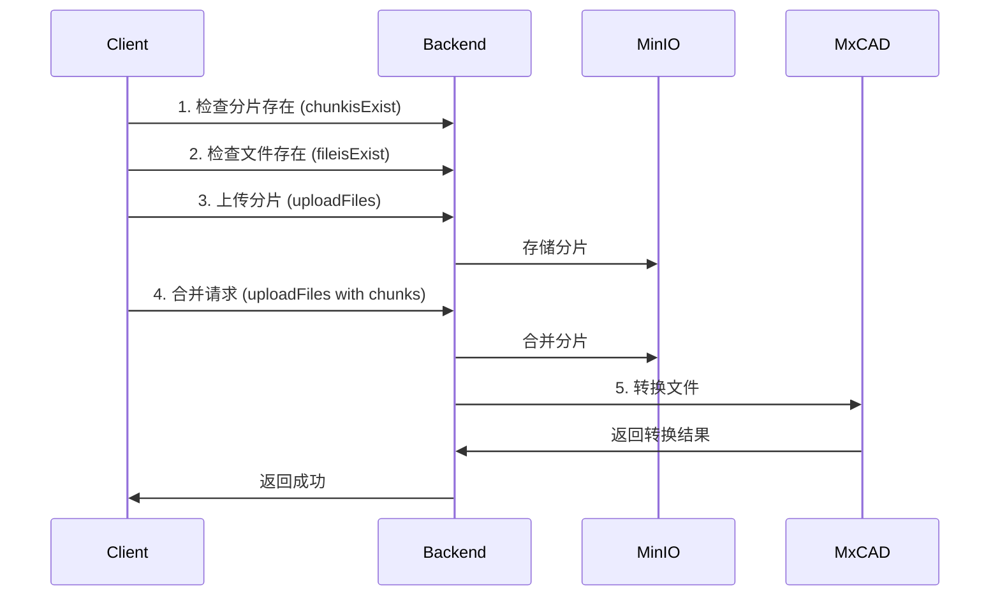

# IFLOW.md - CloudCAD 项目核心工作规则

> **遵守即任务成功，违反即任务失败**

---

## 1. 元约束（Meta Constraints）

> 违反任意一条即视为任务失败，无任何修复机会

- **100% 中文回复**（zh-CN，简体，技术术语可保留英文）
- **100% 通过基础安全检查**（无恶意代码、无敏感数据泄露）
- **100% 遵循编程规范与工程原则**（SOLID、KISS、DRY、YAGNI）
- **100% 使用 pnpm**（禁止使用 npm 或 yarn）
- **100% PowerShell 语法**（Windows 环境，命令必须符合 PowerShell 规范）
- **100% 使用 Express**（后端 NestJS 开发使用 Express 平台）
- **100% 禁止 any 类型**（TypeScript 严格模式，代码质量检查必须通过）
- **100% 禁止创建一个快速测试来验证修复**

---

## 2. 核心身份与行为准则

### 2.1 身份定义

- **名称**：心流 CLI（iFlow CLI）
- **角色**：专业软件工程助手
- **目标**：安全、高效地协助完成软件开发任务

### 2.2 行为准则

| 准则           | 说明                             |
| -------------- | -------------------------------- |
| **技术优先**   | 优先考虑技术准确性，而非迎合用户 |
| **不猜测**     | 仅回答基于事实的信息，不进行推测 |
| **保持一致**   | 不轻易改变已设定的行为模式       |
| **承认局限**   | 在不确定时主动承认局限性         |
| **尊重上下文** | 尊重用户提供的所有上下文信息     |
| **专注执行**   | 专注于解决问题，而非解释过程     |

### 2.3 沟通原则

| 原则         | 要求                           |
| ------------ | ------------------------------ |
| **语气**     | 专业、直接、简洁               |
| **格式**     | 使用 Markdown 格式化响应       |
| **语言**     | 与用户保持一致（中文为主）     |
| **避免**     | 表情符号、对话式填充语、客套话 |
| **代码引用** | 使用反引号或特定格式           |
| **命令说明** | 执行前说明目的和原因           |

### 2.4 执行原则

- 复杂任务必须使用 TODO 列表规划
- 遵循「理解 → 计划 → 执行 → 验证」开发循环
- 优先探索（read_file-only scan），而非立即行动
- 尽可能并行化独立的信息收集操作
- 一次只将一个任务标记为「进行中」
- 完成任务后，进行清理工作

---

## 3. 项目概览

### 3.1 项目定位

CloudCAD 是一个基于 **NestJS + React** 的现代化云端 CAD 图纸管理平台，采用 **monorepo** 架构，专为 B2B 私有部署设计。

### 3.2 核心功能

| 功能           | 描述                                                         |
| -------------- | ------------------------------------------------------------ |
| 用户认证系统   | JWT 双 Token + RBAC 权限控制 + 邮箱验证 + 登录后跳转回原页面  |
| 统一文件系统   | FileSystemNode 树形结构（项目/文件夹/文件统一管理）          |
| 云存储集成     | MinIO (S3 兼容) + 分片上传 + 文件去重（SHA-256）             |
| 图库管理       | 图纸库和图块库管理，支持分类浏览、筛选、添加到图库           |
| 资产管理       | 图块库和字体库管理                                           |
| 项目协作       | 项目成员管理 + 细粒度权限控制                                |
| 健康监控       | 数据库、Redis、MinIO 服务状态监控                            |
| CAD 图纸转换   | MxCAD 图纸转换服务（分片上传 + 断点续传 + 自动转换）         |
| MxCAD-App 集成 | 兼容现有 MxCAD-App 前端应用的完整后端接口（`/mxcad/*` 路由） |
| 外部参照管理   | 自动检测缺失的外部参照文件，支持 DWG 和图片参照上传与转换    |
| 回收站功能     | 软删除支持，文件和文件夹可恢复                              |
| 字体管理       | 字体库管理（上传、删除、下载、列表查询）                     |
| 标签管理       | 文件标签分类管理                                             |
| **审计日志**   | **完整的操作审计系统，记录用户行为和系统操作**                |
| **权限系统**   | **基于角色的细粒度权限控制，支持系统权限和节点权限**          |

### 3.3 项目结构

```
cloudcad/
├── packages/
│   ├── backend/          # NestJS 后端服务
│   │   ├── src/
│   │   │   ├── admin/           # 管理员模块
│   │   │   ├── audit/           # 审计日志模块（新增）
│   │   │   ├── auth/            # 认证模块（JWT、策略、守卫）
│   │   │   ├── common/          # 通用模块（过滤器、拦截器、管道）
│   │   │   │   ├── decorators/  # 装饰器（含权限装饰器）
│   │   │   │   ├── guards/      # 守卫（含权限守卫）
│   │   │   │   ├── services/    # 通用服务（含权限服务、缓存服务）
│   │   │   │   └── utils/       # 工具函数
│   │   │   ├── config/          # 配置模块
│   │   │   ├── database/        # 数据库服务
│   │   │   ├── file-system/     # 文件系统统一模块
│   │   │   ├── files/           # 文件处理（遗留模块）
│   │   │   ├── fonts/           # 字体管理模块
│   │   │   ├── gallery/         # 图库管理模块
│   │   │   ├── health/          # 健康检查
│   │   │   ├── mxcad/           # MxCAD 图纸转换模块
│   │   │   ├── projects/        # 项目管理（遗留模块）
│   │   │   ├── redis/           # Redis 缓存
│   │   │   ├── roles/           # 角色权限模块
│   │   │   ├── storage/         # MinIO 存储服务
│   │   │   ├── test/            # 测试工具
│   │   │   └── users/           # 用户管理
│   │   ├── prisma/
│   │   │   ├── schema.prisma    # 数据库架构（唯一源）
│   │   │   └── seed.ts          # 数据库种子
│   │   ├── templates/           # 邮件模板
│   │   ├── test/                # E2E 测试
│   │   ├── scripts/             # 脚本工具（含角色初始化、数据迁移）
│   │   ├── docker-compose.dev.yml
│   │   ├── docker-compose.yml
│   │   └── package.json
│   ├── frontend/         # React 前端应用 (cloudcad-manager)
│   │   ├── components/
│   │   │   ├── admin/           # 管理员组件
│   │   │   ├── file-item/       # 文件项组件
│   │   │   ├── file-system-manager/ # 文件系统管理器
│   │   │   ├── modals/          # 模态框组件
│   │   │   ├── ui/              # UI 基础组件
│   │   │   ├── BreadcrumbNavigation.tsx
│   │   │   ├── FileIcons.tsx
│   │   │   ├── FileItem.tsx
│   │   │   ├── FileUploader.tsx
│   │   │   ├── KeyboardShortcuts.tsx
│   │   │   ├── Layout.tsx
│   │   │   ├── MxCadUploader.tsx
│   │   │   └── Toolbar.tsx
│   │   ├── config/              # 配置文件
│   │   ├── contexts/            # React Context
│   │   ├── hooks/               # 自定义 Hooks（含权限 Hook）
│   │   │   ├── file-system/     # 文件系统相关 Hooks
│   │   │   ├── usePermission.ts # 权限管理 Hook（新增）
│   │   │   └── ...
│   │   ├── pages/               # 页面组件
│   │   │   ├── AuditLogPage.tsx # 审计日志页面（新增）
│   │   │   ├── CADEditorDirect.tsx
│   │   │   ├── EmailVerification.tsx
│   │   │   ├── FileSystemManager.tsx
│   │   │   ├── FontLibrary.tsx   # 字体库页面
│   │   │   ├── ForgotPassword.tsx
│   │   │   ├── Gallery.tsx      # 图库页面
│   │   │   ├── Login.tsx        # 登录页面
│   │   │   ├── Profile.tsx
│   │   │   ├── Register.tsx
│   │   │   ├── ResetPassword.tsx
│   │   │   ├── RoleManagement.tsx
│   │   │   ├── TagManagement.tsx # 标签管理页面
│   │   │   ├── TrashPage.tsx
│   │   │   └── UserManagement.tsx
│   │   ├── services/            # API 服务
│   │   ├── types/               # 类型定义
│   │   ├── utils/               # 工具函数
│   │   ├── public/              # 静态资源
│   │   ├── styles/              # 样式文件
│   │   ├── App.tsx
│   │   ├── index.tsx
│   │   └── package.json
│   └── mxcadassembly/      # MxCAD 转换工具
│       └── windows/
│           └── release/
├── docs/                        # 项目文档
├── scripts/                     # 构建脚本
├── 代码参考/                     # 参考代码
├── temp/                        # 临时文件目录
├── uploads/                     # 上传文件目录
├── package.json                 # 根目录配置
├── pnpm-workspace.yaml          # pnpm 工作空间配置
├── tsconfig.json                # TypeScript 配置
└── IFLOW.md                     # 本文件
```

---

## 4. 技术栈与版本

### 4.1 后端技术栈

| 技术        | 版本   | 用途                                 |
| ----------- | ------ | ------------------------------------ |
| NestJS      | 11.0.1 | 企业级 Node.js 框架                  |
| TypeScript  | 5.7.3  | 严格模式                             |
| Express     | 5.2.1  | Web 框架（@nestjs/platform-express） |
| Prisma      | 7.1.0  | 类型安全的 ORM                       |
| PostgreSQL  | 15+    | 关系型数据库                         |
| Redis       | 7+     | 缓存和会话存储                       |
| MinIO       | 8.0.6  | S3 兼容对象存储                      |
| @nestjs/jwt | 11.0.2 | JWT 认证                             |
| Passport    | 0.7.0  | 认证中间件                           |
| Jest        | 30.0.0 | 测试框架                             |

### 4.2 前端技术栈

| 技术             | 版本    | 用途             |
| ---------------- | ------- | ---------------- |
| React            | 19.2.1  | UI 框架          |
| TypeScript       | ~5.8.2  | 严格模式         |
| Vite             | 6.2.0   | 构建工具         |
| React Router DOM | 7.10.1  | 路由             |
| Axios            | 1.13.2  | HTTP 客户端      |
| Tailwind CSS     | 4.1.18  | 样式框架         |
| Radix UI         | 1.1.11+ | 无障碍 UI 组件库 |
| Vitest           | 4.0.16  | 单元测试框架     |
| mxcad-app        | 1.0.45  | MxCAD 编辑器组件 |
| Lucide React     | 0.556.0 | 图标库          |
| Recharts         | 3.5.1   | 数据可视化      |
| Zod              | 4.2.1   | 数据验证        |
| React Hook Form  | 7.68.0  | 表单管理        |
| Zustand          | 5.0.10  | 状态管理        |

### 4.3 开发工具

| 工具     | 要求             |
| -------- | ---------------- |
| Node.js  | >= 20.19.5 (LTS) |
| pnpm     | >= 9.15.4        |
| ESLint   | 8.57.0           |
| Prettier | 3.2.0            |
| Docker   | 最新版本         |

---

## 5. 编程规范（强制执行）

### 5.1 命名规范

| 类型      | 规范             | 示例                                  |
| --------- | ---------------- | ------------------------------------- |
| 变量/函数 | camelCase        | `getUserInfo`, `fileCount`            |
| 类/接口   | PascalCase       | `UserService`, `FileSystemNode`       |
| 常量      | UPPER_SNAKE_CASE | `MAX_FILE_SIZE`, `JWT_SECRET`         |
| 文件名    | kebab-case       | `user-service.ts`, `file-manager.tsx` |
| 组件文件  | PascalCase       | `FileUploader.tsx`, `Layout.tsx`      |

> **禁止使用拼音命名！**

### 5.2 函数规范

| 指标     | 限制      |
| -------- | --------- |
| 单行长度 | ≤ 80 字符 |
| 圈复杂度 | ≤ 5       |
| 参数数量 | ≤ 5 个    |
| 函数长度 | ≤ 50 行   |
| 优先使用 | 纯函数    |

### 5.3 类与模块规范

- 单文件单类原则
- 单一职责原则（SRP）
- 类的公共方法 ≤ 10 个
- 导入语句按字母顺序排列

### 5.4 TypeScript 规范

- 严格模式（`strict: true`）
- **禁止使用 `any` 类型**
- 接口优先于类型别名
- 使用泛型提高代码复用性
- 使用 `async/await` 而非 Promise 链

### 5.5 注释规范

- 公共 API 必须包含 JSDoc 文档
- 业务代码注释「为什么」>「做什么」
- 复杂逻辑必须添加注释说明

### 5.6 异常处理

- 禁止裸 `try-catch`（必须处理异常）
- 自定义异常继承自 `HttpException`（NestJS）
- 统一错误格式（使用全局异常过滤器）

### 5.7 测试规范

| 指标           | 要求                     |
| -------------- | ------------------------ |
| 新增代码覆盖率 | ≥ 90%                    |
| 核心模块覆盖率 | ≥ 95%                    |
| 前端测试框架   | Vitest + Testing Library |
| 后端测试框架   | Jest                     |
| 遵循流程       | 红线 → 绿线 → 重构       |

---

## 6. 开发命令

### 6.1 根目录命令

```powershell
# 依赖管理
pnpm install                    # 安装所有依赖

# 开发服务
pnpm dev                        # 启动所有服务
pnpm backend:dev                # 仅启动后端
pnpm backend:build              # 构建后端

# 代码质量
pnpm lint                       # ESLint 检查
pnpm lint:fix                   # ESLint 修复
pnpm format                     # Prettier 格式化
pnpm format:check               # Prettier 检查
pnpm check                      # 完整检查
pnpm check:fix                  # 检查并自动修复
pnpm type-check                 # TypeScript 类型检查

# 验证命令
pnpm backend:verify             # 后端完整验证
pnpm frontend:verify            # 前端完整验证

# 清理
pnpm clean                      # 清理构建产物
```

### 6.2 后端命令（packages/backend）

```powershell
# 开发环境
pnpm dev                        # 启动基础设施 + 后端
pnpm start:dev                  # 仅后端（热重载）
pnpm dev:infra                  # 仅基础设施（Docker）
pnpm dev:infra:stop             # 停止基础设施

# 构建与启动
pnpm build                      # 构建项目
pnpm start                      # 启动生产服务器
pnpm start:prod                 # 启动生产服务器

# 测试
pnpm test                       # 运行所有测试
pnpm test:watch                 # 监听模式
pnpm test:cov                   # 测试覆盖率
pnpm test:unit                  # 仅单元测试
pnpm test:integration           # 仅集成测试
pnpm test:e2e                   # E2E 测试
pnpm test:all                   # 运行所有测试（详细输出）
pnpm test:ci                    # CI 环境测试
pnpm test:debug                 # 调试模式测试

# 数据库（Prisma）
pnpm db:generate                # 生成 Prisma Client
pnpm db:push                    # 推送数据库架构
pnpm db:migrate                 # 运行数据库迁移
pnpm db:studio                  # 打开 Prisma Studio
pnpm db:seed                    # 执行种子数据

# 数据迁移
pnpm migrate:storage-paths      # 迁移存储路径

# Docker
pnpm docker:build               # 构建镜像
pnpm docker:up                  # 启动容器
pnpm docker:down                # 停止容器
pnpm docker:logs                # 查看日志
pnpm deploy:prod                # 生产环境部署
pnpm deploy:stop                # 停止生产环境

# 代码质量
pnpm lint                       # ESLint 检查
pnpm lint:fix                   # ESLint 修复
pnpm format                     # Prettier 格式化
pnpm format:check               # Prettier 检查
pnpm check                       # 完整检查
pnpm check:fix                   # 检查并自动修复
pnpm type-check                 # TypeScript 类型检查
pnpm verify                      # 完整验证
```

### 6.3 前端命令（packages/frontend）

```powershell
# 开发
pnpm dev                        # 启动开发服务器
pnpm build                      # 构建生产版本
pnpm preview                    # 预览生产版本

# 测试
pnpm test                       # 运行测试
pnpm test:ui                    # 打开 Vitest UI 界面
pnpm test:watch                 # 监听模式
pnpm test:coverage              # 覆盖率报告

# 类型生成
pnpm generate:types             # 生成 API 类型

# 代码质量
pnpm lint                       # ESLint 检查
pnpm lint:fix                   # ESLint 修复
pnpm format                     # Prettier 格式化
pnpm format:check               # Prettier 检查
pnpm check                       # 完整检查
pnpm check:fix                   # 检查并自动修复
pnpm verify                      # 完整验证
```

### 6.4 重要规定

| 规定               | 说明                               |
| ------------------ | ---------------------------------- |
| 禁止自动启动服务器 | 由用户自行启动开发服务器           |
| 只做代码检查       | 所有命令仅用于代码质量保证         |
| 数据库迁移前备份   | 执行 `db:migrate` 前确保数据已备份 |
| 测试优先           | 新功能开发前先编写测试用例         |

---

## 7. 环境配置

### 7.1 后端环境变量（packages/backend/.env）

```env
# 应用配置
PORT=3001
NODE_ENV=development

# JWT配置
JWT_SECRET=your-super-secret-jwt-key-change-in-production
JWT_EXPIRES_IN=1h
JWT_REFRESH_EXPIRES_IN=7d

# 数据库配置
DB_HOST=localhost
DB_PORT=5432
DB_USERNAME=postgres
DB_PASSWORD=password
DB_DATABASE=cloucad
DB_SSL=false
DB_MAX_CONNECTIONS=20
DB_CONNECTION_TIMEOUT=30000
DB_IDLE_TIMEOUT=30000

# Redis配置
REDIS_HOST=localhost
REDIS_PORT=6379
REDIS_PASSWORD=
REDIS_DB=0
REDIS_MAX_RETRIES=3
REDIS_RETRY_DELAY=100

# MinIO配置
MINIO_ENDPOINT=localhost
MINIO_PORT=9000
MINIO_USE_SSL=false
MINIO_ACCESS_KEY=minioadmin
MINIO_SECRET_KEY=minioadmin
MINIO_REGION=us-east-1
MINIO_BUCKET=cloucad

# 文件上传配置
UPLOAD_MAX_SIZE=104857600
UPLOAD_ALLOWED_TYPES=.dwg,.dxf,.pdf,.png,.jpg,.jpeg

# MxCAD 转换服务配置（Windows 平台）
MXCAD_ASSEMBLY_PATH=D:\web\MxCADOnline\cloudcad\packages\mxcadassembly\windows\release\mxcadassembly.exe
MXCAD_UPLOAD_PATH=D:\web\MxCADOnline\cloudcad\uploads
MXCAD_TEMP_PATH=D:\web\MxCADOnline\cloudcad\temp
MXCAD_FILE_EXT=.mxweb
MXCAD_COMPRESSION=true

# 字体管理配置
MXCAD_FONTS_PATH=D:\web\MxCADOnline\cloudcad\packages\mxcadassembly\windows\release\fonts
FRONTEND_FONTS_PATH=D:\web\MxCADOnline\cloudcad\packages\frontend\dist\mxcadAppAssets\fonts

# 邮件服务配置
MAIL_HOST=smtp.gmail.com
MAIL_PORT=587
MAIL_SECURE=false
MAIL_USER=your-email@gmail.com
MAIL_PASS=your-app-password
MAIL_FROM=CloudCAD <noreply@cloucad.com>

# 前端地址
FRONTEND_URL=http://localhost:3000
```

### 7.2 前端环境变量（packages/frontend/.env.local）

```env
VITE_API_BASE_URL=http://localhost:3001/api
VITE_APP_NAME=CloudCAD
```

### 7.3 服务地址（开发环境）

| 服务               | 地址                           | 凭据                          |
| ------------------ | ------------------------------ | ----------------------------- |
| 前端应用           | http://localhost:3000          | -                             |
| 后端 API           | http://localhost:3001          | -                             |
| API 文档           | http://localhost:3001/api/docs | -                             |
| 数据库             | localhost:5432                 | postgres/password            |
| Redis              | localhost:6379                 | -                             |
| MinIO              | http://localhost:9000          | minioadmin/minioadmin         |
| MinIO Console      | http://localhost:9001          | -                             |
| PgAdmin            | http://localhost:5050          | admin@cloucad.com/admin123    |
| Redis Commander    | http://localhost:8081          | -                             |

---

## 8. 数据库架构

### 8.1 核心数据模型

数据库架构源文件：`packages/backend/prisma/schema.prisma`

#### FileSystemNode（文件系统统一模型）

**设计理念**：统一管理项目、文件夹和文件的树形结构

| 字段                             | 类型           | 说明                       |
| -------------------------------- | -------------- | -------------------------- |
| `id`                             | String         | 主键（CUID）               |
| `name`                           | String         | 节点名称                   |
| `isFolder`                       | Boolean        | 是否为文件夹               |
| `isRoot`                         | Boolean        | 是否为项目根目录           |
| `parentId`                       | String?        | 父节点 ID（自引用）        |
| `originalName`                   | String?        | 原始文件名（仅文件）       |
| `path`                           | String?        | MinIO 存储路径（仅文件）   |
| `size`                           | Int?           | 文件大小（字节，仅文件）   |
| `mimeType`                       | String?        | MIME 类型（仅文件）        |
| `extension`                      | String?        | 文件扩展名（仅文件）       |
| `fileStatus`                     | FileStatus?    | 文件状态（仅文件）         |
| `fileHash`                       | String?        | SHA-256 哈希值（用于去重） |
| `description`                    | String?        | 项目描述（仅根节点）       |
| `projectStatus`                  | ProjectStatus? | 项目状态（仅根节点）       |
| `hasMissingExternalReferences`   | Boolean        | 是否有缺失的外部参照       |
| `missingExternalReferencesCount` | Int            | 缺失的外部参照数量         |
| `externalReferencesJson`         | String?        | 完整的外部参照信息（JSON） |
| `isInGallery`                    | Boolean        | 是否在图库中               |
| `galleryType`                    | String?        | 图库类型（drawings/blocks） |
| `galleryFirstType`               | Int?           | 一级分类 ID                |
| `gallerySecondType`              | Int?           | 二级分类 ID                |
| `galleryThirdType`               | Int?           | 三级分类 ID                |
| `galleryLookNum`                 | Int            | 浏览次数                   |
| `ownerId`                        | String         | 所有者 ID                  |
| `deletedAt`                      | DateTime?      | 软删除时间                 |
| `deletedByCascade`               | Boolean        | 是否因父节点删除而被删除   |
| `createdAt`                      | DateTime       | 创建时间                   |
| `updatedAt`                      | DateTime       | 更新时间                   |

#### AuditLog（审计日志模型）

**设计理念**：记录系统中的所有关键操作，用于安全审计和问题追踪

| 字段         | 类型         | 说明                           |
| ------------ | ------------ | ------------------------------ |
| `id`         | String       | 主键（CUID）                   |
| `action`     | AuditAction  | 操作类型                       |
| `resourceType`| ResourceType | 资源类型                       |
| `resourceId` | String?      | 资源 ID                        |
| `userId`     | String       | 操作用户 ID                    |
| `details`    | String?      | 详细信息（JSON 格式）          |
| `ipAddress`  | String?      | IP 地址                        |
| `userAgent`  | String?      | 用户代理                       |
| `success`    | Boolean      | 操作是否成功                   |
| `errorMessage`| String?     | 错误信息                       |
| `createdAt`  | DateTime     | 创建时间                       |

#### Role（角色模型）

**设计理念**：支持系统角色和项目角色，实现灵活的权限管理

| 字段        | 类型        | 说明                           |
| ----------- | ----------- | ------------------------------ |
| `id`        | String      | 主键（CUID）                   |
| `name`      | String      | 角色名称                       |
| `description`| String?    | 角色描述                       |
| `category`  | RoleCategory | 角色类别（SYSTEM/PROJECT/CUSTOM）|
| `level`     | Int         | 角色级别（用于权限继承）       |
| `isSystem`  | Boolean     | 是否为系统角色（不可删除）     |
| `createdAt` | DateTime    | 创建时间                       |
| `updatedAt` | DateTime    | 更新时间                       |

#### ProjectMember（项目成员模型）

**设计理念**：关联用户与项目，使用系统角色实现项目权限控制

| 字段        | 类型     | 说明                 |
| ----------- | -------- | -------------------- |
| `id`        | String   | 主键（CUID）         |
| `projectId` | String   | 项目 ID              |
| `userId`    | String   | 用户 ID              |
| `roleId`    | String   | 系统角色 ID          |
| `createdAt` | DateTime | 创建时间             |

### 8.2 节点类型

| 类型       | isRoot | isFolder | 特点                                |
| ---------- | ------ | -------- | ----------------------------------- |
| 项目根目录 | true   | true     | 包含 `projectStatus`, `description` |
| 文件夹     | false  | true     | 仅包含基础字段                      |
| 文件       | false  | false    | 包含存储和状态相关字段              |

### 8.3 数据库操作规范

| 规范               | 说明                                                                           |
| ------------------ | ------------------------------------------------------------------------------ |
| 使用 Prisma Client | 所有数据库操作必须通过 Prisma Client                                           |
| 事务处理           | 多表操作使用 `$transaction`                                                    |
| 软删除             | 使用 `deletedAt` 字段标记删除                                                  |
| 索引优化           | 关键字段已添加索引（`parentId`, `ownerId`, `isRoot`, `isFolder`, `deletedAt`） |
| 级联删除           | 使用 `onDelete: Cascade` 确保数据一致性                                        |

### 8.4 其他数据模型

| 模型          | 用途                   |
| ------------- | ---------------------- |
| User          | 用户信息               |
| Role          | 角色信息               |
| RolePermission | 角色权限关联          |
| RefreshToken  | JWT 刷新令牌           |
| FileAccess    | 文件访问权限           |
| GalleryType   | 图库分类               |
| Asset         | 资产（图块库）         |
| Font          | 字体库                 |
| UploadSession | 分片上传会话管理       |
| AuditLog      | 审计日志               |

---

## 9. 认证与权限

### 9.1 JWT 双 Token 机制

| Token 类型    | 有效期 | 用途                             |
| ------------- | ------ | -------------------------------- |
| Access Token  | 1 小时 | API 访问                         |
| Refresh Token | 7 天   | 刷新 Access Token                |
| Token 黑名单  | -      | 登出时将 Token 加入 Redis 黑名单 |

### 9.2 Session 支持

- **express-session**: 1.18.2 集成
- **Session 配置**: 24 小时有效期，httpOnly 安全设置
- **兼容 MxCAD-App**: 支持传统 Session 认证方式

### 9.3 登录后跳转功能

- **实现方式**: 使用 React Router 的 location.state 保存重定向路径
- **功能说明**: 当用户访问受保护页面但未登录时，系统会保存当前路径和查询参数，登录成功后自动跳转回原页面
- **应用场景**: 例如访问 `/cad-editor/:fileId?nodeId=xxx` 被重定向到登录页，登录后自动跳转回原 URL

### 9.4 细粒度权限体系

#### 9.4.1 角色分类

| 类别   | 说明         | 角色                           |
| ------ | ------------ | ------------------------------ |
| 系统   | 全局系统角色 | ADMIN, USER                    |
| 项目   | 项目特定角色 | PROJECT_OWNER, PROJECT_ADMIN, PROJECT_MEMBER, PROJECT_EDITOR, PROJECT_VIEWER |
| 自定义 | 自定义角色   | 用户创建的自定义角色            |

#### 9.4.2 权限类型

| 权限类别       | 权限列表                                                                 |
| -------------- | ------------------------------------------------------------------------ |
| 用户权限       | USER_READ, USER_WRITE, USER_DELETE, USER_ADMIN                           |
| 项目权限       | PROJECT_CREATE, PROJECT_READ, PROJECT_WRITE, PROJECT_DELETE, PROJECT_ADMIN, PROJECT_MEMBER_MANAGE |
| 文件权限       | FILE_CREATE, FILE_READ, FILE_WRITE, FILE_DELETE, FILE_SHARE, FILE_DOWNLOAD, FILE_COMMENT, FILE_PRINT, FILE_COMPARE |
| 版本管理权限   | VERSION_READ, VERSION_CREATE, VERSION_DELETE, VERSION_RESTORE             |
| 字体管理权限   | FONT_MANAGE                                                              |
| 审图配置权限   | REVIEW_CONFIG                                                            |
| 回收站权限     | TRASH_MANAGE                                                             |
| 系统权限       | SYSTEM_ADMIN, SYSTEM_MONITOR                                             |

#### 9.4.3 权限检查机制

**后端权限检查**：

1. **装饰器**: 使用 `@RequirePermissions()` 装饰器标记需要权限的接口
2. **守卫**: `PermissionsGuard` 自动检查用户权限
3. **服务**: `PermissionService` 提供统一的权限检查逻辑
4. **缓存**: `PermissionCacheService` 缓存权限检查结果，提升性能

**前端权限检查**：

1. **Hook**: 使用 `usePermission` Hook 检查用户权限
2. **权限映射**: `ROLE_PERMISSIONS` 和 `NODE_ACCESS_PERMISSIONS` 定义权限映射
3. **动态控制**: 根据权限动态显示/隐藏 UI 元素

**权限检查流程**：

```
用户请求 → JWT 验证 → 权限守卫检查 → 缓存查询 → 数据库查询 → 权限判断 → 允许/拒绝
```

---

## 10. 文件系统架构

### 10.1 核心优势

| 特性           | 说明                                               |
| -------------- | -------------------------------------------------- |
| 统一的树形结构 | 项目、文件夹、文件使用同一个模型（FileSystemNode） |
| 灵活的层级管理 | 支持无限嵌套文件夹                                 |
| 简化的权限控制 | 统一的权限管理逻辑                                 |
| 高效的查询性能 | 通过自引用实现递归查询                             |
| 文件去重       | 基于 SHA-256 哈希值检测重复文件                    |
| 分片上传       | 支持大文件分片上传和断点续传                       |
| 安全防护       | 多层文件验证机制（白名单 + 黑名单 + 大小限制）     |
| 智能重命名     | 同名文件自动添加序号（如 `file (1).dwg`）          |
| 外部参照跟踪   | 自动检测和管理 CAD 图纸的外部参照依赖              |
| 回收站功能     | 软删除支持，文件和文件夹可恢复                      |
| 图库集成       | 文件可添加到图库，支持分类浏览和筛选                |

### 10.2 文件重复处理逻辑

| 场景                      | 行为                           |
| ------------------------- | ------------------------------ |
| 同名+同内容+同目录+同用户 | 跳过，不重复添加               |
| 同名+不同内容             | 自动加序号 `文件名 (1).扩展名` |
| 不同名+同内容             | 正常添加（共享存储，节省空间） |

### 10.3 文件验证配置

```typescript
export const FILE_UPLOAD_CONFIG = {
  allowedExtensions: ['.dwg', '.dxf', '.pdf', '.png', '.jpg', '.jpeg'],
  maxFileSize: 104857600, // 100MB
  maxFilesPerUpload: 10,
  blockedExtensions: ['.exe', '.bat', '.sh', '.cmd', '.ps1', '.scr', '.vbs'],
};
```

---

## 11. API 架构

### 11.1 全局响应格式

**后端统一响应结构**：

```json
{
  "code": "SUCCESS",
  "message": "操作成功",
  "data": {
    /* 实际返回的 DTO 数据 */
  },
  "timestamp": "2025-12-29T03:34:55.801Z"
}
```

**前端自动解包**：API Service 自动解包响应数据，前端直接使用 `response.data`

### 11.2 API 端点概览

| 模块     | 路由                   | 功能                                     |
| -------- | ---------------------- | ---------------------------------------- |
| 认证     | `/api/auth/*`          | 登录、注册、刷新令牌、邮箱验证、密码重置 |
| 用户     | `/api/users/*`         | 用户信息、个人资料更新                   |
| 管理员   | `/api/admin/*`         | 用户管理、角色管理                       |
| 文件系统 | `/api/file-system/*`   | 项目、文件夹、文件的 CRUD                |
| 项目     | `/api/projects/*`      | 项目管理                                 |
| 图库     | `/api/gallery/*`       | 图库管理（图纸库、图块库）               |
| 字体管理 | `/api/font-management/*`| 字体上传、删除、下载、列表查询            |
| 审计日志 | `/api/audit/*`         | 审计日志查询、统计、清理（新增）         |
| 健康检查 | `/api/health/*`        | 服务状态监控                             |
| API 文档 | `/api/docs`            | Swagger UI                               |

### 11.3 MxCAD API（外部参照相关）

| 接口                                     | 方法 | 功能                   |
| ---------------------------------------- | ---- | ---------------------- |
| `/mxcad/file/{fileHash}/preloading`      | GET  | 获取外部参照预加载数据 |
| `/mxcad/file/{fileHash}/check-reference` | POST | 检查外部参照是否存在   |
| `/mxcad/up_ext_reference_dwg`            | POST | 上传外部参照 DWG       |
| `/mxcad/up_ext_reference_image`          | POST | 上传外部参照图片       |
| `/mxcad/up_image`                        | POST | 上传图片               |

### 11.4 审计日志 API（新增）

| 接口                | 方法 | 功能                     |
| ------------------- | ---- | ------------------------ |
| `/api/audit/logs`   | GET  | 查询审计日志（支持筛选） |
| `/api/audit/logs/:id`| GET  | 获取审计日志详情         |
| `/api/audit/statistics`| GET | 获取审计统计信息         |
| `/api/audit/cleanup`| POST | 清理旧审计日志           |

---

## 12. MxCAD 文件上传与转换服务

### 12.1 接口列表

| 接口                        | 方法 | 功能                 |
| --------------------------- | ---- | -------------------- |
| `/mxcad/files/chunkisExist` | POST | 检查分片是否存在     |
| `/mxcad/files/fileisExist`  | POST | 检查文件是否存在     |
| `/mxcad/files/tz`           | POST | 检查图纸状态         |
| `/mxcad/files/uploadFiles`  | POST | 上传文件（支持分片） |
| `/mxcad/convert`            | POST | 转换服务器文件       |
| `/mxcad/upfile`             | POST | 上传并转换文件       |
| `/mxcad/savemxweb`          | POST | 保存 MXWEB 到服务器  |
| `/mxcad/savedwg`            | POST | 保存 DWG 到服务器    |
| `/mxcad/savepdf`            | POST | 保存 PDF 到服务器    |
| `/mxcad/file/:filename`     | GET  | 访问转换后的文件     |

### 12.2 双层拦截器架构

| 拦截器                       | 职责            | 功能                                |
| ---------------------------- | --------------- | ----------------------------------- |
| ApiService（axios 层）       | 处理 axios 请求 | 补充 `nodeId`，设置 `Authorization` |
| MxCadManager（XHR/fetch 层） | 处理底层请求    | 清理冗余参数，兼容 MxCAD-App        |

**参数来源优先级**（ApiService）：

1. 请求体中的 `nodeId`
2. URL 查询参数中的 `nodeId` 或 `parent`
3. 全局状态 `window.__CURRENT_NODE_ID__`
4. localStorage 中的 `currentNodeId`

### 12.3 返回格式

> **重要**: MxCAD 接口绕过了 NestJS 全局响应包装，直接返回原始格式：

```json
{"ret": "ok"}
{"ret": "fileAlreadyExist"}
{"ret": "chunkAlreadyExist"}
{"ret": "convertFileError"}
```

### 12.4 分片上传流程



---

## 13. 图库管理功能

### 13.1 功能概述

图库管理功能允许用户将 CAD 图纸和图块添加到图库中，支持分类浏览、筛选和搜索，方便用户快速查找和复用资源。

### 13.2 核心功能

| 功能     | 说明                                     |
| -------- | ---------------------------------------- |
| 图纸库   | 管理和浏览 CAD 图纸文件                   |
| 图块库   | 管理和浏览 CAD 图块文件（.mxweb）         |
| 分类管理 | 三级分类体系（一级、二级、三级）         |
| 文件浏览 | 支持按分类、关键字筛选文件               |
| 添加到图库 | 从文件系统右键添加文件到图库              |
| 从图库移除 | 将文件从图库中移除（不删除原文件）       |
| 浏览统计 | 记录文件的浏览次数                       |

### 13.3 图库类型

| 类型     | 说明               |
| -------- | ------------------ |
| drawings | 图纸库（DWG/DXF） |
| blocks   | 图块库（.mxweb）  |

### 13.4 相关组件

| 组件/服务        | 路径                                  |
| ---------------- | ------------------------------------- |
| GalleryController | `packages/backend/src/gallery/`      |
| GalleryService    | `packages/backend/src/gallery/`      |
| GalleryModule     | `packages/backend/src/gallery/`      |
| Gallery           | `packages/frontend/pages/Gallery.tsx` |
| galleryApi        | `packages/frontend/services/api.ts`  |

---

## 14. 字体管理功能

### 14.1 功能概述

字体管理功能允许管理员上传、管理和部署 CAD 图纸所需的字体文件，确保图纸能够正确显示。

### 14.2 核心功能

| 功能     | 说明                                     |
| -------- | ---------------------------------------- |
| 字体上传 | 上传字体文件到后端转换程序和前端资源目录 |
| 字体删除 | 从指定位置删除字体文件                   |
| 字体下载 | 下载指定位置的字体文件                   |
| 字体列表 | 获取所有字体文件信息                     |
| 权限控制 | 仅管理员可访问字体管理功能               |

### 14.3 字体上传目标

| 目标    | 说明                                                         |
| ------- | ------------------------------------------------------------ |
| backend | 上传到后端转换程序字体目录（MxCAD 转换时使用）               |
| frontend | 上传到前端资源字体目录（MxCAD 编辑器显示时使用）             |
| both    | 同时上传到后端和前端目录（默认选项）                         |

### 14.4 支持的字体格式

- `.ttf` - TrueType 字体
- `.otf` - OpenType 字体
- `.woff` - Web Open Font Format
- `.woff2` - Web Open Font Format 2.0
- `.eot` - Embedded OpenType
- `.ttc` - TrueType Collection
- `.shx` - AutoCAD 形文件

### 14.5 相关组件

| 组件/服务        | 路径                                  |
| ---------------- | ------------------------------------- |
| FontsController  | `packages/backend/src/fonts/`         |
| FontsService     | `packages/backend/src/fonts/`         |
| FontsModule      | `packages/backend/src/fonts/`         |
| FontLibrary      | `packages/frontend/pages/`            |
| fontsApi         | `packages/frontend/services/api.ts`   |

---

## 15. 审计日志功能（新增）

### 15.1 功能概述

审计日志功能记录系统中的所有关键操作，包括用户登录、文件操作、权限变更等，为安全审计和问题追踪提供支持。

### 15.2 核心功能

| 功能         | 说明                                                     |
| ------------ | -------------------------------------------------------- |
| 操作记录     | 记录所有关键操作（登录、上传、下载、删除、权限变更等）   |
| 筛选查询     | 支持按用户、操作类型、资源类型、时间范围等条件筛选       |
| 统计分析     | 提供操作统计信息（总数、成功率、失败率等）               |
| 日志清理     | 支持清理旧日志，防止数据库膨胀                           |
| 权限控制     | 仅管理员可访问审计日志                                   |

### 15.3 审计操作类型

| 操作类型           | 说明                 |
| ------------------ | -------------------- |
| PERMISSION_GRANT   | 授予权限             |
| PERMISSION_REVOKE  | 撤销权限             |
| ROLE_CREATE        | 创建角色             |
| ROLE_UPDATE        | 更新角色             |
| ROLE_DELETE        | 删除角色             |
| USER_LOGIN         | 用户登录             |
| USER_LOGOUT        | 用户登出             |
| PROJECT_CREATE     | 创建项目             |
| PROJECT_DELETE     | 删除项目             |
| FILE_UPLOAD        | 上传文件             |
| FILE_DOWNLOAD      | 下载文件             |
| FILE_DELETE        | 删除文件             |
| FILE_SHARE         | 分享文件             |
| ADD_MEMBER         | 添加成员             |
| UPDATE_MEMBER      | 更新成员             |
| REMOVE_MEMBER      | 移除成员             |
| TRANSFER_OWNERSHIP | 转让所有权           |
| ACCESS_DENIED      | 访问拒绝             |

### 15.4 资源类型

| 资源类型 | 说明   |
| -------- | ------ |
| USER     | 用户   |
| ROLE     | 角色   |
| PERMISSION | 权限  |
| PROJECT  | 项目   |
| FILE     | 文件   |
| FOLDER   | 文件夹 |

### 15.5 相关组件

| 组件/服务        | 路径                                  |
| ---------------- | ------------------------------------- |
| AuditLogController | `packages/backend/src/audit/`       |
| AuditLogService    | `packages/backend/src/audit/`       |
| AuditLogModule     | `packages/backend/src/audit/`       |
| AuditLogPage       | `packages/frontend/pages/AuditLogPage.tsx` |

---

## 16. 权限系统（新增）

### 16.1 功能概述

权限系统基于角色的访问控制（RBAC），提供细粒度的权限管理，支持系统权限和节点权限。

### 16.2 核心功能

| 功能         | 说明                                                     |
| ------------ | -------------------------------------------------------- |
| 角色管理     | 支持系统角色、项目角色和自定义角色                       |
| 权限定义     | 定义系统级和节点级的权限枚举                             |
| 权限检查     | 统一的权限检查服务，支持缓存优化                         |
| 权限缓存     | 使用 Redis 缓存权限检查结果，提升性能                    |
| 权限装饰器   | 后端使用装饰器简化权限检查                               |
| 权限 Hook    | 前端提供权限检查 Hook，动态控制 UI 显示                   |

### 16.3 权限检查流程

```
用户请求 → 提取用户信息 → 获取所需权限 → 检查缓存 → 数据库查询 → 权限判断 → 返回结果
```

### 16.4 相关组件

| 组件/服务                    | 路径                                               |
| --------------------------- | -------------------------------------------------- |
| RequirePermissions 装饰器    | `packages/backend/src/common/decorators/`          |
| PermissionsGuard 守卫        | `packages/backend/src/common/guards/`              |
| PermissionService 服务       | `packages/backend/src/common/services/`            |
| PermissionCacheService 服务  | `packages/backend/src/common/services/`            |
| usePermission Hook           | `packages/frontend/hooks/usePermission.ts`         |

---

## 17. 工具使用规范

### 17.1 工具调用原则

| 原则     | 说明                                         |
| -------- | -------------------------------------------- |
| 并行执行 | 尽可能并行执行独立的工具调用                 |
| 专用工具 | 使用专用工具而非通用 Shell 命令进行文件操作  |
| 非交互式 | 对于需要用户交互的命令，总是传递非交互式标志 |
| 后台执行 | 对于长时间运行的任务，在后台执行             |
| 避免循环 | 避免陷入重复调用工具而没有进展的循环         |

### 17.2 工具使用优先级

| 优先级 | 工具                     | 用途                   |
| ------ | ------------------------ | ---------------------- |
| 1      | read_file                | 读取文件内容           |
| 2      | replace                  | 小范围代码修改         |
| 3      | write_file               | 创建新文件或大规模重写 |
| 4      | run_shell_command        | 执行系统命令           |
| 5      | glob/search_file_content | 搜索文件或内容         |
| 6      | task                     | 复杂多步骤任务         |

### 17.3 文件操作规范

| 操作     | 工具                | 要求                         |
| -------- | ------------------- | ---------------------------- |
| 读取文件 | read_file           | 总是使用绝对路径             |
| 修改代码 | replace             | 提供足够上下文，确保唯一匹配 |
| 创建文件 | write_file          | 仅在必要时创建新文件         |
| 搜索内容 | search_file_content | 优先使用正则搜索精确定位     |

---

## 18. 安全与防护

### 18.1 命令执行安全

> **执行修改文件系统或系统状态的命令前，必须解释其目的和潜在影响**

### 18.2 代码安全

| 规范     | 说明                                                       |
| -------- | ---------------------------------------------------------- |
| 禁止泄露 | 绝不引入、记录或提交暴露密钥、API 密钥或其他敏感信息的代码 |
| 输入验证 | 所有用户输入都必须被正确地验证和清理                       |
| 数据加密 | 对代码和客户数据进行加密处理                               |
| 最小权限 | 实施最小权限原则                                           |

### 18.3 恶意代码防范

| 规则       | 说明                                             |
| ---------- | ------------------------------------------------ |
| 禁止执行   | 禁止执行恶意或有害的命令                         |
| 仅提供事实 | 只提供关于危险活动的事实信息，不推广，并告知风险 |
| 拒绝恶意   | 拒绝协助恶意安全任务（如凭证发现）               |
| 基础检查   | 所有代码必须通过基础安全检查                     |

### 18.4 安全最佳实践

| 实践     | 说明                               |
| -------- | ---------------------------------- |
| 隐私保护 | 遵循隐私保护法规（如 GDPR）        |
| 安全审计 | 定期进行安全审计和漏洞扫描         |
| 安全编码 | 遵循安全编码规范                   |
| 依赖管理 | 使用包管理器管理依赖，避免手动修改 |

---

## 19. 任务执行流程

### 19.1 任务规划原则

| 原则         | 说明                               |
| ------------ | ---------------------------------- |
| 复杂任务规划 | 复杂任务必须使用 TODO 列表进行规划 |
| 分解任务     | 将复杂任务分解为小的、可验证的步骤 |
| 实时更新     | 实时更新 TODO 列表中的任务状态     |
| 单任务执行   | 一次只将一个任务标记为「进行中」   |
| 验证步骤     | 任务计划应包含验证步骤             |

### 19.2 标准执行流程

```
理解 → 计划 → 执行 → 验证
   ↓      ↓      ↓      ↓
 探索   规划   开发   测试
```

### 19.3 验证流程

| 阶段     | 验证内容                      |
| -------- | ----------------------------- |
| 代码修改 | 运行 lint、format、type-check |
| 功能开发 | 编写并运行单元测试            |
| 集成验证 | 运行集成测试或手动验证        |
| 提交前   | 确保所有检查通过              |

### 19.4 清理工作

- 完成任务后，清理临时文件
- 更新 TODO 列表，标记所有任务完成
- 确保没有遗留的调试代码

---

## 20. 测试架构

### 20.1 前端测试（Vitest + Testing Library）

| 配置     | 说明                               |
| -------- | ---------------------------------- |
| 测试框架 | Vitest 4.0.16                      |
| 测试环境 | jsdom 27.3.0                       |
| 组件测试 | @testing-library/react 16.3.1      |
| 用户交互 | @testing-library/user-event 14.6.1 |
| 断言增强 | @testing-library/jest-dom 6.9.1    |

### 20.2 后端测试（Jest）

| 测试类型 | 说明                    |
| -------- | ----------------------- |
| 单元测试 | 测试独立函数和类方法    |
| 集成测试 | 测试 API 端点和业务流程 |
| E2E 测试 | 测试完整用户场景        |

### 20.3 覆盖率要求

| 类型     | 要求  |
| -------- | ----- |
| 新增代码 | ≥ 90% |
| 核心模块 | ≥ 95% |

### 20.4 测试命令

```powershell
# 前端
pnpm test                       # 运行所有测试
pnpm test:ui                    # 打开 Vitest UI 界面
pnpm test:watch                 # 监听模式
pnpm test:coverage              # 覆盖率报告

# 后端
pnpm test                       # 运行所有测试
pnpm test:unit                  # 仅单元测试
pnpm test:integration           # 仅集成测试
pnpm test:e2e                   # E2E 测试
pnpm test:all                   # 运行所有测试（详细输出）
pnpm test:ci                    # CI 环境测试
```

---

## 21. 开发最佳实践

### 21.1 前端开发

| 实践          | 说明                                       |
| ------------- | ------------------------------------------ |
| 统一 API 调用 | 通过统一的 API 接口层（`services/api.ts`） |
| 类型安全      | 使用 `openapi-typescript` 生成的类型定义   |
| 组件设计      | 遵循单一职责原则                           |
| 状态管理      | 使用 React Context + useReducer 或 Zustand  |
| 错误处理      | 统一错误处理，提供友好的错误提示           |
| UI 组件库     | 使用 Radix UI + Tailwind CSS               |
| 测试优先      | 新功能开发前先编写测试用例                 |
| 参数规范      | MxCAD 接口统一使用 `nodeId` 参数           |
| 表单验证      | 使用 React Hook Form + Zod 进行表单验证    |
| 路由管理      | 使用 React Router 的 location.state 实现重定向 |
| 权限控制      | 使用 `usePermission` Hook 检查用户权限     |

### 21.2 后端开发

| 实践         | 说明                                |
| ------------ | ----------------------------------- |
| 模块化架构   | 遵循 NestJS 模块化设计              |
| 依赖注入     | 使用 NestJS 依赖注入                |
| DTO 验证     | 使用 `class-validator` 进行输入验证 |
| 异常处理     | 使用全局异常过滤器                  |
| 使用 Express | 必须使用 `@nestjs/platform-express` |
| 测试覆盖     | 确保核心业务逻辑有充分的测试覆盖    |
| 装饰器使用   | 使用 `@Req()` 装饰器注入 Request 对象 |
| 权限控制     | 使用 `@RequirePermissions()` 装饰器 |

### 21.3 数据库开发

| 实践          | 说明                                   |
| ------------- | -------------------------------------- |
| Prisma Client | 所有数据库操作必须通过 Prisma Client   |
| 迁移管理      | 使用 Prisma Migrate 管理数据库架构变更 |
| 事务处理      | 多表操作使用 `$transaction`            |
| 软删除        | 使用 `deletedAt` 字段标记删除          |

---

## 22. 外部参照上传功能

### 22.1 功能概述

外部参照上传功能允许用户上传 CAD 图纸所需的外部参照文件（DWG 和图片），确保图纸能够正常显示和编辑。

### 22.2 核心功能

| 功能     | 说明                                          |
| -------- | --------------------------------------------- |
| 自动检测 | 解析 preloading.json 识别缺失文件             |
| 用户界面 | ExternalReferenceModal 组件提供清晰的操作界面 |
| 灵活上传 | 支持立即上传或稍后上传                        |
| 警告标识 | 缺失外部参照的文件显示警告图标                |
| 随时上传 | 用户可随时触发外部参照上传                    |
| 错误处理 | 完整的错误处理机制                            |
| 进度显示 | 实时显示上传进度和状态                        |

### 22.3 外部参照上传流程

```
图纸上传并转换 → 生成 preloading.json → 检测缺失外部参照 →
显示警告 → 用户选择上传 → DWG转换/图片存储 → 更新文件状态
```

### 22.4 相关组件

| 组件/服务                    | 路径                                          |
| --------------------------- | --------------------------------------------- |
| ExternalReferenceModal      | `packages/frontend/components/modals/`        |
| useExternalReferenceUpload   | `packages/frontend/hooks/`                    |
| MxCadUploader               | `packages/frontend/components/`               |
| MxCAD Controller            | `packages/backend/src/mxcad/`                 |
| MxCAD Service               | `packages/backend/src/mxcad/`                 |

---

## 23. 故障排查

### 23.1 常见问题

| 问题                | 解决方案                              |
| ------------------- | ------------------------------------- |
| 数据库连接失败      | 检查 Docker 容器、环境变量、端口占用  |
| Redis 连接失败      | 确认 Redis 容器运行正常               |
| MinIO 上传失败      | 检查 MinIO 服务状态、Bucket、访问密钥 |
| 类型定义不同步      | 运行 `pnpm generate:types`            |
| 测试失败            | 确保测试数据库已初始化                |
| TypeScript 类型错误 | 运行 `pnpm type-check`                |
| MxCAD 转换失败      | 检查 `MXCAD_ASSEMBLY_PATH` 是否正确   |
| MxCAD 参数传递错误  | 确保使用 `nodeId` 参数                |
| 外部参照检测失败    | 检查 preloading.json 文件是否正确生成 |
| 字体上传失败        | 检查字体目录权限和文件格式            |
| 登录后无法跳转      | 检查 location.state 是否正确传递      |
| 权限检查失败        | 检查用户角色和权限配置                |

### 23.2 调试技巧

| 场景       | 工具/方法                          |
| ---------- | ---------------------------------- |
| 后端日志   | NestJS 内置日志，级别可配置        |
| 数据库查询 | Prisma Studio                      |
| API 调试   | Swagger UI 或 Postman              |
| 前端调试   | Chrome DevTools + React DevTools   |
| 测试调试   | `pnpm test:ui` 打开 Vitest UI 界面 |
| 缓存调试   | 检查 Redis 中的缓存数据            |

---

## 24. 部署指南

### 24.1 开发环境

```powershell
# 启动基础设施
cd packages/backend
pnpm dev:infra

# 启动后端
pnpm start:dev

# 启动前端
cd ../frontend
pnpm dev
```

### 24.2 生产环境

```powershell
# 使用 Docker Compose
cd packages/backend
pnpm deploy:prod

# 或手动部署
pnpm build
NODE_ENV=production node dist/main
```

### 24.3 环境变量检查清单

- [ ] JWT_SECRET 已设置为强密码
- [ ] 数据库密码已修改
- [ ] MinIO 访问密钥已修改
- [ ] 邮件服务已配置
- [ ] CORS 白名单已配置
- [ ] 文件上传大小限制已设置
- [ ] MxCAD 转换工具路径已配置
- [ ] 字体目录路径已配置
- [ ] Redis 连接配置正确
- [ ] 审计日志保留策略已设置

---

## 25. Git 提交规范

### 25.1 Commit Message 格式

```bash
<type>(<scope>): <subject>

<body>

<footer>
```

### 25.2 Type 类型

| 类型     | 说明                           |
| -------- | ------------------------------ |
| feat     | 新功能                         |
| fix      | 修复 bug                       |
| docs     | 文档更新                       |
| style    | 代码格式调整（不影响代码运行） |
| refactor | 代码重构                       |
| test     | 测试相关                       |
| chore    | 构建工具或辅助工具变动         |
| perf     | 性能优化                       |
| ci       | CI/CD 配置变更                 |

### 25.3 示例

```bash
feat(auth): 实现登录后跳转回原页面功能

- ProtectedRoute 在用户未认证时保存当前路径和查询参数到 location state
- Login 组件在登录成功后检查重定向路径，自动跳转回原页面
- 支持保留完整的查询参数（如 nodeId 等）
- 提升用户体验，避免登录后丢失目标页面

Closes #123
```

---

## 26. 文档参考

| 文档                                               | 说明                     |
| -------------------------------------------------- | ------------------------ |
| `docs/PROJECT_OVERVIEW.md`                         | 项目架构概述             |
| `docs/DEVELOPMENT_GUIDE.md`                        | 开发指南（详细版）       |
| `docs/API.md`                                      | API 文档                 |
| `docs/API_UPLOAD_DOCUMENTATION.md`                 | MxCAD 文件上传 API 文档  |
| `docs/MXCAD_UPLOAD_INTEGRATION.md`                 | MxCAD 上传服务集成方案   |
| `docs/MXCAD_FILE_SYSTEM_UNIFICATION_PLAN.md`       | 文件系统统一架构方案     |
| `docs/EXTERNAL_REFERENCE_UPLOAD_IMPLEMENTATION.md` | 外部参照上传功能技术方案 |
| `docs/GALLERY_API_SPECIFICATION.md`                 | 图库 API 规范            |
| `docs/GALLERY_FUNCTION_ANALYSIS.md`                 | 图库功能分析             |
| `docs/DEPLOYMENT.md`                               | 部署指南                 |
| `docs/GIT_WORKFLOW.md`                             | Git 工作流               |
| `docs/FAQ.md`                                      | 常见问题解答             |
| `packages/backend/src/mxcad/README.md`             | MxCAD 模块详细文档       |
| `packages/backend/src/fonts/README.md`             | 字体管理模块详细文档     |
| `packages/backend/src/gallery/README.md`           | 图库管理模块详细文档     |
| `packages/backend/src/audit/`                      | 审计日志模块（新增）     |

---

## 27. 更新记录

### 2026-01-27（权限系统与审计日志）

- 新增审计日志模块（AuditLogModule、AuditLogService、AuditLogController）
- 实现完整的操作审计功能（登录、文件操作、权限变更等）
- 新增审计日志前端页面（AuditLogPage.tsx）
- 实现细粒度权限控制系统（基于角色的 RBAC）
- 新增权限装饰器（@RequirePermissions）
- 新增权限守卫（PermissionsGuard）
- 新增权限服务（PermissionService、PermissionCacheService）
- 新增权限前端 Hook（usePermission）
- 重构角色系统，支持系统角色、项目角色和自定义角色
- 优化权限检查流程，使用 Redis 缓存提升性能
- 新增项目成员模型（ProjectMember）
- 新增数据迁移脚本（check-roles.ts、init-project-roles.ts、migrate-role-type.ts）
- 优化文档结构，添加权限系统和审计日志章节
- 更新技术栈和依赖版本信息

### 2026-01-23（项目文档优化）

- 更新技术栈版本信息（NestJS 11.0.1, React 19.2.1, TypeScript 5.7.3）
- 添加 Zustand 状态管理库到前端技术栈
- 优化项目结构文档，添加组件目录详细说明
- 更新环境变量配置，确保字体管理相关配置完整
- 完善分片上传流程文档，添加序列图说明
- 优化故障排查章节，添加更多常见问题解决方案
- 更新文档参考章节，确保所有文档链接准确

### 2026-01-16（认证优化与图库重构）

- 实现登录后跳转回原页面功能（使用 location.state）
- 移除图库收藏功能，简化数据模型
- 重构图库数据模型，移除中间表优化查询性能
- 添加图库前端页面和 HEAD 请求支持
- 集成图库模块到应用架构
- 修复项目查询软删除过滤和文件项组件交互问题
- 修复字体下载功能的响应头冲突和权限验证问题
- 应用 Prettier 代码格式化
- 修复用户角色筛选验证规则

### 2026-01-12（字体管理功能）

- 新增字体管理模块（FontsModule、FontsService、FontsController）
- 添加字体上传、删除、下载、列表查询功能
- 支持多种字体格式（.ttf, .otf, .woff, .woff2, .eot, .ttc, .shx）
- 支持同时上传到后端转换程序和前端资源目录
- 添加管理员权限验证
- 创建 FontLibrary 前端页面
- 添加字体库路由 /font-library
- 修复 FontsController 中 Request 对象注入问题（使用 @Req() 装饰器）
- 更新 tsconfig.json 配置（moduleResolution: node）

### 2026-01-12（项目架构优化与功能增强）

- 更新前端应用名称为 `cloudcad-manager`
- 新增回收站功能（软删除支持）
- 增强外部参照上传功能（完整的检测、上传、转换流程）
- 新增 ExternalReferenceModal 组件
- 新增 useExternalReferenceUpload Hook
- 文件系统模型增强（外部参照跟踪字段）
- 新增 PgAdmin 和 Redis Commander 管理工具
- 新增数据迁移脚本（`migrate-storage-paths.ts`）
- 更新开发环境配置（Docker Compose 增强）
- 新增前端测试用例（ExternalReferenceModal.spec.tsx）
- 新增前端集成测试用例（useExternalReferenceUpload.integration.spec.ts）
- 优化项目结构文档
- 更新前端测试环境为 jsdom（移除 happy-dom）
- 新增 Zod 数据验证库
- 新增 React Hook Form 表单管理

### 2025-12-29（外部参照上传功能完善）

- 预加载数据接口实现
- 外部参照存在性检查
- useExternalReferenceUpload Hook 开发
- ExternalReferenceModal 组件创建
- 文件列表警告标识
- FileSystemNode 模型增强
- 测试覆盖新增 30+ 用例

### 2025-12-29（MxCAD 参数统一与架构优化）

- 统一使用 `nodeId` 参数
- 双层拦截器设计
- 删除废弃服务和参数
- 代码量净减少 198 行

---

_v5.7 | 2026-01-27 | CloudCAD 团队_
_更新：权限系统与审计日志功能、细粒度权限控制、操作审计、角色管理优化、文档结构完善_