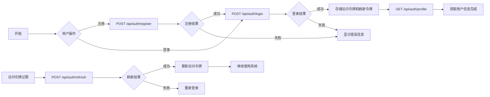

# CloudCAD 核心业务流程图

> 生成时间: 2026-05-02

---

## 目录

1. [用户注册登录链路](#1-用户注册登录链路)
2. [文件上传转换链路](#2-文件上传转换链路)
3. [项目管理链路](#3-项目管理链路)
4. [图纸库管理链路](#4-图纸库管理链路)
5. [版本控制链路](#5-版本控制链路)

---

## 1. 用户注册登录链路

### 链路描述
完整的用户身份认证流程，包括注册、登录、获取用户信息和刷新访问令牌。

### 接口调用顺序



### 接口详细信息

| 序号 | 方法 | 路径 | 说明 | 状态 | 重要性 |
|------|------|------|------|------|--------|
| 1 | POST | /api/auth/register | 用户注册 | ✅ 已使用 | 🔴 核心 |
| 2 | POST | /api/auth/login | 用户登录 | ✅ 已使用 | 🔴 核心 |
| 3 | GET | /api/auth/profile | 获取用户信息 | ✅ 已使用 | 🔴 核心 |
| 4 | POST | /api/auth/refresh | 刷新访问令牌 | ✅ 已使用 | 🔴 核心 |

### 可选增强接口

| 方法 | 路径 | 说明 | 状态 |
|------|------|------|------|
| POST | /api/auth/send-verification | 发送邮箱验证码 | ✅ 已使用 |
| POST | /api/auth/verify-email | 验证邮箱 | ✅ 已使用 |
| POST | /api/auth/send-sms-code | 发送短信验证码 | ✅ 已使用 |
| POST | /api/auth/verify-phone | 验证手机号 | ✅ 已使用 |
| POST | /api/auth/register-phone | 手机号注册 | ✅ 已使用 |
| POST | /api/auth/login-phone | 手机号验证码登录 | ✅ 已使用 |
| GET | /api/auth/wechat/login | 获取微信授权URL | ✅ 已使用 |
| GET | /api/auth/wechat/callback | 微信授权回调 | ✅ 已使用 |
| POST | /api/auth/forgot-password | 忘记密码 | ✅ 已使用 |
| POST | /api/auth/reset-password | 重置密码 | ✅ 已使用 |
| POST | /api/auth/check-field | 检查字段唯一性 | ✅ 已使用 |

### 链路完整度
✅ **完整** - 所有核心接口均已实现并使用。

---

## 2. 文件上传转换链路

### 链路描述
CAD 文件的上传、转换和保存流程，支持分片上传、秒传、文件转换为 mxweb 格式。

### 接口调用顺序

```mermaid
flowchart LR
    A[选择文件] --> B[计算文件哈希]
    B --> C[POST /api/mxcad/files/fileisExist]
    C --> D{文件是否已存在}
    
    D -->|是| E[秒传成功]
    D -->|否| F[开始分片上传]
    
    F --> G{遍历所有分片}
    G --> H[POST /api/mxcad/files/chunkisExist]
    H --> I{分片是否存在}
    
    I -->|是| J[跳过该分片]
    I -->|否| K[POST /api/mxcad/files/uploadFiles]
    K --> L[上传分片]
    
    J --> M{是否最后一个分片}
    L --> M
    
    M -->|否| G
    M -->|是| N{是否上传了新分片}
    
    N -->|否| O[POST /api/mxcad/files/uploadFiles - 合并]
    N -->|是| P[获取 nodeId]
    
    O --> Q[文件转换处理]
    P --> Q
    
    Q --> R[POST /api/mxcad/savemxweb/{nodeId}]
    R --> S[保存完成]
    
    T[编辑中保存] --> U[POST /api/mxcad/savemxweb/{nodeId}]
    U --> V[保存文件]
    V --> W[生成新版本]
```

### 接口详细信息

| 序号 | 方法 | 路径 | 说明 | 状态 | 重要性 |
|------|------|------|------|------|--------|
| 1 | POST | /api/mxcad/files/fileisExist | 检查文件是否存在（秒传） | ✅ 已使用 | 🔴 核心 |
| 2 | POST | /api/mxcad/files/chunkisExist | 检查分片是否存在 | ✅ 已使用 | 🔴 核心 |
| 3 | POST | /api/mxcad/files/uploadFiles | 上传文件分片 | ✅ 已使用 | 🔴 核心 |
| 4 | POST | /api/mxcad/savemxweb/{nodeId} | 保存 mxweb 文件 | ✅ 已使用 | 🔴 核心 |

### 可选增强接口

| 方法 | 路径 | 说明 | 状态 |
|------|------|------|------|
| GET | /api/mxcad/file/{nodeId}/preloading | 获取外部参照预加载数据 | ✅ 已使用 |
| POST | /api/mxcad/file/{nodeId}/check-reference | 检查外部参照文件是否存在 | ✅ 已使用 |
| POST | /api/mxcad/save-as | 另存为 mxweb 文件 | ✅ 已使用 |
| POST | /api/mxcad/up_ext_reference_dwg/{nodeId} | 上传外部参照 DWG | ✅ 已使用 |
| POST | /api/mxcad/up_ext_reference_image | 上传外部参照图片 | ✅ 已使用 |
| GET | /api/mxcad/filesData/*path | 访问 filesData 目录中的文件 | ✅ 已使用 |
| GET | /api/mxcad/file/*path | 访问转换后的 mxweb 文件 | ✅ 已使用 |

### 链路完整度
✅ **完整** - 核心上传、转换、保存流程完整。

---

## 3. 项目管理链路

### 链路描述
项目的创建、列表获取、成员管理和权限检查流程。

### 接口调用顺序

```mermaid
flowchart LR
    A[用户登录] --> B[GET /api/file-system/projects]
    B --> C[显示项目列表]
    
    D[创建新项目] --> E[POST /api/file-system/projects]
    E --> F[项目创建成功]
    F --> G[刷新项目列表]
    
    H[进入项目] --> I[GET /api/file-system/projects/{projectId}/permissions]
    I --> J[获取用户权限]
    J --> K[GET /api/file-system/projects/{projectId}/members]
    K --> L[显示成员列表]
    
    M[添加成员] --> N[POST /api/file-system/projects/{projectId}/members]
    N --> O[添加成功]
    O --> P[刷新成员列表]
    
    Q[更新成员角色] --> R[PATCH /api/file-system/projects/{projectId}/members/{userId}]
    R --> S[更新成功]
    S --> P
    
    T[移除成员] --> U[DELETE /api/file-system/projects/{projectId}/members/{userId}]
    U --> V[移除成功]
    V --> P
    
    W[浏览项目文件] --> X[GET /api/file-system/nodes/{nodeId}/children]
    X --> Y[显示文件列表]
```

### 接口详细信息

| 序号 | 方法 | 路径 | 说明 | 状态 | 重要性 |
|------|------|------|------|------|--------|
| 1 | POST | /api/file-system/projects | 创建项目 | ✅ 已使用 | 🔴 核心 |
| 2 | GET | /api/file-system/projects | 获取项目列表 | ✅ 已使用 | 🔴 核心 |
| 3 | GET | /api/file-system/projects/{projectId}/members | 获取项目成员 | ✅ 已使用 | 🔴 核心 |
| 4 | POST | /api/file-system/projects/{projectId}/members | 添加项目成员 | ✅ 已使用 | 🔴 核心 |
| 5 | GET | /api/file-system/projects/{projectId}/permissions | 获取用户在项目中的权限 | ✅ 已使用 | 🔴 核心 |

### 可选增强接口

| 方法 | 路径 | 说明 | 状态 |
|------|------|------|------|
| GET | /api/file-system/personal-space | 获取当前用户私人空间 | ✅ 已使用 |
| GET | /api/file-system/projects/{projectId} | 获取项目详情 | ✅ 已使用 |
| PATCH | /api/file-system/nodes/{nodeId} | 更新节点 | ✅ 已使用 |
| DELETE | /api/file-system/nodes/{nodeId} | 删除节点 | ✅ 已使用 |
| POST | /api/file-system/nodes/{nodeId}/move | 移动节点 | ✅ 已使用 |
| POST | /api/file-system/nodes/{nodeId}/copy | 复制节点 | ✅ 已使用 |
| GET | /api/file-system/nodes/{nodeId}/thumbnail | 获取文件节点缩略图 | ✅ 已使用 |
| GET | /api/file-system/nodes/{nodeId}/download | 下载节点 | ✅ 已使用 |
| GET | /api/file-system/search | 统一搜索接口 | ✅ 已使用 |
| PATCH | /api/file-system/projects/{projectId}/members/{userId} | 更新项目成员角色 | ✅ 已使用 |
| DELETE | /api/file-system/projects/{projectId}/members/{userId} | 移除项目成员 | ✅ 已使用 |
| GET | /api/file-system/projects/{projectId}/permissions/check | 检查用户是否具有特定权限 | ✅ 已使用 |
| GET | /api/file-system/projects/{projectId}/role | 获取用户在项目中的角色 | ✅ 已使用 |
| GET | /api/roles/project-roles/all | 获取所有项目角色 | ✅ 已使用 |

### 链路完整度
✅ **完整** - 项目创建、成员管理、权限检查流程完整。

---

## 4. 图纸库管理链路

### 链路描述
图纸库的文件上传、保存、移动、复制和删除流程。

### 接口调用顺序

```mermaid
flowchart LR
    A[进入图纸库] --> B[GET /api/library/drawing]
    B --> C[GET /api/library/drawing/children/{nodeId}]
    C --> D[显示图纸库文件列表]
    
    E[上传文件到图纸库] --> F[计算文件哈希]
    F --> G[POST /api/mxcad/files/fileisExist]
    G --> H{文件是否存在}
    H -->|是| I[秒传]
    H -->|否| J[POST /api/mxcad/files/chunkisExist]
    J --> K{分片是否存在}
    K -->|是| L[跳过]
    K -->|否| M[POST /api/mxcad/files/uploadFiles]
    L --> N{是否最后一个分片}
    M --> N
    N -->|否| J
    N -->|是| O[上传完成]
    
    P[编辑后保存] --> Q[POST /api/library/drawing/save/{nodeId}]
    Q --> R[保存覆盖]
    
    S[另存为] --> T[POST /api/library/drawing/save-as]
    T --> U[创建新文件]
    
    V[移动文件] --> W[POST /api/library/drawing/nodes/{nodeId}/move]
    W --> X[刷新列表]
    
    Y[复制文件] --> Z[POST /api/library/drawing/nodes/{nodeId}/copy]
    Z --> X
    
    AA[删除文件] --> AB[DELETE /api/library/drawing/nodes/{nodeId}]
    AB --> X
```

### 接口详细信息

| 序号 | 方法 | 路径 | 说明 | 状态 | 重要性 |
|------|------|------|------|------|--------|
| 1 | GET | /api/library/drawing | 获取图纸库详情 | ✅ 已使用 | 🔴 核心 |
| 2 | GET | /api/library/drawing/children/{nodeId} | 获取图纸库子节点列表 | ✅ 已使用 | 🔴 核心 |
| 3 | POST | /api/library/drawing/save/{nodeId} | 保存图纸到图纸库 | ✅ 已使用 | 🔴 核心 |
| 4 | POST | /api/library/drawing/nodes/{nodeId}/move | 移动图纸库节点 | ✅ 已使用 | 🔴 核心 |
| 5 | POST | /api/library/drawing/nodes/{nodeId}/copy | 复制图纸库节点 | ✅ 已使用 | 🔴 核心 |
| 6 | DELETE | /api/library/drawing/nodes/{nodeId} | 删除图纸库节点 | ✅ 已使用 | 🔴 核心 |

### 可选增强接口

| 方法 | 路径 | 说明 | 状态 |
|------|------|------|------|
| GET | /api/library/drawing/all-files/{nodeId} | 递归获取图纸库节点下的所有文件 | ✅ 已使用 |
| GET | /api/library/drawing/nodes/{nodeId} | 获取图纸库节点详情 | ✅ 已使用 |
| GET | /api/library/drawing/nodes/{nodeId}/thumbnail | 获取图纸库文件缩略图 | ✅ 已使用 |
| GET | /api/library/block | 获取图块库详情 | ✅ 已使用 |
| GET | /api/library/block/children/{nodeId} | 获取图块库子节点列表 | ✅ 已使用 |
| GET | /api/library/block/all-files/{nodeId} | 递归获取图块库节点下的所有文件 | ✅ 已使用 |
| GET | /api/library/block/nodes/{nodeId} | 获取图块库节点详情 | ✅ 已使用 |
| POST | /api/library/drawing/save-as | 另存为图纸到图纸库 | ✅ 已使用 |
| POST | /api/library/block/save/{nodeId} | 保存图块到图块库 | ✅ 已使用 |
| POST | /api/library/block/save-as | 另存为图块到图块库 | ✅ 已使用 |
| POST | /api/library/block/nodes/{nodeId}/move | 移动图块库节点 | ✅ 已使用 |
| POST | /api/library/block/nodes/{nodeId}/copy | 复制图块库节点 | ✅ 已使用 |
| DELETE | /api/library/block/nodes/{nodeId} | 删除图块库节点 | ✅ 已使用 |

### 链路完整度
✅ **完整** - 图纸库的上传、保存、移动、复制、删除流程完整。

---

## 5. 版本控制链路

### 链路描述
获取文件历史版本和查看特定版本文件内容的流程。

### 接口调用顺序

```mermaid
flowchart LR
    A[打开文件] --> B[点击版本历史]
    B --> C[GET /api/version-control/history]
    C --> D[显示版本列表]
    
    D --> E[选择某个版本]
    E --> F[GET /api/version-control/file/{revision}]
    F --> G[获取文件内容]
    G --> H[显示该版本内容]
    
    I[对比版本] --> J[选择两个版本]
    J --> K[分别获取两个版本内容]
    K --> L[进行版本对比]
```

### 接口详细信息

| 序号 | 方法 | 路径 | 说明 | 状态 | 重要性 |
|------|------|------|------|------|--------|
| 1 | GET | /api/version-control/history | 获取文件的 SVN 提交历史 | ✅ 已使用 | 🔴 核心 |
| 2 | GET | /api/version-control/file/{revision} | 获取指定版本的文件内容 | ✅ 已使用 | 🔴 核心 |

### 可选增强接口
暂无非核心增强接口。

### 链路完整度
✅ **完整** - 版本历史获取和文件内容查看流程完整。

---

## 总结

| 业务链路 | 完整度 | 核心接口数 | 增强接口数 |
|----------|--------|------------|------------|
| 用户注册登录链路 | ✅ 完整 | 4 | 11 |
| 文件上传转换链路 | ✅ 完整 | 4 | 7 |
| 项目管理链路 | ✅ 完整 | 5 | 13 |
| 图纸库管理链路 | ✅ 完整 | 6 | 10 |
| 版本控制链路 | ✅ 完整 | 2 | 0 |

**总体评价**: 所有核心业务链路均已完整实现，接口使用状态良好。
