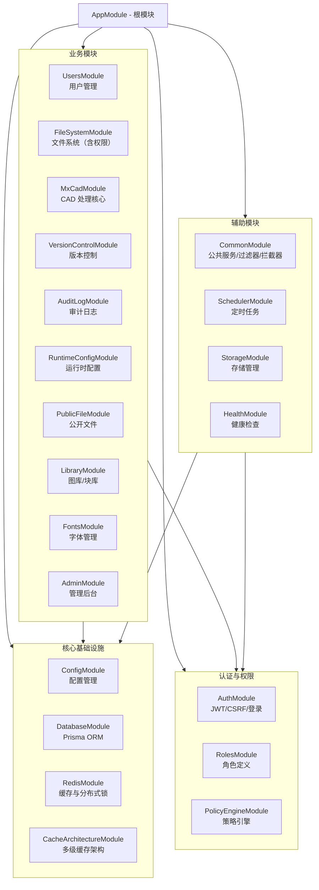
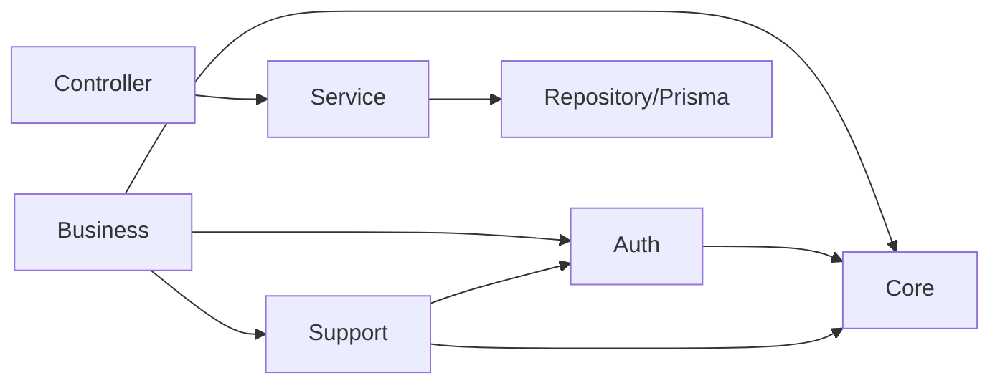
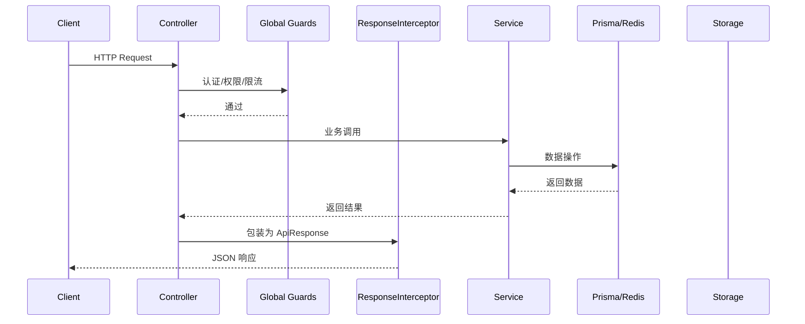

# 后端模块依赖关系

## 概述

CloudCAD 后端基于 NestJS 框架构建，采用模块化设计。核心模块通过 `AppModule` 统一导入，形成清晰的依赖层级。

## 模块依赖图



## 核心模块详解

### 1. 基础设施层

| 模块 | 职责 | 关键依赖 |
|------|------|----------|
| `DatabaseModule` | Prisma client 管理、数据库连接 | PostgreSQL 15 |
| `RedisModule` | Redis client、分布式锁、会话存储 | Redis 7 |
| `CacheArchitectureModule` | 本地缓存(LRU) + Redis 多级缓存 | RedisModule |
| `ConfigModule` | 环境变量与配置文件加载 | dotenv |

### 2. 认证与权限层

| 模块 | 职责 | 关键特性 |
|------|------|----------|
| `AuthModule` | 登录/注册、JWT 令牌、CSRF 保护、会话管理 | 支持手机/邮箱登录 |
| `RolesModule` | 角色定义、角色继承 | RBAC 基础 |
| `PolicyEngineModule` | 权限策略评估、动态授权 | 支持系统权限 + 项目权限 |

**权限校验流程**：
- `JwtStrategyExecutor` (全局 Guard) → 解析 token 并注入用户
- `PermissionsGuard` (配合 `@RequirePermissions`) → 系统权限校验
- `ProjectPermissionsGuard` (配合 `@RequireProjectPermission`) → 项目级权限校验
- `CsrfGuard` → CSRF token 验证

### 3. 业务模块

#### 3.1 `FileSystemModule`

最复杂的业务模块，内部拆分为多个子模块：

```
FileSystemModule
├── file-tree/        # 文件树管理
├── file-permission/  # 文件级权限
├── file-validation/  # 文件验证（大小/类型）
├── file-hash/        # 文件指纹（去重）
├── file-download/    # 下载服务
├── storage-quota/    # 存储配额
├── search/           # 文件搜索
├── project-member/   # 项目成员管理
└── file-operations/  # CRUD 操作（独立模块）
```

#### 3.2 `MxCadModule`

CAD 引擎相关功能，拆分为多个子模块：

```
MxCadModule
├── core/          # 核心 CAD 操作（打开/保存/编辑）
├── conversion/    # 格式转换（DWG/DXF → 内部格式）
├── save/          # 保存逻辑
├── upload/        # 上传处理
├── infra/         # 基础设施（缩略图生成）
├── node/          # Node.js 底层绑定
├── tus/           # TUS 断点续传
└── external-ref/  # 外部参照处理
```

#### 3.3 其他业务模块

| 模块 | 职责 |
|------|------|
| `UsersModule` | 用户信息管理、密码重置 |
| `VersionControlModule` | SVN 集成、版本历史、回滚 |
| `AuditLogModule` | 操作审计日志 |
| `RuntimeConfigModule` | 动态配置（不重启生效） |
| `PublicFileModule` | 匿名公开文件访问 |
| `LibraryModule` | 企业图库/块库管理 |
| `FontsModule` | CAD 字体库管理 |
| `AdminModule` | 管理员操作接口 |

### 4. 辅助模块

| 模块 | 职责 |
|------|------|
| `CommonModule` | 全局异常过滤器、响应拦截器、验证管道、限流 Guard、公共服务 |
| `SchedulerModule` | 定时任务（缓存清理、存储清理、用户清理） |
| `StorageModule` | 底层存储抽象（本地/MinIO/OSS） |
| `HealthModule` | 健康检查端点 |

## 模块依赖规则

### 允许的依赖方向



### 禁止的循环依赖

- `FileSystemModule` 与 `VersionControlModule` 之间存在相互调用 → 已通过 `VersionControlService` 注入 `FileSystemService` 单向依赖解决
- `AuthModule` 与 `UsersModule` 循环已通过 `forwardRef()` 解决

## 全局 Guards / Interceptors / Pipes

在 `AppModule` 中注册的顺序（影响执行顺序）：

```typescript
providers: [
  { provide: APP_FILTER, useClass: GlobalExceptionFilter },      // 1. 异常捕获
  { provide: APP_FILTER, useClass: PrismaExceptionFilter },      // 2. Prisma 异常
  { provide: APP_INTERCEPTOR, useClass: ResponseInterceptor },   // 3. 响应包装
  { provide: APP_PIPE, useClass: CustomValidationPipe },         // 4. 参数验证
  { provide: APP_GUARD, useClass: RateLimitGuard },              // 5. 限流
  { provide: APP_GUARD, useClass: JwtStrategyExecutor },         // 6. JWT 认证
  { provide: APP_GUARD, useClass: CsrfGuard },                   // 7. CSRF 防护
]
```

## 控制器列表（21个）

| 控制器路径 | 所属模块 |
|-----------|----------|
| `/api/auth` | AuthModule |
| `/api/session` | AuthModule |
| `/api/users` | UsersModule |
| `/api/roles` | RolesModule |
| `/api/file-system` | FileSystemModule |
| `/api/version-control` | VersionControlModule |
| `/api/mxcad` | MxCadModule |
| `/api/save` | MxCadSaveModule |
| `/api/thumbnail` | MxCadInfraModule |
| `/api/policy-config` | PolicyEngineModule |
| `/api/runtime-config` | RuntimeConfigModule |
| `/api/public-file` | PublicFileModule |
| `/api/library` | LibraryModule |
| `/api/fonts` | FontsModule |
| `/api/admin` | AdminModule |
| `/api/audit-log` | AuditLogModule |
| `/api/cache-monitor` | CacheArchitectureModule |
| `/api/health` | HealthModule |
| `/api/user-cleanup` | CommonModule |

## 数据流示意



## 常见问题

### NestJS DI 注意事项

❌ **错误用法**（会破坏 DI 元数据）：
```typescript
import type { SomeService } from './some.service';
```

✅ **正确用法**：
```typescript
import { SomeService } from './some.service';
```

Biome 的 `organizeImports` 可能自动将普通 import 转换为 `import type`，需要在运行后手动检查。

### 模块导出

每个业务模块应导出其公共 Service，供其他模块使用：

```typescript
@Module({
  imports: [...],
  providers: [FileSystemService],
  exports: [FileSystemService],  // 重要：允许其他模块注入
})
export class FileSystemModule {}
```