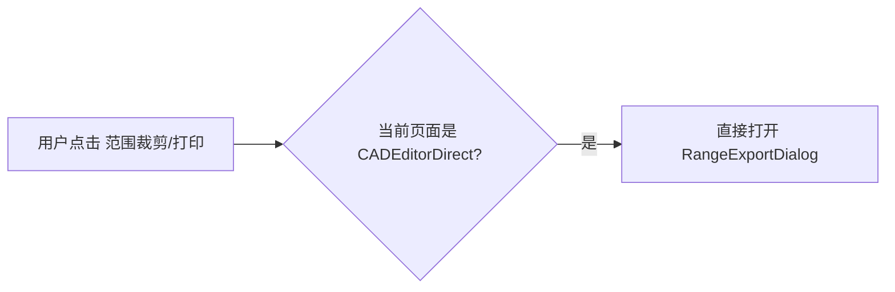

# 统一范围导出功能 — 完整设计文档

> 目标：将下载、打印、剪切合并为一个统一的范围导出功能。
> 所有参数对所有格式适用，一个对话框解决所有区域选择→格式转换的需求。
> 不新建后端接口，增强现有 `download-with-format` API。

---

## 一、参考材料

### 1.1 MxCAD 转换文档

**URL:** https://help.mxdraw.com/mxcad_docs/zh/docs/8.RelatedArticles/1.IntroductionGuide/3.Drawing%20Conversion%20Function%20Usage%20Guide.html

**核心程序：** `mxcadassembly.exe`（位于 MxDrawCloudServer/Bin/MxCAD/）

#### 1.1.1 转换命令汇总

| 命令 | cmd 值 | 输入格式 | 输出格式 | 核心参数 |
|------|--------|---------|---------|---------|
| 默认转换 | 无 | dwg/dxf/mxweb | mxweb | `srcpath`, `outname`(无后缀则默认.mxweb) |
| 互转 | 无 | dwg↔dxf, mxweb↔dwg, mxweb↔dxf | 由outname后缀决定 | `srcpath`, `outname`(必须带后缀) |
| 指定范围裁剪 | `cut_dwg` | dwg/mxweb | dwg | `bd_pt1_x/y`, `bd_pt2_x/y`, `srcpath`, `outname`(.dwg) |
| 指定范围输出PDF | `print_to_pdf` | dwg/mxweb | pdf | `bd_pt1_x/y`, `bd_pt2_x/y`, `width`, `height`, `colorPolicy`, `srcpath`, `outname`(.pdf) |
| 全图转PDF | 无(或print_to_pdf无坐标) | dwg/mxweb | pdf | `width`, `height`, `colorPolicy`, `srcpath`, `outname`(.pdf) |
| DWG转JPG | `cadtojpg`(不同接口) | dwg | jpg | 通过 `/users/tools` 接口，参数拼接字符串 |

#### 1.1.2 参数完整说明

| 参数 | 类型 | 适用 | 说明 |
|------|------|------|------|
| `srcpath` | string | 全部 | 源文件绝对路径，支持 `.dwg` `.dxf` `.mxweb` |
| `outname` | string | 全部 | **后缀决定目标格式**：`.dwg` `.dxf` `.pdf` `.mxweb` |
| `outpath` | string | 全部 | 输出目录（可选，默认源文件同级目录） |
| `cmd` | string | cut_dwg, print_to_pdf | 命令类型，无 cmd 走默认转换 |
| `bd_pt1_x` | string | cut_dwg, print_to_pdf | 范围角点1 X 坐标 |
| `bd_pt1_y` | string | cut_dwg, print_to_pdf | 范围角点1 Y 坐标 |
| `bd_pt2_x` | string | cut_dwg, print_to_pdf | 范围角点2 X 坐标 |
| `bd_pt2_y` | string | cut_dwg, print_to_pdf | 范围角点2 Y 坐标 |
| `width` | string | print_to_pdf, 全图PDF | PDF 宽度（像素），如 "2100" |
| `height` | string | print_to_pdf, 全图PDF | PDF 高度（像素），如 "2970" |
| `colorPolicy` | string | print_to_pdf, 全图PDF | `"mono"`(黑白) / 不填/`"color"`(彩色) |
| `compression` | number | 默认转换 | `0`=不压缩，不填=压缩 |
| `create_preloading_data` | boolean | 默认转换 | 是否创建预加载 JSON |
| `exportLayout` | string | print_to_pdf | `"false"`=不导出布局空间 |
| `src_file_md5` | string | 全部 | 源文件 MD5 哈希 |
| `roate_angle` | number | print(代码中) | 旋转角度，默认 0 |
| `view_angle` | number | print(代码中) | 视图角度 |
| `open_file_md5` | string | print(代码中) | 当前打开文件的 MD5 |
| `layout_name` | string | print(代码中) | 布局名称（非模型空间时） |
| `create_clip_block` | boolean | print(代码中) | 是否创建裁剪块 |

#### 1.1.3 关键规则

1. **MXWEB 作为中间格式**：所有命令的 `srcpath` 都可以指向 `.mxweb` 文件，参数完全不变
2. **`outname` 后缀决定一切**：
   - `outname: "test.pdf"` → PDF 输出
   - `outname: "test.dwg"` → DWG 输出
   - `outname: "test.dxf"` → DXF 输出
   - `outname: "test.mxweb"` 或不带后缀 → MXWEB 输出
3. **无坐标 + 无 cmd** = 整图默认转换
4. **有坐标 + cmd='print_to_pdf'** = 范围 PDF
5. **有坐标 + cmd='cut_dwg'** = 范围裁剪（输出格式由 outname 后缀决定）
6. **参数全字符串**：所有数值参数均以字符串形式传递

#### 1.1.4 完整示例对照

```json
// 默认转换：DWG→MXWEB
{"srcpath":"C:/test/1.dwg","outname":"1.mxweb"}

// 互转：MXWEB→DWG
{"srcpath":"C:/test/1.mxweb","outname":"1.dwg"}

// 互转：MXWEB→DXF
{"srcpath":"C:/test/1.mxweb","outname":"1.dxf"}

// 范围裁剪：DWG→裁剪DWG
{"cmd":"cut_dwg","bd_pt1_x":"1000","bd_pt1_y":"1200","bd_pt2_x":"1400","bd_pt2_y":"1400","srcpath":"1.dwg","outname":"cut.dwg"}

// 范围PDF：DWG→范围PDF
{"cmd":"print_to_pdf","width":"2100","height":"2970","bd_pt1_x":"1000","bd_pt1_y":"1200","bd_pt2_x":"1400","bd_pt2_y":"1400","srcpath":"1.dwg","outname":"print.pdf","colorPolicy":"mono"}
```

---

### 1.2 参考代码 A — 打印对话框

**来源:** `MxPrint.vue`（组件模板）+ `useMxPrint.ts`（逻辑 composable）

#### 1.2.1 打印状态变量

| 变量名 | 类型 | 默认值 | 说明 |
|--------|------|--------|------|
| `dialog.isShow` | Ref\<boolean> | false | 打印对话框是否显示 |
| `batchPrintingDialog.isShow` | Ref\<boolean> | false | 批处理对话框是否显示 |
| `isDrawingBoundary` | Ref\<boolean\|null> | true | true=图纸界限, false=显示区域, null=自定义 |
| `lowerLeftCornerCoordinateX` | Ref\<number> | 0 | 左下角 X |
| `lowerLeftCornerCoordinateY` | Ref\<number> | 0 | 左下角 Y |
| `upperRightCornerCoordinateX` | Ref\<number> | 0 | 右上角 X |
| `upperRightCornerCoordinateY` | Ref\<number> | 0 | 右上角 Y |
| `sheetSizes` | const array | ["A1","A2","A3","A4","自定义16.55x23.90"] | 可选纸张 |
| `sheetSize` | Ref | "A4" | 当前纸张 |
| `paperOrientations` | const array | ["横向","纵向"] | 可选方向 |
| `paperOrientation` | Ref | "横向" | 当前方向 |
| `printParameterMillimeter` | Ref\<number> | 1 | 毫米值（比例分子） |
| `printParametersCADDrawingUnits` | Ref\<number> | 1 | CAD绘图单位（比例分母） |
| `isBlackAndWhitePrinting` | Ref\<boolean> | true | 黑白打印开关 |
| `scopeHistory` | MxScope[] | [] | 范围历史栈 |
| `currentScope` | MxScope | — | 当前范围 |
| `framesRectBoxArr` | [MxDbText, MxDbRect][] | [] | CAD上的红框标记数组 |
| `frameIndexArr` | Ref\<{name, index}[]> | [] | 帧名称列表 |
| `frames` | (FrameInfo\|null)[] | [] | 帧数据 |

#### 1.2.2 `getSize()` — 纸张尺寸映射

```typescript
switch (sheetSize.value) {
  case "A1": return { w: 594, h: 841 };
  case "A2": return { w: 420, h: 594 };
  case "A3": return { w: 297, h: 420 };
  case "A4": return { w: 210, h: 297 };
  case "自定义16.55x23.90": return { w: 165.5, h: 239, nw: 130, nh: 190 };
}
// nw/nh 是自定义纸张的内边距参考线（用于固定图纸大小选择的虚线显示）
```

#### 1.2.3 核心数学函数

**`calculateScaleToFitMaintainingAspectRatio(rectBWidth, rectBHeight, pt1, pt2)`**
- 目的：计算图纸尺寸适配用户选择范围的缩放比例
- 逻辑：比较 `rectBWidth/newWidth` 和 `rectBHeight/newHeight`，取较小的比例
- 返回值：缩放因子（number）

**`adjustPointsToFitWithAspectRatio(rectBWidth, rectBHeight, pt1, pt2, newScaleFactor)`**
- 目的：按新缩放因子重新计算两个角点坐标（保持中心不变）
- 逻辑：`scaledW = rectBWidth * scale`, `centerX = (pt1.x+pt2.x)/2`，然后从中心扩展
- 返回值：`[adjustedPt1, adjustedPt2]`

**`calculateOppositeCornerAutoScaleBasedOnPts(rectBWidth, rectBHeight, pt1, pt2)`**
- 目的：固定比例选择时，根据 pt1 和鼠标位置自动计算 pt2 以保持纸张比例
- 逻辑：比较 newWidth/newHeight，取较大的作为基准维度，计算比例后生成 pt2
- 返回值：调整后的 pt2

#### 1.2.4 `keepDecimal(value, decimals)` — 保留小数位

来源：`@/utils/math/number`
将所有坐标值保留 4 位小数。

#### 1.2.5 `update(pt1, pt2)` — 核心更新函数

```typescript
const update = (pt1, pt2) => {
  oldPt1 = pt1; oldPt2 = pt2;
  let { w, h, nw, nh } = getSize();
  // 横向时交换 w/h
  if (paperOrientation === "横向") { [w, h] = [h, w]; [nw, nh] = [nh, nw]; }
  // 保存旧范围到历史
  if (currentScope) scopeHistory.push(currentScope);
  // 计算比例
  const scaleFactor = calculateScaleToFitMaintainingAspectRatio(w, h, pt1, pt2);
  oScale = scaleFactor;
  printParametersCADDrawingUnits = printParameterMillimeter * scaleFactor;
  // 保存当前范围
  currentScope = { pt1, pt2, w, h, size, paperOrientation, mm, cadUnits, isDrawingBoundary };
  // 更新四个坐标输入框
  lowerLeftX = keepDecimal(pt1.x, 4);
  lowerLeftY = keepDecimal(pt1.y, 4);
  upperRightX = keepDecimal(pt2.x, 4);
  upperRightY = keepDecimal(pt2.y, 4);
};
```

**重要细节 — 横向交换 w/h：**
- 选择"横向"时，纸张的宽高互换
- 自定义纸张的 nw/nh 也同步互换
- 这将影响固定比例选择和固定大小选择的行为

**重要细节 — 纸张/比例联动：**
- `updateSize()`：纸张变化 → `calculateScaleToFitMaintainingAspectRatio` → 更新 `cadUnits` → `updatePrintParameters`
- `updatePrintParameters()`：比例变化 → `adjustPointsToFitWithAspectRatio` → 更新坐标 → 更新 currentScope
- 变化小于 0.000001 时跳过（防抖动）
- 用 `keepDecimal(x, 4)` 保留 4 位小数

#### 1.2.6 `updateDrawingBoundary()` — 图纸界限/显示区域切换

```typescript
if (typeof isDrawingBoundary === "boolean") {
  isDrawingBoundary ? updateDrawingBounds() : updateCurrentlyDisplayedBounds();
}
```

- `updateDrawingBounds()`：`currentSpace.getBoundingBox()` → `update(minPt, maxPt)`
- `updateCurrentlyDisplayedBounds()`：`getViewCADCoord()` 的 pt1/pt3 → `update(pt1, pt3)`

#### 1.2.7 `callLastTimeScopeHistory()` — 恢复上次范围

```typescript
const scope = scopeHistory.pop();
if (!scope) return error("没有历史记录");
// 恢复所有状态
currentScope = scope;
lowerLeftX/Y = scope.pt1.x/y;
upperRightX/Y = scope.pt2.x/y;
sheetSize = scope.size;
paperOrientation = scope.paperOrientation;
printParameterMillimeter = scope.mm;
printParametersCADDrawingUnits = scope.cadUnits;
isDrawingBoundary = scope.isDrawingBoundary;
```

#### 1.2.8 `callFreeChoiceOfRange()` — 自由选择

关键实现细节：
1. 关闭对话框 → 创建 `MxCADUiPrPointTransform`（带视图旋转矩阵补偿）
2. 第一步：选 pt1（禁用正交追踪，清除上次输入点）
3. 第二步：选 pt2（带 `setUserDraw` 动态绘制）
4. **动态绘制逻辑**：
   - 红色矩形边框（`McDbPolyline` 从 pt1 到 pt2 的对角线矩形，线宽=2px）
   - 半透明蓝色填充（`worldDraw.drawSolid(points, 0.5)`）
5. 设置 `DynamicInputType.kXYCoordInput`（显示 XY 坐标输入）
6. 选完后 `pt1.transformBy(rmat)`，`pt2.transformBy(rmat)`（旋转补偿）
7. 调用 `update(pt1, pt2)` → 设置 `isDrawingBoundary = null` → 重新打开对话框

#### 1.2.9 `callFixedProportionalSelection()` — 固定比例选择

关键实现细节：
1. 获取当前纸张尺寸 w/h/nw/nh 并按比例缩放（`scale = cadUnits/mm`）
2. 横向时交换 w/h
3. 第一步：选 pt1（`disableAllTrace` 禁用所有追踪）
4. 第二步：选 pt2 时，每次鼠标移动调用 `calculateOppositeCornerAutoScaleBasedOnPts` 自动计算对角点
5. **动态绘制逻辑**：使用计算后的 pt2 绘制矩形（同自由选择）
6. 关键区别：用户鼠标移动时，矩形保持纸张比例（不随鼠标自由变形）
7. `disableOsnap(true)` + `disableOrthoTrace(true)` 防止干扰

#### 1.2.10 `callFixedDrawingSizeSelection()` — 固定图纸大小选择

关键实现细节：
1. 获取缩放后的纸张尺寸
2. 横向时交换 w/h
3. 用户点击一个点作为**中心**
4. **动态绘制逻辑**：
   - 红色矩形（从中心点按 w/h 扩展）
   - 如果有 nw/nh（自定义纸张），绘制**白色虚线内框**（`MxThreeJS.createDashedLines`，线宽 3px，间隔 6px）
5. 点击后：`pt1 = center`, `pt2 = center + (w, h)`
6. 调用 `update(pt1, pt2)`

#### 1.2.11 `runPrint(pt1, pt2, w, h, isNoPint)` — 执行打印（Web 分支）

```typescript
// 构建参数（代码中的 param 对象）
{
  width: String(w),           // PDF 像素宽度
  height: String(h),          // PDF 像素高度
  roate_angle: "0",
  view_angle: mxcad.mxdraw.getViewAngle(),
  bd_pt1_x: String(pt1.x),
  bd_pt1_y: String(pt1.y),
  bd_pt2_x: String(pt2.x),
  bd_pt2_y: String(pt2.y),
  colorPolicy: isBlackAndWhite ? 'mono' : 'default',
  open_file_md5: mxcad.getCurrentOpenFileMd5(),
}

// 非模型空间时添加
if (!mxcad.database.isCurrentModelSpace) {
  param.layout_name = mxcad.getCurrentLayout();
  param.create_clip_block = false;
}

// Web 流程：saveFileToUrl
MxCpp.getCurrentMxCAD().saveFileToUrl(
  printPdfUrl,    // 服务器转换 URL
  callback,       // 回调处理返回结果
  undefined,
  JSON.stringify(param)
);

// 回调处理：
// 成功 → 解析返回的 filePath
//   isNoPint=true → 返回 filePath（上层做下载）
//   isNoPint=false → print-js 打开打印对话框
// 失败 → 错误提示
```

**重要细节 — 全屏处理：**
- 调用 `isFullscreen()` 检查是否全屏
- 如果是全屏，先调用 `MxFullScreen` 退出全屏再打印
- 打印完成后恢复全屏

**重要细节 — `print-js` 的使用：**
```javascript
print({
  printable: url,       // PDF 的 blob URL
  type: "pdf",
  onPrintDialogClose() {
    URL.revokeObjectURL(url);  // 打印完成后释放 blob URL
  }
});
```

#### 1.2.12 `callPrint(isNoPint)` — 统一打印入口

```typescript
const { pt1, pt2, w, h } = currentScope || updateDrawingBounds();
runPrint(pt1, pt2, w, h, isNoPint);
dialog.isShow = false;
```

- `isNoPint=false` → 打开浏览器打印对话框（`print-js`）
- `isNoPint=true` → 直接生成 PDF 文件（下载/保存）

#### 1.2.13 帧识别相关（打印代码版本）

**`createRectBox(minPt, maxPt, color)`**
```typescript
const rect = new MxDbRect();
rect.pt1 = minPt.toVector3();
rect.pt2 = maxPt.toVector3();
rect.setLineWidth(10);
rect.color = color || 0xff0000;
rect.top();  // 置顶显示
return rect;
```

**`frameRecognition()`**（打印代码版）
1. 关闭主对话框和批处理对话框
2. 调用 `identificationFrame()`（默认 polyline 方法，最外层）
3. 生成 `frameIndexArr = frames.map((_, index) => ({ name: '图框' + index, index }))`
4. 遍历帧，在 CAD 上绘制：
   - `MxDbRect` 红色框（线宽 10）
   - `MxDbText` 编号文字（红色，字号 = 边框对角线长度 * 0.5，居中）
   - `mxcad.getMxDrawObject().addMxEntity(entity)`
5. 打开批处理对话框

**`removeFramesRectBoxArr()`**
- 遍历 `framesRectBoxArr`，`eraseMxEntity(text.objectId())` + `eraseMxEntity(box.objectId())`
- `mxcad.updateDisplay()` 刷新显示
- 清空 frames / frameIndexArr

**`removeFrame(index)`**
- 删除单个帧的 text 和 box 实体
- `frames.splice(index, 1)` / `framesRectBoxArr.splice(index, 1)` / `frameIndexArr.value.splice(index, 1)`

**`positioningFrame(index)`**
```typescript
const offset = minPt.distanceTo(maxPt) * 0.1;  // 10% 边距
maxPt = maxPt.clone();
minPt = minPt.clone();
minPt.x -= offset; minPt.y -= offset;
maxPt.x += offset; maxPt.y += offset;
mxcad.zoomW(minPt, maxPt);
```

**`universalBatchPrinting()`**
```typescript
let { w, h } = getSize();
for (let index = 0; index < frames.length; index++) {
  const { minPt, maxPt } = frames[index];
  const path = await runPrint(minPt, maxPt, w, h, true);  // isNoPint=true
  path && downloadFile(path, frameIndexArr[index].name);
}
batchPrintingDialog.isShow = false;
```

**`downloadFile(url, fileName)`**
```typescript
var element = document.createElement('a');
element.setAttribute('href', url);
element.setAttribute('download', fileName);
document.body.appendChild(element);
element.click();
document.body.removeChild(element);
```

#### 1.2.14 打印对话框组件 UI 结构

```
<MxDialog title="打印" v-model="isShow" max-width="600">
  <v-row align="stretch">
    <v-col cols="6">
      <MxFieldset title="打印区域">
        <v-radio-group v-model="isDrawingBoundary">
          <v-radio value=true label="图纸界限" />
          <v-radio value=false label="显示区域" />
        </v-radio-group>
        <div class="d-flex flex-column">
          <MxDialogBtn @click="callLastTimeScopeHistory">上次范围</MxDialogBtn>
          <MxDialogBtn @click="callFreeChoiceOfRange">自由选择</MxDialogBtn>
          <MxDialogBtn @click="callFixedProportionalSelection">固定比例选择</MxDialogBtn>
          <MxDialogBtn @click="callFixedDrawingSizeSelection">固定图纸大小选择</MxDialogBtn>
          <MxDialogBtn @click="frameRecognition">图框识别批量打印</MxDialogBtn>
        </div>
        <v-text-field v-model="lowerLeftX" prepend="左下角坐标X:" type="number" />
        <v-text-field v-model="lowerLeftY" prepend="左下角坐标Y:" type="number" />
        <v-text-field v-model="upperRightX" prepend="右上角坐标X:" type="number" />
        <v-text-field v-model="upperRightY" prepend="右上角坐标Y:" type="number" />
      </MxFieldset>
    </v-col>
    <v-col cols="6">
      <MxFieldset title="图纸尺寸">
        <v-select v-model="sheetSize" :items="sheetSizes" prepend="图纸大小:" />
        <v-select v-model="paperOrientation" :items="paperOrientations" prepend="图纸方向:" />
      </MxFieldset>
      <MxFieldset title="打印参数">
        <v-text-field v-model.lazy="printParameterMillimeter" append="毫米" type="number" />
        <span>=</span>
        <v-text-field v-model.lazy="printParametersCADDrawingUnits" append="CAD绘图单位" type="number" />
        <v-checkbox v-model="isBlackAndWhitePrinting" label="黑白打印" />
      </MxFieldset>
    </v-col>
  </v-row>
</MxDialog>

<!-- 按钮 -->
<v-btn @click="callPrint(false)">打印</v-btn>
<v-btn @click="callPrint(true)">生成打印PDF</v-btn>
<v-btn @click="showDialog(false)">取消</v-btn>

<!-- 批处理子对话框 -->
<MxDialog title="图框识别批量打印" v-model="batchPrintingDialog.isShow">
  <v-table>
    <thead><tr><th>pdf名称</th><th>操作</th></tr></thead>
    <tbody>
      <tr v-for="(item, index) in frameIndexArr">
        <td><input v-model="item.name" /></td>
        <td>
          <v-btn @click="removeFrame(index)">删除</v-btn>
          <v-btn @click="framePrint(index)">打印</v-btn>
          <v-btn @click="positioningFrame(index)">定位</v-btn>
        </td>
      </tr>
    </tbody>
  </v-table>
</MxDialog>
```

---

### 1.3 参考代码 B — DWG 剪切对话框

**来源:** 单个 `.vue` 文件（含所有逻辑 + 模板 + 样式）

#### 1.3.1 剪切状态变量

| 变量名 | 类型 | 默认值 | 说明 |
|--------|------|--------|------|
| `cutMethod` | ref | `'manual'` | 剪切方式: manual/polyline/block |
| `blockName` | ref | `''` | 图块名称（手动输入或点选获取） |
| `selectedLayer` | ref | `''` | 图层名称 |
| `isFullGraphMatching` | ref | false | 全图匹配模式（不对范围做限制） |
| `levelDepth` | ref\<number> | 0 | 层级深度 |
| `isMultiSelectMode` | ref | false | 多选模式开关 |
| `cutBoxList` | ref\<CutBox[]> | [] | 剪切区域列表 |
| `saveDirPath` | ref | `''` | Electron 存储路径 |
| `isScroll` | ref | false | 自动滚动到底部 |
| `isExporting` | computed | — | 是否有正在导出的项 |

#### 1.3.2 数据接口

```typescript
interface BoxParam {
  bd_pt1_x: string;
  bd_pt1_y: string;
  bd_pt2_x: string;
  bd_pt2_y: string;
}

interface CutBox {
  imgBase64: string;                    // 缩略图 data URL
  param: BoxParam;                      // 坐标参数
  exportStatus: 'ready' | 'exporting' | 'success' | 'error';
  fileName?: string;                    // 导出后的文件名
  selected?: boolean;                   // 多选模式下选中状态
}
```

#### 1.3.3 `expandFrameBoundary(frame, expandFactor = 1)` — 边界扩展

```typescript
function expandFrameBoundary(frame: { minPt, maxPt }, expandFactor = 1) {
  const expandX = expandFactor;    // X 方向扩展量（CAD 单位）
  const expandY = expandFactor;    // Y 方向扩展量
  return {
    minPt: new McGePoint3d(frame.minPt.x - expandX, frame.minPt.y - expandY, frame.minPt.z),
    maxPt: new McGePoint3d(frame.maxPt.x + expandX, frame.maxPt.y + expandY, frame.maxPt.z),
  };
}
```

**用途：** 所有区域选择后都经过扩展，确保图框线被完整包含。

#### 1.3.4 `getFrameImage(minPt, maxPt)` — 缩略图截图

```typescript
async function getFrameImage(minPt, maxPt) {
  let mxcad = MxCpp.getCurrentMxCAD();
  mxcad.setAttribute({ ShowCoordinate: false });  // 隐藏坐标显示
  let w = Math.abs(minPt.x - maxPt.x);
  let h = Math.abs(minPt.y - maxPt.y);

  if (w < 1 || h < 1) return undefined;

  const targetWidth = 800;    // 固定宽度 800px
  let jpg_width, jpg_height;

  if (w <= targetWidth) {
    jpg_width = w;
    jpg_height = h;
  } else {
    jpg_width = targetWidth;
    jpg_height = targetWidth * (h / w);   // 按比例计算高度
  }

  return new Promise((resolve) => {
    mxcad.mxdraw.createCanvasImageData(
      (imageData) => {
        resolve(imageData);               // data URL
        mxcad.setAttribute({ ShowCoordinate: true });  // 恢复坐标显示
      },
      {
        width: jpg_width,                 // 图片宽度
        height: jpg_height,               // 图片高度
        range_pt1: minPt.toVector3(),     // 截图范围角点1
        range_pt2: maxPt.toVector3(),     // 截图范围角点2
      }
    );
  });
}
```

**关键细节：**
- 截图前隐藏坐标、截图后恢复
- 宽度小于 1 单位返回 undefined（太小的区域不截图）
- 固定宽度 800，按原始比例算高度
- 使用 `range_pt1/range_pt2` 指定截图范围（3D Vector 格式）

#### 1.3.5 `isDuplicateCutBox(param)` — 坐标去重

```typescript
function isDuplicateCutBox(param: BoxParam): boolean {
  const epsilon = 0.001;  // 浮点误差容忍度
  return cutBoxList.value.some(box => {
    const x1Same = Math.abs(parseFloat(box.param.bd_pt1_x) - parseFloat(param.bd_pt1_x)) < epsilon;
    const y1Same = Math.abs(parseFloat(box.param.bd_pt1_y) - parseFloat(param.bd_pt1_y)) < epsilon;
    const x2Same = Math.abs(parseFloat(box.param.bd_pt2_x) - parseFloat(param.bd_pt2_x)) < epsilon;
    const y2Same = Math.abs(parseFloat(box.param.bd_pt2_y) - parseFloat(param.bd_pt2_y)) < epsilon;
    return x1Same && y1Same && x2Same && y2Same;
  });
}
```

#### 1.3.6 `addCutBoxWithDeduplication(imgBase64, param)` — 添加+去重

```typescript
function addCutBoxWithDeduplication(imgBase64: string, param: BoxParam): void {
  if (isDuplicateCutBox(param)) {
    useMessage().info("已过滤重复的剪切区域");
    return;
  }
  cutBoxList.value.push({
    imgBase64,
    param,
    exportStatus: 'ready',
    selected: false,
  });
  isScroll.value = true;  // 自动滚到底部
}
```

#### 1.3.7 `manualSelect()` — 手动框选

1. `MxCADUiPrPoint` 选 pt1（禁用追踪）
2. 选 pt2 时动态绘制红色矩形 + 半透明填充（同打印代码）
3. 计算原始边界框（`minPt` = 取 pt1/pt2 的 min, `maxPt` = 取 max）
4. 调用 `expandFrameBoundary(originalFrame)` 扩展边界
5. 调用 `getFrameImage(minPt, maxPt)` 截图
6. 调用 `addCutBoxWithDeduplication(imgBase64, param)` 添加

**与打印代码手动选择的区别：**
- 打印用 `MxCADUiPrPointTransform`（带旋转矩阵补偿），剪切用 `MxCADUiPrPoint`（无旋转补偿）
- 打印的 isNoPint 模式直接走 PDF，剪切走 cut_dwg

#### 1.3.8 `frameRecognition()` — 多段线图框识别

```typescript
const frames = await identificationFrame({
  method: 'polyline',
  isSpecifiedRange: !isFullGraphMatching.value,  // 全图匹配时不需要用户指定范围
  layerName: selectedLayer.value || undefined,
  targetLevel: levelDepth.value,
});

if (frames.length === 0) { error("未找到符合条件的图框"); return; }

for (const frame of frames) {
  const expandedFrame = expandFrameBoundary(frame);  // 扩展边界
  const imgBase64 = await getFrameImage(expandedFrame.minPt, expandedFrame.maxPt);
  if (!imgBase64) continue;
  addCutBoxWithDeduplication(imgBase64, {
    bd_pt1_x: "" + expandedFrame.minPt.x,
    bd_pt1_y: "" + expandedFrame.minPt.y,
    bd_pt2_x: "" + expandedFrame.maxPt.x,
    bd_pt2_y: "" + expandedFrame.maxPt.y,
  });
}
```

**关键区别（与打印版的 frameRecognition）：**
- 打印版直接调用 `identificationFrame()` 无参数 → 最外层 polyline
- 剪切版传 `layerName`, `targetLevel`, `isSpecifiedRange`
- 剪切版添加前做 `expandFrameBoundary` 扩展
- 剪切版生成缩略图后添加到列表，**不在 CAD 上画红框**
- 打印版在 CAD 上画红框+编号，打开批处理子对话框

#### 1.3.9 `recognizeByBlockName()` — 图块图框识别

```typescript
const frames = await identificationFrame({
  method: 'block',
  blockName: blockName.value,
  isSpecifiedRange: !isFullGraphMatching.value,
  layerName: selectedLayer.value || undefined,
});

// 后续逻辑与 frameRecognition 完全相同：扩展→截图→去重添加
```

#### 1.3.10 `addCutBox()` — 统一添加入口

```typescript
switch (cutMethod.value) {
  case 'polyline': await frameRecognition(); break;
  case 'block':    await recognizeByBlockName(); break;
  case 'manual':
  default:         await manualSelect(); break;
}
```

所有选择方法都：
1. 关闭对话框（`showDialog(false)`）
2. 执行交互选择
3. `finally` 重新打开对话框（`showDialog(true)`）

#### 1.3.11 `exportDWG(index)` — 单个导出（Web 分支）

```typescript
// 设置状态
cutBox.exportStatus = 'exporting';

let { baseUrl = "", mxfilepath = "", cutDwgUrl = "" } = getUploadFileConfig() || {};

// 通过 saveFileToUrl 发送到服务器
MxCpp.getCurrentMxCAD().saveFileToUrl(
  cutDwgUrl,
  (iResult, sserverResult) => {
    let ret = JSON.parse(sserverResult);
    if (ret.ret == "ok") {
      let filePath = baseUrl + mxfilepath + ret.file;
      MxTools.downloadFileFromUrl(filePath, fileName);  // 触发下载
      cutBox.exportStatus = 'success';
      cutBox.fileName = fileName;
    } else {
      cutBox.exportStatus = 'error';
    }
  },
  undefined,
  JSON.stringify(cutBox.param)  // 传递 bd_pt1_x/y, bd_pt2_x/y
);
```

**关键细节：**
1. 导出前 `tempDraw.clear()` 清除临时绘制标记
2. 导出完成后更新 `exportStatus`（用于 UI 显示状态图标）
3. 文件名 = `时间戳_index.dwg`

#### 1.3.12 `exportAllDWG()` — 全部导出

```typescript
if (isExporting.value) return;  // 防止重复触发
if (cutBoxList.value.length === 0) { error("请先添加剪切区域"); return; }

for (let i = 0; i < cutBoxList.value.length; i++) {
  cutBoxList.value[i].exportStatus = 'ready';   // 重置状态
  const is = await exportDWG(i);
  await new Promise(resolve => setTimeout(resolve, 500));  // 500ms 间隔防过载
  if (is) isSuccess.push(i);
}
```

**关键细节：**
- `isExporting` 计算属性 = 列表中有任何 `exportStatus === 'exporting'` 的项 → 锁定按钮
- 500ms 间隔防止服务器过载
- 每个导出前重置状态为 'ready'

#### 1.3.13 `exportSelectedCutBoxes()` — 批量导出选中

```typescript
const selectedIndices = cutBoxList.value
  .map((box, index) => box.selected ? index : -1)
  .filter(index => index !== -1);

for (const index of selectedIndices) {
  cutBoxList.value[index].exportStatus = 'ready';
  const is = await exportDWG(index);
  await new Promise(resolve => setTimeout(resolve, 500));
  if (is) isSuccess.push(index);
}
```

#### 1.3.14 多选模式逻辑

**`toggleSelectCutBox(index)` — 切换选中**
```typescript
if (!isMultiSelectMode.value) return;  // 非多选模式下不响应点击
cutBox.selected = !cutBox.selected;
```

**`toggleSelectAll()` — 全选/取消全选**
```typescript
const hasUnselected = cutBoxList.value.some(box => !box.selected);
cutBoxList.value.forEach(box => { box.selected = hasUnselected; });
```

**`deleteSelectedCutBoxes()` — 批量删除选中**
```typescript
cutBoxList.value = cutBoxList.value.filter(box => !box.selected);
```

**多选模式切换时的行为：**
- 关闭多选模式时 → 全部取消选中（`cutBoxList.forEach(box => box.selected = false)`）

#### 1.3.15 `jumpToArea(index)` — 跳转到区域

```typescript
// 1. 解析坐标
const x1 = parseFloat(cutBox.param.bd_pt1_x);
const y1 = parseFloat(cutBox.param.bd_pt1_y);
const x2 = parseFloat(cutBox.param.bd_pt2_x);
const y2 = parseFloat(cutBox.param.bd_pt2_y);

// 2. 计算扩展后的范围（扩展 20%）
const expandFactor = 0.2;
const width = Math.abs(x2 - x1);
const height = Math.abs(y2 - y1);
const expandedX1 = x1 - width * expandFactor;
const expandedY1 = y1 - height * expandFactor;
const expandedX2 = x2 + width * expandFactor;
const expandedY2 = y2 + height * expandFactor;

// 3. 关闭对话框
showDialog(false);

// 4. zoomW 到扩展后的范围
mxcad.zoomW(new McGePoint3d(expandedX1, expandedY1), new McGePoint3d(expandedX2, expandedY2));

// 5. 在 CAD 上绘制临时红线标记原始矩形
const tempDraw = mxcad.mxdraw.getTempMarkDraw();
tempDraw.clear();
const rectLine = MxThreeJS.createLines([pt1, pt2, pt3, pt4, pt1], 0xff0000);
tempDraw.drawEntity(rectLine);
mxcad.updateDisplay();

// 6. 点击鼠标左键恢复
setTimeout(() => {
  useMessage().warning("点击鼠标左键返回");
  document.addEventListener("click", () => {
    tempDraw.clear();
    showDialog(true);
  }, { once: true });
});
```

#### 1.3.16 `getLayerName()` / `getBlockName()` — 点选获取条件

**`getLayerName()`：**
1. 关闭对话框
2. `new MxCADUiPrEntity()` → `setMessage("选择对象获取图层名:")` → `go()`
3. 获取实体 → `ent.layer` 获取图层名
4. 设置到 `selectedLayer.value`
5. 重新打开对话框

**`getBlockName()`：**
1. 关闭对话框
2. `new MxCADUiPrEntity()` → `setMessage("选择图块获取名称:")` → `go()`
3. 检查 `ent instanceof McDbBlockReference`
4. 如果是图块 → `blockRef.blockName` 获取块名
5. 设置到 `blockName.value`
6. 重新打开对话框

#### 1.3.17 `close()` — 清空所有状态

```typescript
blockName.value = '';
selectedLayer.value = '';
cutBoxList.value = [];
showDialog(false);
```

#### 1.3.18 图层列表获取

```typescript
const { list } = storeToRefs(useLayer());
const layerNames = computed(() => list.value.map(item => item.name));
```

#### 1.3.19 剪切对话框组件 UI 结构

```
<MxDialog title="DWG剪切" v-model="isShow" max-width="610">
  <!-- Electron 存储路径（忽略，本项目不启用） -->
  
  <div class="d-flex">
    <MxFieldset title="剪切方式" class="mr-2">
      <v-radio-group v-model="cutMethod">
        <v-radio value="manual" label="手动框选" />
        <v-radio value="polyline" label="多段线图框识别" />
        <v-radio value="block" label="图块图框识别" />
      </v-radio-group>
    </MxFieldset>
    
    <MxFieldset title="条件过滤">
      <v-checkbox v-model="isFullGraphMatching" label="全图匹配" />
      <v-combobox v-model="blockName" :items="getBlockNames()" prepend="图块名:">
        <template #append><MxGetPointBtn @click="getBlockName" /></template>
      </v-combobox>
      <v-combobox v-model="selectedLayer" :items="layerNames" prepend="图层名:">
        <template #append><MxGetPointBtn @click="getLayerName" /></template>
      </v-combobox>
      <v-text-field v-model.number="levelDepth" prepend="层级深度:" type="number" min="0" />
    </MxFieldset>
  </div>

  <MxFieldset title="剪切区域" style="min-height: 420px;">
    <!-- 多选模式开关 + 批量操作按钮 -->
    <v-switch v-model="isMultiSelectMode" label="多选/单选" />
    <MxDialogBtn @click="toggleSelectAll">全选/取消全选</MxDialogBtn>
    <MxDialogBtn v-for="btn in batchActionBtnList" @click="btn.fun">{{ btn.name }}</MxDialogBtn>

    <!-- 缩略图网格 -->
    <div class="d-flex flex-wrap" style="max-height: 340px;">
      <div v-for="(cutBox, index) in cutBoxList" class="cut-box-container"
           :class="{ 'selected-box': cutBox.selected }">
        
        <div class="cut-box" :style="{ backgroundImage: `url(${cutBox.imgBase64})` }"
             @click="isMultiSelectMode && toggleSelectCutBox(index)">

          <!-- 状态图标（右上角） -->
          <div class="cut-box-status">
            <template v-if="isMultiSelectMode">
              <v-checkbox v-model="cutBox.selected" />
            </template>
            <template v-else>
              <!-- ready → pending 图标 -->
              <!-- exporting → progress-circular -->
              <!-- success → check 图标 -->
              <!-- error → 错误图标 -->
            </template>
          </div>

          <!-- 操作按钮（悬停显示） -->
          <div class="cut-box-actions">
            <v-btn icon @click="deleteCutBox(index)">🗑</v-btn>
            <v-btn icon :loading="cutBox.exportStatus === 'exporting'"
                   @click="exportDWG(index)">📥</v-btn>
          </div>

          <!-- 跳转按钮 -->
          <div class="cut-box-jump">
            <v-btn icon @click="jumpToArea(index)">🔍</v-btn>
          </div>
        </div>

        <!-- 文件名 -->
        <div class="cut-box-filename" v-if="cutBox.fileName">{{ cutBox.fileName }}</div>
      </div>

      <!-- +添加按钮 -->
      <div class="cut-box-add">
        <v-btn variant="outlined" @click="addCutBox">+</v-btn>
      </div>
    </div>
  </MxFieldset>
</MxDialog>

<!-- 按钮 -->
<v-btn @click="exportAllDWG">全部导出</v-btn>
<v-btn @click="close">关闭</v-btn>
```

#### 1.3.20 剪切样式

```scss
.cut-box-container {
  width: 160px; height: 150px;
  margin-bottom: 10px;
  &.selected-box .cut-box {
    outline: 2px solid rgb(25, 118, 210);
    outline-offset: 2px;
  }
}
.cut-box {
  width: 100%; height: 120px;
  background-position: center; background-repeat: no-repeat; background-size: contain;
}
.cut-box-status {
  position: absolute; top: 5px; right: 5px;
  width: 24px; height: 24px; border-radius: 50%;
  background-color: rgba(0,0,0,0.5);
}
.status-ready    { background-color: rgba(100,100,100,0.6); }
.status-exporting { background-color: rgba(33,150,243,0.6); }
.status-success  { background-color: rgba(76,175,80,0.6); }
.status-error    { background-color: rgba(244,67,54,0.6); }
.cut-box-actions { position: absolute; top: 5px; right: 34px; opacity: 0; transition: opacity 0.2s; }
.cut-box-jump    { position: absolute; bottom: 5px; right: 5px; opacity: 0; transition: opacity 0.2s; }
.cut-box-container:hover .cut-box-actions,
.cut-box-container:hover .cut-box-jump { opacity: 1; }
.cut-box-add {
  width: 160px; height: 120px;
  border: 2px dashed rgba(0,0,0,0.2);
  display: flex; align-items: center; justify-content: center;
}
.cut-box-filename { font-size: 12px; text-align: center; overflow: hidden; text-overflow: ellipsis; }
.delete-btn, .export-btn, .jump-btn {
  width: 24px; height: 24px; min-width: 24px; min-height: 24px; border-radius: 50%;
  background-color: rgba(255,255,255,0.8);
}
```

---

### 1.4 参考代码 C — `identificationFrame.ts`

**来源:** `hooks/identificationFrame.ts`

#### 1.4.1 数据类型

```typescript
export interface FrameInfo {
  minPt: McGePoint3d;
  maxPt: McGePoint3d;
}
```

#### 1.4.2 `sortByAreaDesc(frames)` — 按面积降序

```typescript
function sortByAreaDesc(frames: FrameInfo[]): FrameInfo[] {
  return [...frames].sort((a, b) => {
    const areaA = (a.maxPt.x - a.minPt.x) * (a.maxPt.y - a.minPt.y);
    const areaB = (b.maxPt.x - b.minPt.x) * (b.maxPt.y - b.minPt.y);
    return areaB - areaA;  // 降序：大在外层
  });
}
```

#### 1.4.3 `calculateFrameLevels(frames)` — 计算嵌套层级

```typescript
function calculateFrameLevels(frames: FrameInfo[]): Map<FrameInfo, number> {
  const sortedFrames = sortByAreaDesc(frames);  // 先按面积降序（外层先处理）
  const levels = new Map<FrameInfo, number>();

  for (const frame of sortedFrames) {
    let level = 0;
    for (const [outerFrame, outerLevel] of levels.entries()) {
      if (
        frame.minPt.x >= outerFrame.minPt.x &&
        frame.minPt.y >= outerFrame.minPt.y &&
        frame.maxPt.x <= outerFrame.maxPt.x &&
        frame.maxPt.y <= outerFrame.maxPt.y
      ) {
        level = Math.max(level, outerLevel + 1);
      }
    }
    levels.set(frame, level);
  }
  return levels;
}
```

**逻辑：** 面积大的先处理，面积小的如果包含在已处理的图框内，层级 +1。

#### 1.4.4 `filterNonNestedInSameLevel(frames)` — 同级去重

去除同级内互相包含的图框（避免异常嵌套）。

```typescript
for (const current of frames) {
  let isContained = false;
  for (const other of frames) {
    if (other === current) continue;
    if (current包含在other内) { isContained = true; break; }
  }
  if (!isContained) result.push(current);
}
```

#### 1.4.5 `identificationByBlock(options)` — 图块识别

**参数：**
- `blockName?` — 指定图块名，不指定则让用户选一个
- `isSpecifiedRange` — 是否在指定范围内搜索
- `layerName?` — 图层过滤
- `targetLevel` — 目标层级（默认 0=最外层）

**流程：**
1. 如果没有 blockName → `MxCADUtility.userSelect()` 让用户选 → 取块名
2. 创建 `MxCADSelectionSet` → 添加过滤器 `AddMcDbEntityTypes('INSERT')`
3. 根据 `isSpecifiedRange` 选择全图搜索或用户指定范围
4. 遍历找到的 INSERT 实体：
   - 检查 `entity instanceof McDbBlockReference`
   - 检查层级（`blockRef.layer !== layerName` 则跳过）
   - 比较 `blockRecord.name === targetBlockName`
   - 获取包围盒 → 取 min/max 处理负向 → push
5. 计算层级 → 按 targetLevel 过滤 → 同级去重
6. **内容检查**：用 `ss.imp.userSelect(minPt.x, minPt.y, maxPt.x, maxPt.y, getFilterImp(), false)` 检查框内是否有实体
7. 返回有效帧列表

#### 1.4.6 `identificationByPolyline(options)` — 多段线识别

**参数：** 同 block，但无 blockName

**流程：**
1. 根据 isSpecifiedRange 选择用户指定范围或全图搜索 LWPOLYLINE
2. 遍历实体：
   - **处理多段线**：检查封闭性、顶点数（closed 时 >4 跳过）、`getBulgeAt` 凸度 >0.001 跳过、正交矩形检查
   - **正交矩形判断**：`isOrthogonal(p1,p2,p3)` = 向量垂直检测 `(p2.x-p1.x)*(p2.x-p3.x) + (p2.y-p1.y)*(p2.y-p3.y) == 0`
   - **处理块内多段线**：若实体是 `McDbBlockReference`，递归进入块内找多段线
3. 层级过滤 + 去重 + 内容检查（同 block）

**关键细节：** 处理块内多段线时，递归进入 `McDbBlockReference` 的 `blockTableRecordId`，遍历其所有实体。

#### 1.4.7 `identificationFrame(options)` — 统一入口

```typescript
const { method = 'polyline', blockName, isSpecifiedRange, layerName, targetLevel } = options;
if (method === 'block') return identificationByBlock({ blockName, isSpecifiedRange, layerName, targetLevel });
else return identificationByPolyline({ isSpecifiedRange, layerName, targetLevel });
```

---

## 二、合并方案

### 2.1 核心原则

1. **一个对话框** — 不分 tab，所有参数全部可见
2. **所有参数对所有格式适用** — 只是 PDF 多 `width/height/colorPolicy`
3. **不新建后端接口** — 增强现有 `download-with-format` 加可选坐标参数
4. **两份代码的功能不遗漏** — 每个函数在新 hook 中都有对应实现

### 2.2 入口策略

不是直接替换现有下载对话框，而是在现有 `DownloadFormatModal` 中加一个入口按钮：

```
现有下载弹框（简单模式）：
┌──────────────────────────────────┐
│  选择下载格式                      │
│  格式: [mxweb ▼]                 │
│  ┌────────────────────────────┐  │
│  │  范围裁剪/打印 →            │  │ ← 新增入口按钮
│  └────────────────────────────┘  │
│       [取消]     [下载]          │
└──────────────────────────────────┘
          │ 用户点击
          ▼
关闭，打开：
新的范围导出弹框（高级模式）：
┌──────────────────────────────────┐
│  范围导出                         │
│  所有参数 + 预览列表              │
│  [导出全部] [下载/打印] [取消]    │
└──────────────────────────────────┘
```

同时 CAD 工具栏注册 `Mx_RangeExport` 命令，作为第二种入口。

#### 2.2.1 重要：范围导出依赖 CAD 编辑器

范围导出功能**必须**在 CAD 编辑器页面（`CADEditorDirect`）才能使用，因为：
- 交互式区域选择需要 MxCAD 画布（`MxCADUiPrPoint`）
- 图框识别需要 MxCAD 数据库（`MxCpp.getCurrentDatabase()`）
- 缩略图截图需要 `createCanvasImageData`

因此 `DownloadFormatModal` 中「范围裁剪/打印」按钮的行为分两种情况：

**场景 A：用户已在 CAD 编辑器页面**


直接在 `CADEditorDirect.tsx` 中控制 RangeExportDialog 的显隐。在非 CAD 页面时不渲染 RangeExportDialog，按钮点击时通过事件或 store 通知 CADEditorDirect 打开。

**场景 B：用户在其他页面（文件管理/图纸库/图块库）**
```mermaid
graph LR
  A[用户点击 范围裁剪/打印] --> B{当前页面是 CADEditorDirect?}
  B -->|否| C[新标签页打开 /cad-editor/{nodeId}?openRangeExport=true]
  C --> D[CADEditorDirect 检测到 query 参数]
  D --> E[文件加载完成后自动打开 RangeExportDialog]
```

流程：
1. `DownloadFormatModal` 检测不在 CAD 编辑器页面 → `window.open(/cad-editor/{nodeId}?openRangeExport=true, '_blank')`
2. `CADEditorDirect.tsx` 检测 URL 中有 `openRangeExport=true` 参数
3. 等待文件打开完成（`mxcad-file-open-complete` 事件）
4. 自动打开 `RangeExportDialog`

**好处：**
- 现有 4 处 `DownloadFormatModal` 调用点不改，只需在组件内部加按钮
- 普通用户继续用简单的下载弹框
- 需要高级功能的用户自主进入
- 非 CAD 页面时自动跳转到编辑器，用户体验连续

### 2.3 对话框 UI 设计

```
┌───────────────────────────────────────────────────────────┐
│  范围导出                                                   │
├────────────────────────┬──────────────────────────────────┤
│  选择区域               │  输出设置                         │
│  ○ 手动框选             │  格式:  [dwg ▼]                  │
│  ○ 多段线图框识别       │  颜色:  [彩色/黑白 ▼]            │
│  ○ 图块图框识别         │                                  │
│  ☐ 全图匹配              │  纸张大小: [A4 ▼]               │
│                         │  方向:    [横向/纵向 ▼]          │
│  图层: [_________] [🎯] │  比例:  1mm = [____] 绘图单位    │
│  图块: [_________] [🎯] │                                  │
│  层级深度: [0_________]  │  边界扩展: [1.0] (单位)          │
│                         │                                  │
│  [自由选择] [图框识别]   │  预览:  ☐ 显示缩略图             │
│                         │                                  │
│  左下: X[______] Y[______]  右上: X[______] Y[______]      │
├────────────────────────┴──────────────────────────────────┤
│  预览列表                                                   │
│  ┌──────────────┐ ┌──────────────┐ ┌──────────────┐       │
│  │ [缩略图]      │ │ [缩略图]      │ │    [+添加]   │       │
│  │ 名称: 图框1   │ │ 名称: 图框2   │ │              │       │
│  │ 状态: ✓成功   │ │ 状态: ⚙导出中 │ │              │       │
│  │ [🗑][📥][🔍]  │ │ [🗑][📥][🔍]  │ │              │       │
│  └──────────────┘ └──────────────┘ └──────────────┘       │
│  [单选/多选]  [全选]  [批量导出]  [批量删除]                 │
├───────────────────────────────────────────────────────────┤
│  [导出全部] [下载文件 / 打开打印] [取消]                     │
└───────────────────────────────────────────────────────────┘
```

### 2.4 Store 设计

```typescript
// stores/rangeExportStore.ts

import { create } from 'zustand';
import { McGePoint3d } from 'mxcad';

export const SHEET_SIZES = ['A1', 'A2', 'A3', 'A4', '自定义16.55x23.90'] as const;
export const PAPER_ORIENTATIONS = ['横向', '纵向'] as const;
export const OUTPUT_FORMATS = ['dwg', 'dxf', 'mxweb', 'pdf'] as const;

export type SheetSize = (typeof SHEET_SIZES)[number];
export type PaperOrientation = (typeof PAPER_ORIENTATIONS)[number];
export type OutputFormat = (typeof OUTPUT_FORMATS)[number];

export interface ExportItem {
  imgBase64?: string;
  param: {
    bd_pt1_x: string;
    bd_pt1_y: string;
    bd_pt2_x: string;
    bd_pt2_y: string;
  };
  exportStatus: 'ready' | 'exporting' | 'success' | 'error';
  fileName?: string;
  selected?: boolean;
  name: string;
}

export interface MxScope {
  pt1X: number; pt1Y: number;
  pt2X: number; pt2Y: number;
  w: number; h: number;
  size: SheetSize;
  paperOrientation: PaperOrientation;
  mm: number;
  cadUnits: number;
}

export function getSize(sheetSize: SheetSize) {
  switch (sheetSize) {
    case 'A1': return { w: 594, h: 841 };
    case 'A2': return { w: 420, h: 594 };
    case 'A3': return { w: 297, h: 420 };
    case 'A4': return { w: 210, h: 297 };
    case '自定义16.55x23.90': return { w: 165.5, h: 239, nw: 130, nh: 190 };
  }
}

interface RangeExportState {
  // 对话框是否打开
  isOpen: boolean;

  // ========== 选择区域 ==========
  selectionMethod: 'manual' | 'polyline' | 'block';
  isFullGraphMatch: boolean;

  // ========== 过滤条件（共享） ==========
  layerName: string;
  blockName: string;
  levelDepth: number;        // 0=最外层

  // ========== 格式（共享） ==========
  format: OutputFormat;
  colorPolicy: 'mono' | 'color';

  // ========== 纸张/比例（共享） ==========
  sheetSize: SheetSize;
  paperOrientation: PaperOrientation;
  mm: number;                 // printParameterMillimeter
  cadUnits: number;           // printParametersCADDrawingUnits

  // ========== 边界扩展（共享） ==========
  expandFactor: number;       // 默认 1.0

  // ========== PDF 特有（非 PDF 时忽略） ==========
  pdfWidth: number;           // 默认 2000
  pdfHeight: number;          // 默认 2000

  // ========== 当前坐标显示（共享） ==========
  lowerLeftX: number;
  lowerLeftY: number;
  upperRightX: number;
  upperRightY: number;

  // ========== 多选模式 ==========
  isMultiSelectMode: boolean;

  // ========== 缩略图 ==========
  showThumbnail: boolean;     // 默认 true

  // ========== 预览列表 ==========
  items: ExportItem[];

  // ========== 范围历史 ==========
  scopeHistory: Array<{
    pt1X: number; pt1Y: number;
    pt2X: number; pt2Y: number;
    // ...其他状态快照
  }>;
}

interface RangeExportActions {
  // 对话框
  openDialog: () => void;
  closeDialog: () => void;

  // 选择区域
  setSelectionMethod: (method: 'manual' | 'polyline' | 'block') => void;
  setIsFullGraphMatch: (v: boolean) => void;

  // 过滤条件
  setLayerName: (name: string) => void;
  setBlockName: (name: string) => void;
  setLevelDepth: (depth: number) => void;

  // 格式
  setFormat: (format: OutputFormat) => void;
  setColorPolicy: (policy: 'mono' | 'color') => void;

  // 纸张/比例
  setSheetSize: (size: SheetSize) => void;
  setPaperOrientation: (orientation: PaperOrientation) => void;
  setMm: (mm: number) => void;
  setCadUnits: (units: number) => void;

  // 坐标
  setLowerLeft: (x: number, y: number) => void;
  setUpperRight: (x: number, y: number) => void;

  // 列表
  setItems: (items: ExportItem[]) => void;
  addItem: (item: ExportItem) => void;
  updateItem: (index: number, item: Partial<ExportItem>) => void;
  removeItem: (index: number) => void;
  clearItems: () => void;

  // 多选
  setMultiSelectMode: (mode: boolean) => void;
  toggleItemSelected: (index: number) => void;
  toggleSelectAll: () => void;
  deleteSelected: () => void;

  // 历史
  pushScope: (scope: MxScope) => void;
  popScope: () => MxScope | undefined;

  // 重置
  reset: () => void;

  setExpandFactor: (factor: number) => void;
  setPdfWidth: (w: number) => void;
  setPdfHeight: (h: number) => void;
  setShowThumbnail: (show: boolean) => void;
}
```

### 2.5 Hook 设计

```typescript
// hooks/useRangeExport.ts

function useRangeExport() {

  // ==================== 比例/坐标计算（来自 print 代码） ====================
  
  calculateScaleToFitMaintainingAspectRatio(w, h, pt1, pt2): number
    // 来自 printScale.ts，保持

  adjustPointsToFitWithAspectRatio(w, h, pt1, pt2, scale): [McGePoint3d, McGePoint3d]
    // 来自 printScale.ts，保持

  calculateOppositeCornerAutoScaleBasedOnPts(w, h, pt1, pt2): McGePoint3d
    // 来自 printScale.ts，保持

  updateSize(): void
    // 纸张变化 → 重新计算 cadUnits
    // 横向时交换 w/h
    // 对应 print 代码的 updateSize()

  updatePrintParameters(): void
    // 比例变化 → 重新计算坐标
    // 用 adjustPointsToFitWithAspectRatio
    // 对应 print 代码的 updatePrintParameters()

  updateScope(pt1, pt2): MxScope
    // 核心更新：保存旧范围到历史 → 计算比例 → 更新坐标 → 更新 store
    // 对应 print 代码的 update()


  // ==================== 区域选择（来自两份代码） ====================

  callFreeChoiceOfRange(): Promise<void>
    // MxCADUiPrPointTransform 交互框选
    // 红色矩形 + 半透明蓝色填充
    // 旋转矩阵补偿 rmat
    // 来自 print 代码的 callFreeChoiceOfRange

  manualSelect(): Promise<void>
    // MxCADUiPrPoint 框选
    // 红色矩形 + 半透明蓝色填充（与 freeChoice 基本相同但无旋转补偿）
    // 扩展边界 expandFrameBoundary
    // 截图 getFrameImage
    // 去重添加 addItem
    // 来自 cut 代码的 manualSelect

  callFixedProportionalSelection(): Promise<void>
    // 按纸张比例固定比例选择
    // calculateOppositeCornerAutoScaleBasedOnPts
    // 来自 print 代码的 callFixedProportionalSelection

  callFixedDrawingSizeSelection(): Promise<void>
    // 用户点中心按固定纸张大小生成矩形
    // 虚线内框（自定义纸张时）
    // 来自 print 代码的 callFixedDrawingSizeSelection

  recognizeByPolyline(): Promise<void>
    // identificationFrame({method:'polyline', layerName, targetLevel, isSpecifiedRange})
    // expandFrameBoundary → getThumbnail → addItems(去重)
    // 来自 cut 代码的 frameRecognition

  recognizeByBlock(): Promise<void>
    // identificationFrame({method:'block', blockName, layerName, targetLevel, isSpecifiedRange})
    // expandFrameBoundary → getThumbnail → addItems(去重)
    // 来自 cut 代码的 recognizeByBlockName

  addCutBox(): Promise<void>
    // 根据 selectionMethod 分支调用对应选择方法
    // 来自 cut 代码的 addCutBox()


  // ==================== 条件获取（来自 cut 代码） ====================

  pickLayerName(): Promise<string | null>
    // MxCADUiPrEntity 点选 → ent.layer
    // 来自 cut 代码的 getLayerName

  pickBlockName(): Promise<string | null>
    // MxCADUiPrEntity 点选 → blockRef.blockName
    // 来自 cut 代码的 getBlockName


  // ==================== 缩略图（来自 cut 代码） ====================

  getThumbnail(minPt, maxPt): Promise<string | undefined>
    // createCanvasImageData 固定宽 800
    // 隐藏/恢复坐标显示
    // 来自 cut 代码的 getFrameImage


  // ==================== 列表管理（来自两份代码） ====================

  jumpToItem(index: number): void
    // zoomW（扩展 20%）+ 临时红线 + 点击鼠标返回
    // 来自 cut 代码的 jumpToArea


  // ==================== 导出（合并两份代码） ====================

  saveCurrentDrawingAsBlob(): Promise<Blob>
    // MxCpp.App.getCurrentMxCAD().saveFile('print', callback)
    // 返回 Blob

  blobToBase64(blob): Promise<string>
    // FileReader → readAsDataURL → 去掉 data:前缀

  exportItem(index: number): Promise<boolean>
    // 1. saveCurrentDrawingAsBlob → blobToBase64
    // 2. 调用后端 download-with-format API + bd_* 坐标
    // 3. 根据 format 分支走不同 cmd：
    //    - pdf → 后端走 print_to_pdf
    //    - dwg/dxf/mxweb → 后端走 cut_dwg
    // 4. 更新 exportStatus
    // 合并 print 的 runPrint + cut 的 exportDWG

  exportAll(): Promise<void>
    // 循环 exportItem，500ms 间隔
    // 来自 cut 代码的 exportAllDWG / print 的 universalBatchPrinting

  exportSelected(): Promise<void>
    // 仅导出 selected=true 的项
    // 来自 cut 代码的 exportSelectedCutBoxes


  // ==================== PDF 打印专用 ====================

  printItem(index: number): Promise<void>
    // exportItem → 获取 PDF blob URL
    // print-js 打开打印对话框
    // 对应 print 的 runPrint(isNoPint=false)

  printAll(): Promise<void>
    // 循环 printItem
    // 对应 print 的 universalBatchPrinting（但走打印而不是下载）


  // ==================== 工具 ====================

  downloadFile(url: string, fileName: string): void
    // 创建 a 标签下载

  closeDialog(): void
    // 清空所有状态：blockName/layerName/items
    // 来自 cut 代码的 close()

  keepDecimal(value: number, decimals: number): number
    // 保留指定位数小数
}
```

### 2.6 后端 API 设计

#### 2.6.1 增强现有 `GET /api/v1/file-system/nodes/:nodeId/download-with-format`

**DTO 修改 — `download-node.dto.ts`：**

```typescript
export class DownloadNodeQueryDto {
  @IsOptional() @IsIn(Object.values(CadDownloadFormat))
  format?: CadDownloadFormat;

  @IsOptional() @IsString() width?: string;
  @IsOptional() @IsString() height?: string;
  @IsOptional() @IsString() colorPolicy?: string;

  // 新增：范围导出参数
  @IsOptional() @IsNumber() bd_pt1_x?: number;
  @IsOptional() @IsNumber() bd_pt1_y?: number;
  @IsOptional() @IsNumber() bd_pt2_x?: number;
  @IsOptional() @IsNumber() bd_pt2_y?: number;
}
```

**`ConvertServerFileParam` 修改 — `mxcad-context.types.ts`：**

```typescript
export interface ConvertServerFileParam {
  // ...已有字段...
  cmd?: string;
  width?: string | number;
  height?: string | number;
  colorPolicy?: string;
  
  // 新增
  bd_pt1_x?: string;
  bd_pt1_y?: string;
  bd_pt2_x?: string;
  bd_pt2_y?: string;
}
```

**`FileDownloadExportService.downloadNodeWithFormat()` 修改：**

```typescript
async downloadNodeWithFormat(
  nodeId: string,
  userId: string,
  format: CadDownloadFormat,
  pdfParams?: { width?: string; height?: string; colorPolicy?: string },
  range?: { pt1X: number; pt1Y: number; pt2X: number; pt2Y: number },  // 新增
): Promise<{ stream: NodeJS.ReadableStream; filename: string; mimeType: string }>
```

**转换逻辑增强：**

```typescript
const conversionOptions: ConvertServerFileParam = {
  srcPath: mxwebPath,
  fileHash: hash,
  nodeId,
  outname: outputFilename,
};

// 有坐标 → 范围导出
if (range) {
  const cmd = format === 'pdf' ? 'print_to_pdf' : 'cut_dwg';
  conversionOptions.cmd = cmd;
  conversionOptions.bd_pt1_x = String(range.pt1X);
  conversionOptions.bd_pt1_y = String(range.pt1Y);
  conversionOptions.bd_pt2_x = String(range.pt2X);
  conversionOptions.bd_pt2_y = String(range.pt2Y);
  
  if (format === 'pdf') {
    conversionOptions.width = pdfParams?.width || '2000';
    conversionOptions.height = pdfParams?.height || '2000';
    conversionOptions.colorPolicy = pdfParams?.colorPolicy || 'mono';
  }
}

const mxCadService = await this.getMxCadServiceInstance();
const result = await mxCadService.convertServerFile(conversionOptions);
```

**向后兼容：** `range` 参数可选，不传时行为完全不变。

#### 2.6.2 新增批量导出端点

```typescript
// file-system.controller.ts
@Post('nodes/batch-export')
@RequireProjectPermission(ProjectPermission.FILE_DOWNLOAD)
@ApiOperation({ summary: '批量范围导出' })
async batchExport(
  @Body() dto: BatchExportDto,
  @Req() req,
  @Res() res: Response,
): Promise<void> {
  const userId = req.user.id;
  const results: Array<{ name: string; buffer: Buffer }> = [];

  for (const range of dto.ranges) {
    const result = await this.fileDownloadExportService.downloadNodeWithFormat(
      dto.nodeId, userId, dto.format,
      { width: dto.width, height: dto.height, colorPolicy: dto.colorPolicy },
      { pt1X: range.pt1X, pt1Y: range.pt1Y, pt2X: range.pt2X, pt2Y: range.pt2Y },
    );
    const buffer = await streamToBuffer(result.stream);
    results.push({ name: range.name, buffer });
  }

  if (results.length === 1) {
    // 单个直接返回
    res.setHeader('Content-Type', results[0].buffer.type);
    res.send(results[0].buffer);
  } else {
    // 多个打包 ZIP
    const JSZip = (await import('jszip')).default;
    const zip = new JSZip();
    for (const r of results) zip.file(`${r.name}.${dto.format}`, r.buffer);
    const zipBuffer = await zip.generateAsync({ type: 'nodebuffer' });
    res.setHeader('Content-Type', 'application/zip');
    res.send(zipBuffer);
  }
}
```

**`BatchExportDto`：**

```typescript
class BatchExportRange {
  @IsString() name: string;
  @IsNumber() pt1X: number; @IsNumber() pt1Y: number;
  @IsNumber() pt2X: number; @IsNumber() pt2Y: number;
}

class BatchExportDto {
  @IsString() nodeId: string;
  @IsArray() @ValidateNested({ each: true }) @Type(() => BatchExportRange)
  ranges: BatchExportRange[];
  @IsString() format: string;
  @IsOptional() @IsString() width?: string;
  @IsOptional() @IsString() height?: string;
  @IsOptional() @IsString() colorPolicy?: string;
}
```

#### 2.6.3 公开文件接口增强

```typescript
// public-file.service.ts 的 convertMxwebToFormat
// 增加可选坐标参数
async convertMxwebToFormat(
  base64File: string,
  targetFormat: string,
  pdfOptions?: { width?: string; height?: string; colorPolicy?: string },
  range?: { pt1X: number; pt1Y: number; pt2X: number; pt2Y: number },  // 新增
): Promise<{ buffer: Buffer; filename: string; mimeType: string }>
```

### 2.7 组件结构

```
frontend/src/
├── stores/
│   └── rangeExportStore.ts                # 统一 store
├── hooks/
│   └── useRangeExport.ts                  # 统一 hook
├── utils/
│   ├── identificationFrame.ts             # ✅ 保留（已创建）
│   └── printScale.ts                      # ✅ 保留（已创建）
├── components/
│   ├── modals/
│   │   └── DownloadFormatModal.tsx        # 修改：加 [范围裁剪/打印] 入口按钮
│   └── range-export/                      # 新组件目录
│       ├── RangeExportDialog.tsx           # 主对话框
│       ├── RangeSelectorPanel.tsx          # 选择区域面板（左栏）
│       ├── RangePreviewList.tsx            # 预览列表（底部）
│       └── FormatOptionsPanel.tsx          # 输出参数面板（右栏）
└── pages/
    └── CADEditorDirect.tsx                 # 注册 Mx_RangeExport 命令 + 渲染 RangeExportDialog
```

---

## 三、实施计划

### 3.1 实施顺序

| 阶段 | 内容 | 需修改/创建的文件 |
|------|------|-------------------|
| **P1 清理** | 删除 `print/` 后端模块、`printStore`、`usePrint`、`PrintDialog`、`BatchPrintDialog`，回退 `app.module`、`mxcadManager/index.ts`、`CADEditorDirect.tsx` | ~10 个文件删除/回退 |
| **P2 后端 DTO** | `DownloadNodeQueryDto` 加 `bd_*` 坐标字段、`ConvertServerFileParam` 加 `bd_*` 字段 | `download-node.dto.ts`, `mxcad-context.types.ts` |
| **P3 后端 service** | `FileDownloadExportService.downloadNodeWithFormat()` 增强：有坐标时注入 `cmd` + `bd_*` | `file-download-export.service.ts` |
| **P4 后端 controller** | 新增 `POST nodes/batch-export` 端点 | `file-system.controller.ts` |
| **P5 后端 public** | 增强 `public-file/convert` 加坐标参数 | `public-file.controller.ts`, `public-file.service.ts` |
| **P6 前端 store** | 创建 `rangeExportStore.ts` | 新文件 |
| **P7 前端 hook** | 创建 `useRangeExport.ts`（合并 print + cut 全部逻辑） | 新文件 |
| **P8 前端子组件** | `RangeSelectorPanel`、`FormatOptionsPanel`、`RangePreviewList` | 3 个新文件 |
| **P9 前端主对话框** | `RangeExportDialog.tsx` | 新文件 |
| **P10 前端入口** | `DownloadFormatModal.tsx` 加 `[范围裁剪/打印]` 按钮 → 打开 RangeExportDialog；`CADEditorDirect` 注册 `Mx_RangeExport` 命令 | 2 个文件修改 |
| **P11 验证** | TypeScript 编译检查 | — |

### 3.2 注意事项

1. **Electron 相关代码全部忽略**（本项目不需要）
2. **向后兼容**：无坐标参数时行为完全不变
3. **`DownloadFormatModal` 不删除**，只是在内部加一个入口按钮
4. **两份代码的所有函数都要在 `useRangeExport.ts` 中找到对应实现**
5. **React 差异**：Vue 的 `ref` → Zustand store，`computed` → `useMemo`/selector，`watch` → `useEffect`
6. **`print-js` 库**：如果项目没有，用 `window.open(pdfUrl)` + `window.print()` 替代，或按需安装
7. **`MxCADUiPrPointTransform`**：只在打印代码的手动选择中用到（旋转矩阵补偿），剪切代码用 `MxCADUiPrPoint`。统一后两种都需要保留，`callFreeChoiceOfRange` 用带旋转补偿的版本，`manualSelect` 用不带旋转补偿的版本
8. **`getBlockNames()`**：剪切代码中从 `@/plugins/mxcad` 导入，需要在目标项目中找到对应 API 或替换实现
9. **`useLayer` store**：剪切代码中从 `@/store/layer` 获取图层列表，目标项目需要找到对应数据源
