# CloudCAD 用户操作手册

## 目录

- [CloudCAD 用户操作手册](#cloudcad-用户操作手册)
  - [目录](#目录)
  - [系统简介](#系统简介)
    - [主要功能](#主要功能)
  - [快速入门](#快速入门)
    - [注册账号](#注册账号)
    - [登录系统](#登录系统)
    - [密码重置](#密码重置)
  - [文件系统管理](#文件系统管理)
    - [界面布局](#界面布局)
    - [我的图纸](#我的图纸)
    - [项目管理](#项目管理)
    - [文件操作](#文件操作)
    - [回收站](#回收站)
    - [版本历史](#版本历史)
  - [CAD 编辑器](#cad-编辑器)
    - [启动编辑器](#启动编辑器)
    - [界面说明](#界面说明)
    - [基本操作](#基本操作)
    - [协同功能](#协同功能)
    - [图层管理](#图层管理)
    - [特性面板](#特性面板)
    - [批注功能](#批注功能)
    - [保存与导出](#保存与导出)
  - [项目协作](#项目协作)
    - [邀请成员](#邀请成员)
    - [角色权限](#角色权限)
    - [管理成员](#管理成员)
  - [图库管理](#图库管理)
    - [添加素材到图库](#添加素材到图库)
    - [使用图库素材](#使用图库素材)
    - [图库分类管理](#图库分类管理)
    - [素材管理](#素材管理)
  - [个人设置](#个人设置)
    - [个人信息](#个人信息)
    - [修改密码](#修改密码)
    - [邮箱绑定](#邮箱绑定)
    - [主题设置](#主题设置)
  - [管理员功能](#管理员功能)
    - [用户管理](#用户管理)
    - [角色权限管理](#角色权限管理)
    - [字体库管理](#字体库管理)
    - [系统监控](#系统监控)

---

## 系统简介

CAD 图纸协同管理平台，支持在线查看、编辑 DWG/DXF 图纸，提供项目级文件管理、版本控制和团队协作功能。

### 主要功能

- **在线 CAD 编辑**：图纸查看和编辑
- **项目文件管理**：支持文件夹、项目、文件三级结构
- **版本控制**：版本历史管理
- **权限控制**：系统级和项目级双重权限体系
- **团队协作**：项目成员管理、角色分配
- **图库管理**：常用图纸素材库
---

## 快速入门

### 注册账号

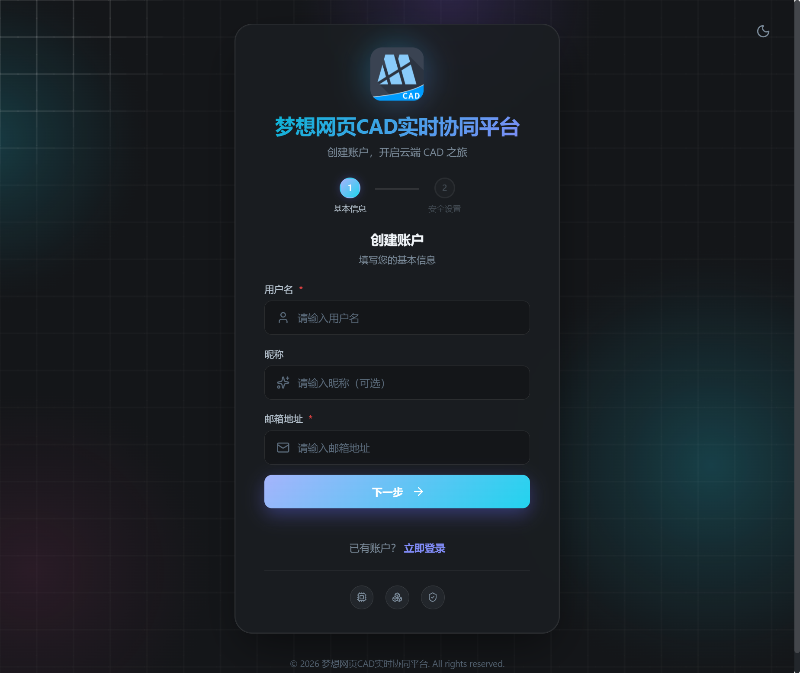

**界面说明**：
- **进度指示器**：显示当前注册步骤（基本信息 → 安全设置）
- **用户名**（*）：登录时使用的唯一标识，必填
- **昵称**（可选）：显示名称，用于在系统中展示
- **邮箱地址**（*）：用于接收验证码和找回密码，必填
- **下一步**：填写完基本信息后进入安全设置步骤
- **立即登录**：已有账户可直接跳转登录

**注册步骤**：

1. 访问系统登录页面
2. 点击「注册账号」
3. 填写注册信息：
   - 用户名（必填）
   - 邮箱（必填，用于接收验证码）
   - 昵称（可选）
4. 点击「下一步」进入安全设置
5. 设置密码（至少 8 位，包含大小写字母和数字）
6. 点击「发送验证码」
7. 查收邮件，输入 6 位验证码
8. 点击「注册」完成账号创建

### 登录系统

**界面说明**：
- **Logo 和标题**：显示系统 Logo 和名称「梦想网页CAD实时协同平台」
- **欢迎回来**：登录表单标题
- **邮箱或用户名**：输入注册时使用的邮箱或用户名
- **密码**：输入账户密码，点击右侧眼睛图标可显示/隐藏密码
- **忘记密码？**：如忘记密码可点击此链接重置
- **立即登录**：蓝色渐变按钮，点击后验证并登录
- **立即注册**：如无账户可点击跳转注册页面
- **主题切换**：右上角可切换浅色/深色模式

**登录步骤**：

1. 输入注册邮箱和密码
2. 点击「立即登录」按钮
3. 登录成功后自动跳转到仪表盘

**注意事项**：
- 支持使用邮箱或用户名登录
- 密码区分大小写
- 连续多次登录失败会触发安全保护

### 密码重置

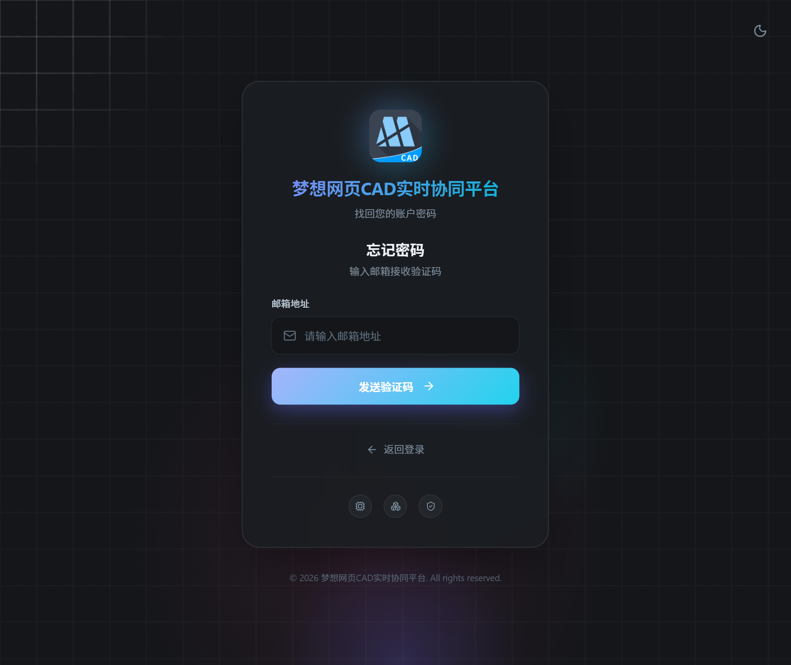

**界面说明**：
- **邮箱地址**：输入注册时使用的邮箱地址
- **发送验证码**：点击后系统会发送验证码到邮箱
- **返回登录**：返回登录页面

**重置步骤**：

1. 在登录页点击「忘记密码」
2. 输入注册邮箱
3. 点击「发送验证码」
4. 查收邮件，获取验证码
5. 输入验证码和新密码
6. 点击「确认重置」
7. 使用新密码登录

---

## 文件系统管理

### 界面布局

文件系统管理器包含三个区域：

- **左侧边栏**：导航菜单（我的图纸、项目管理等）
- **中间区域**：文件/文件夹列表
- **右侧边栏**：选中项的详情和操作

**仪表盘说明**：
登录后默认进入仪表盘，显示以下信息：
- **欢迎语**：显示当前用户名和时间问候
- **快捷按钮**：「新建项目」和「上传图纸」快速入口
- **统计卡片**：
  - 我的项目：显示活跃项目数量
  - 图纸文件：显示 DWG/DXF 文件总数
  - 今日上传：今日新增文件数
  - 存储使用：当前已用存储空间及百分比
- **最近文件**：显示最近访问的图纸文件列表
- **最近项目**：显示最近访问的项目列表

### 我的图纸

我的图纸是个人文件存储区域，其他用户无法访问。

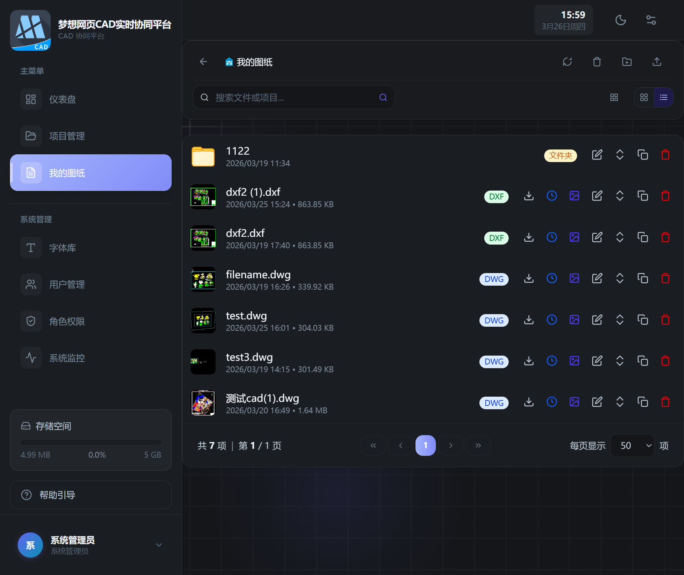

**界面说明**：
- **顶部工具栏**：返回上一级、刷新、回收站、新建文件夹、上传文件
- **搜索框**：可按文件名搜索文件或项目
- **视图切换**：支持列表视图和网格视图切换
- **文件列表**：显示文件名、修改时间、文件大小、文件类型
- **操作按钮**：每个文件右侧有下载、历史版本、重命名、移动、删除等操作按钮

**创建文件夹**：
1. 点击顶部「新建文件夹」按钮
2. 输入文件夹名称
3. 按 Enter 或点击确认

**上传文件**：
1. 进入目标文件夹
2. 点击「上传文件」按钮
3. 选择本地文件（支持 .dwg、.dxf、.mxweb）
4. 等待上传完成

**移动文件/文件夹**：
1. 选中要移动的项目
2. 拖拽到目标文件夹
3. 或右键选择「移动到」，选择目标位置

### 项目管理

**界面说明**：
- **标签切换**：我的项目 / 回收站
- **筛选标签**：全部 / 我创建的 / 我加入的
- **项目列表**：显示项目名称、创建时间
- **项目操作**：删除、编辑、成员管理、设置

**创建项目**：

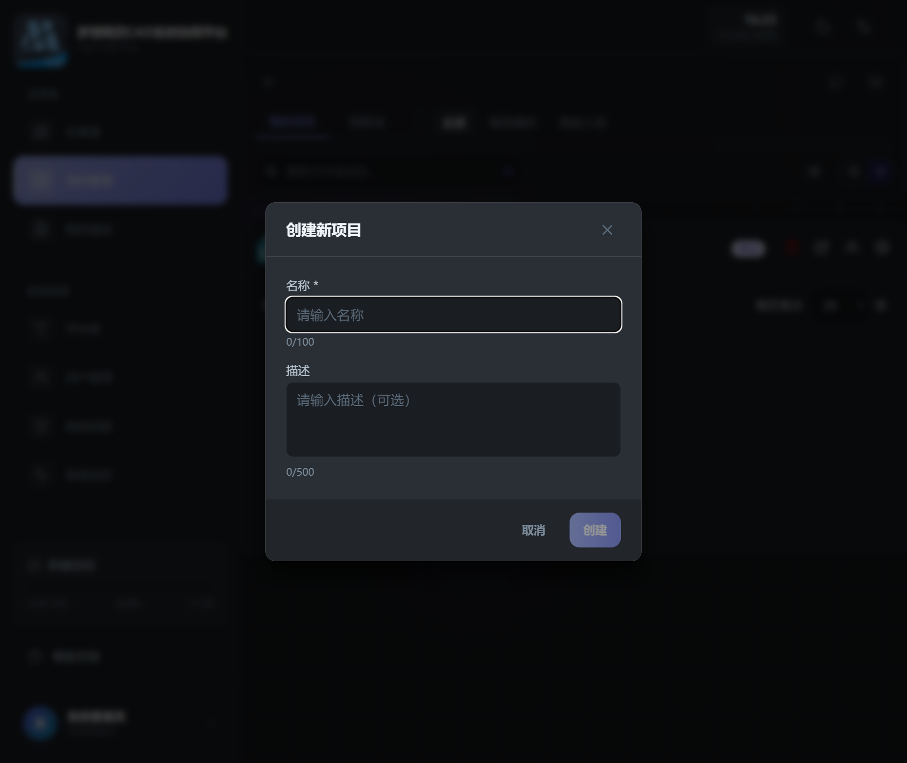

1. 在左侧边栏选择「项目管理」
2. 点击「新建项目」按钮
3. 在弹窗中填写项目信息：
   - **名称**（必填）：输入项目名称，最多100字符
   - **描述**（可选）：输入项目描述，最多500字符
4. 点击「创建」完成

**项目设置**：
1. 点击项目右侧的设置图标
2. 修改项目名称或描述
3. 点击「保存」

**删除项目**：
1. 点击项目右侧的删除图标
2. 确认删除操作
3. 项目移至回收站

### 文件操作

**打开文件**：
- 双击 CAD 文件（.dwg、.dxf）打开编辑器
- 点击文件右侧的「打开」按钮

**下载文件**：
1. 选中文件
2. 点击「下载」按钮
3. 选择保存位置

**重命名**：
1. 右键点击文件/文件夹
2. 选择「重命名」
3. 输入新名称
4. 按 Enter 确认

**批量操作**：
1. 按住 Ctrl 点击多选项目
2. 或按住 Shift 连续选择
3. 使用顶部工具栏进行批量删除/移动

### 回收站

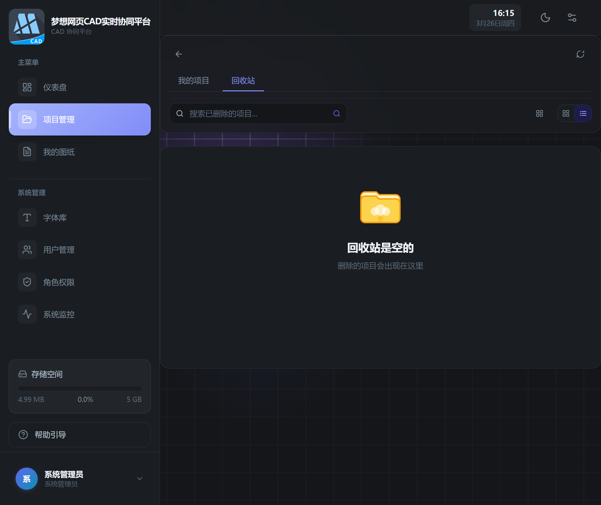

**查看回收站**：
1. 在项目管理页面点击「回收站」标签
2. 查看已删除的项目列表

**恢复项目**：
1. 在回收站中选中项目
2. 点击「恢复」按钮
3. 项目返回原位置

**彻底删除**：
1. 在回收站中选中项目
2. 点击「彻底删除」
3. 确认后不可恢复

> **注意**：回收站为空时显示"回收站是空的"提示，删除的项目会出现在这里

### 版本历史

**查看版本**：
1. 选中 CAD 文件
2. 点击「版本历史」按钮
3. 查看所有历史版本列表

**恢复版本**：
1. 在版本历史中选择目标版本
2. 点击「恢复此版本」
3. 当前文件恢复到该版本状态

**版本对比**：
1. 选择两个版本
2. 点击「对比」按钮
3. 查看差异详情

---

## CAD 编辑器

### 启动编辑器

1. 在文件系统中找到 CAD 文件
2. 双击文件或点击「打开」
3. 等待图纸加载完成

### 界面说明

**界面布局**：
- **顶部菜单栏**：文件、编辑、插入、视图、格式、工具、绘图、标注、修改、批注、地图、帮助
- **顶部工具栏**：保存、打开、导出等快捷按钮
- **功能区标签**：默认 / 其他，切换不同工具集
- **工具面板**：
  - **绘图**：直线、圆、圆弧等绘图工具
  - **修改**：移动、复制、旋转等编辑工具
  - **注释**：文字、标注、引线等注释工具
  - **图层**：图层管理面板
  - **特性**：对象属性编辑
- **左侧边栏**：
  - **图纸**：项目文件列表
  - **协同**：协同会话管理，可创建协同进行多人协作
- **中间画布**：图纸显示和编辑区域，黑色背景显示CAD图形
- **底部状态栏**：
  - **布局切换**：Model / Layout1 / Layout2
  - **坐标显示**：当前鼠标位置坐标
  - **辅助功能开关**：栅格、正交、极轴、对象捕捉、对象追踪、DYN、线宽
  - **命令行**：显示当前命令和提示信息

### 基本操作

**视图操作**：
- 滚轮缩放：向前放大，向后缩小
- 中键平移：按住鼠标中键拖动平移视图
- 右键菜单：点击右键显示快捷菜单

**绘图操作**：
1. 在工具栏选择绘图工具（如直线）
2. 在画布上点击确定起点
3. 移动鼠标，点击确定终点
4. 按 Enter 或 Esc 结束命令

**保存图纸**：
- 点击「保存」按钮
- 自动创建新版本

### 协同功能

**界面说明**：
- **左侧边栏切换**：图纸 / 协同 两个标签
- **创建协同**：发起新的协同会话，邀请他人协作
- **刷新列表**：刷新协同会话列表
- **协同会话**：显示当前进行中的协同会话

**使用步骤**：

1. 打开 CAD 文件
2. 点击左侧「协同」标签
3. 点击「创建协同」按钮
4. 邀请其他用户加入协同
5. 多人同时编辑同一张图纸

### 图层管理

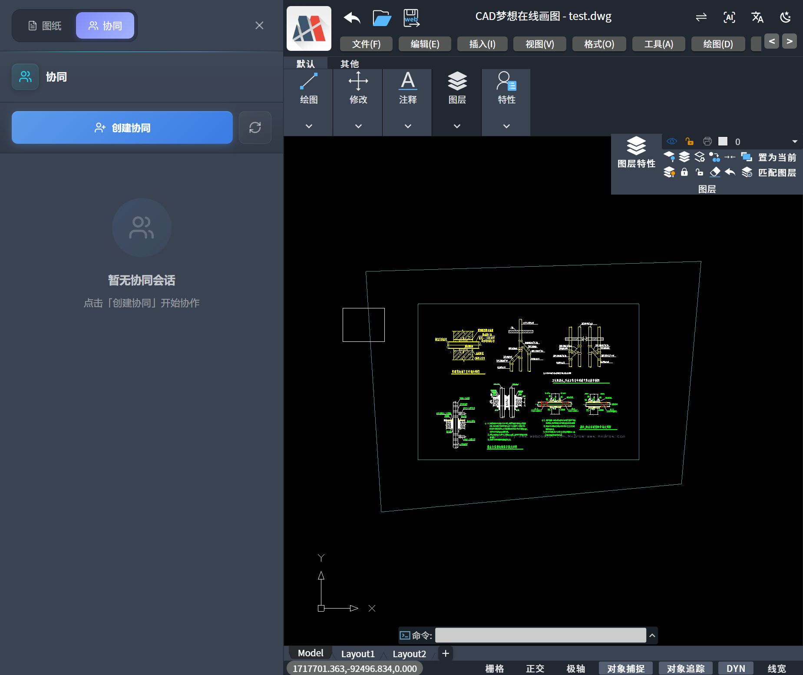

**界面说明**：
- **图层特性**：显示当前图层属性
- **图层列表**：显示所有可用图层
- **图层操作按钮**：
  - 新建图层
  - 删除图层
  - 置为当前：将选中图层设为当前图层
  - 匹配图层：将对象匹配到指定图层

**常用操作**：

1. 点击「图层」选项卡打开图层面板
2. 选择需要操作的图层
3. 使用工具按钮进行图层管理
4. 可以设置图层颜色、线型、线宽等属性

### 特性面板

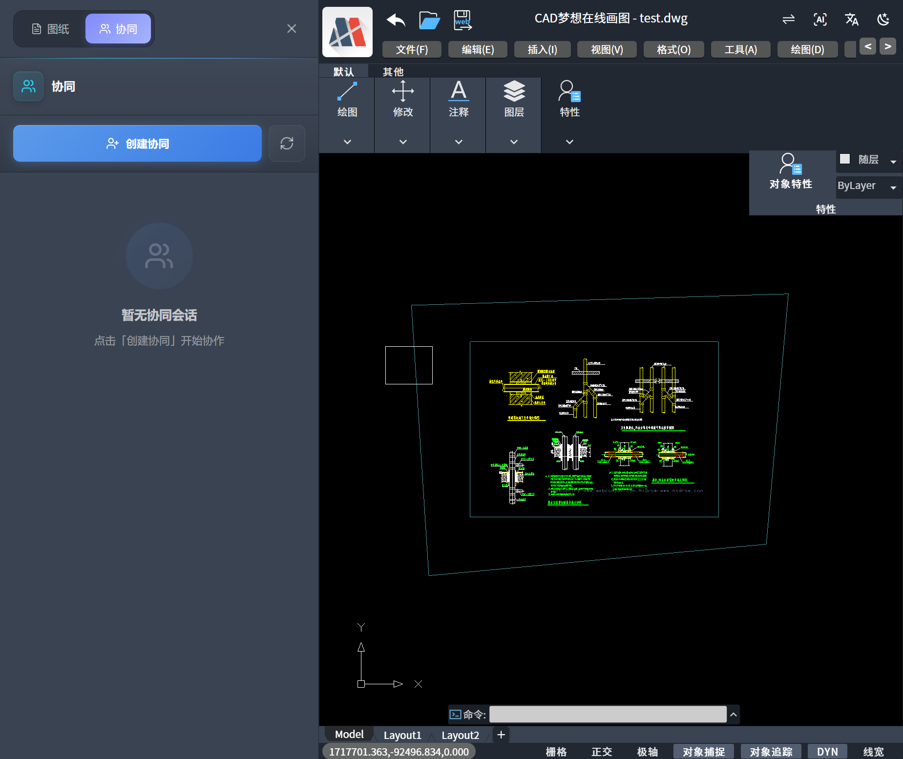

**界面说明**：
- **对象特性**：显示选中对象的属性
- **颜色**：设置对象颜色（随层/指定颜色）
- **线型**：设置线型样式
- **线宽**：设置线条宽度

**使用方法**：

1. 选中图纸中的对象
2. 点击「特性」选项卡
3. 在特性面板中修改对象属性
4. 修改实时生效

### 批注功能

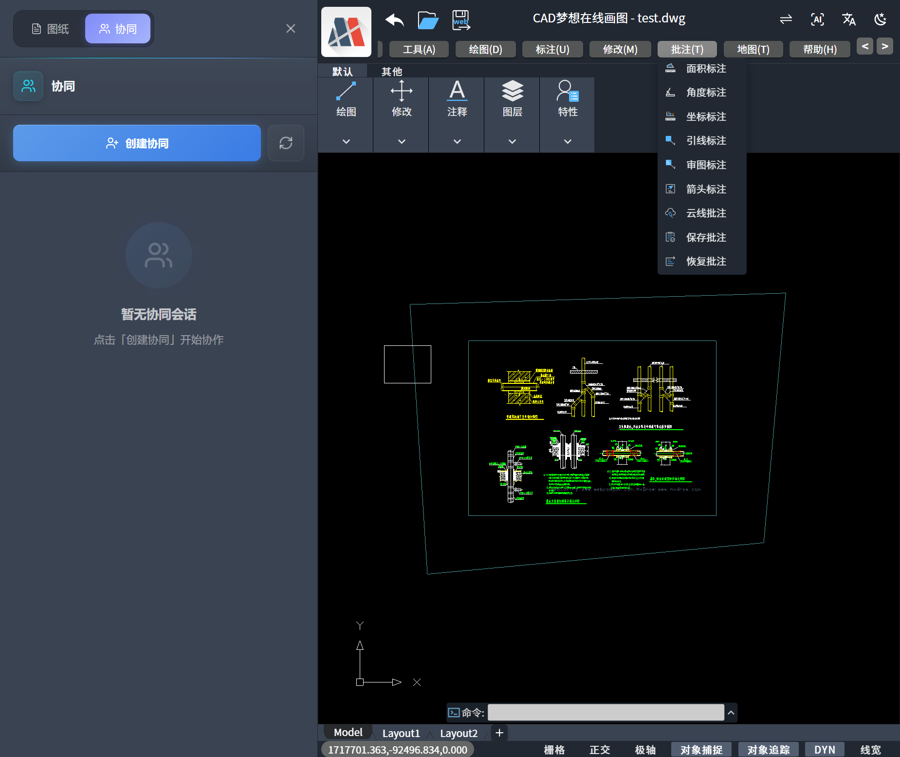

**批注类型**：
- **面积标注**：测量并标注区域面积
- **角度标注**：测量并标注角度
- **坐标标注**：显示指定点坐标
- **引线标注**：添加带引线的文字标注
- **审图标注**：添加审图意见标记
- **箭头标注**：添加箭头指示
- **云线批注**：用云线圈出需要关注的区域
- **保存批注**：将批注保存到文件
- **恢复批注**：加载已保存的批注

**使用方法**：

1. 点击顶部菜单「批注(T)」
2. 选择需要的批注类型
3. 在图纸上点击指定位置添加批注
4. 批注可以保存并分享给他人

### 保存与导出

**保存图纸**：
- 点击「保存」按钮
- 或按 Ctrl + S
- 自动创建新版本

**导出格式**：
1. 点击「导出」按钮
2. 选择导出格式：
   - DWG：AutoCAD 格式
   - DXF：图纸交换格式
   - PDF：文档格式
   - MxWeb：网页格式
3. 选择保存位置

## 项目协作

### 邀请成员

1. 打开项目
2. 点击项目右侧的成员管理图标
3. 在弹窗中点击「添加成员」
4. 输入用户邮箱或用户名
5. 选择角色（项目所有者/管理员/成员/编辑者/查看者）
6. 点击确认

### 角色权限

| 角色 | 权限说明 |
|------|----------|
| 项目所有者 | 拥有项目的完整管理权限，包括删除项目 |
| 项目管理员 | 编辑者权限 + 成员管理、项目设置 |
| 项目成员 | 查看、编辑、上传、删除文件 |
| 项目编辑者 | 查看、编辑文件 |
| 项目查看者 | 仅能查看和下载文件 |

### 管理成员

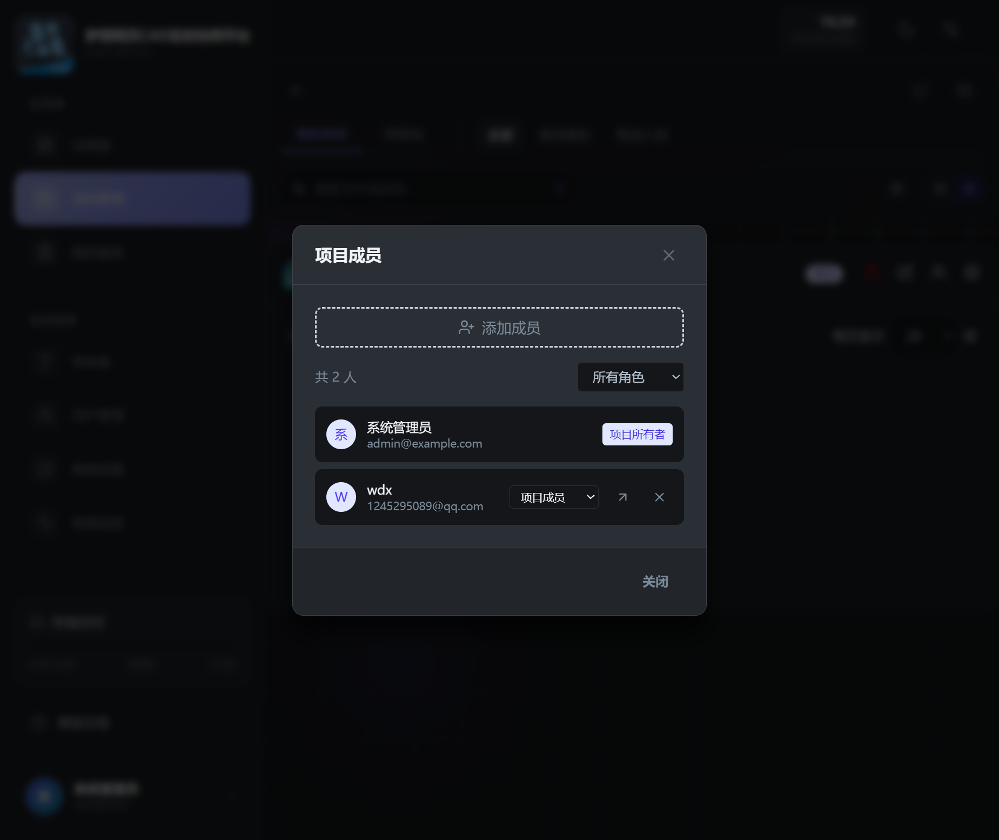

**界面说明**：
- **添加成员**：点击顶部按钮添加新成员
- **角色筛选**：按角色筛选成员列表
- **成员列表**：显示成员头像、用户名、邮箱、角色
- **角色切换**：点击角色下拉框修改成员角色
- **转让所有权**：将项目所有权转让给其他成员
- **移除成员**：将成员从项目中移除

**修改角色**：
1. 打开成员管理弹窗
2. 点击成员右侧的角色下拉框
3. 选择新角色

**移除成员**：
1. 打开成员管理弹窗
2. 点击成员右侧的「移除」按钮
3. 确认移除操作

**转让所有权**：
1. 打开成员管理弹窗
2. 找到目标成员，点击「转让项目所有权」
3. 确认转让

---

## 图库管理

图库管理功能用于管理常用的 CAD 图纸素材，方便在绘图时快速插入标准组件。

### 添加素材到图库

**操作步骤**：

1. 在文件系统中选中文件
2. 右键选择「添加到图库」
3. 选择图库分类（或新建分类）
4. 点击「确定」完成添加

**支持的格式**：
- DWG 文件
- DXF 文件
- MXWEB 文件

### 使用图库素材

**在 CAD 编辑器中插入素材**：

1. 打开 CAD 编辑器
2. 点击「图库」面板（通常在右侧边栏）
3. 浏览或搜索需要的素材
4. 双击素材或拖拽到画布
5. 指定插入位置和比例
6. 按 Enter 确认插入

**素材管理功能**：
- **搜索**：按名称快速查找素材
- **分类筛选**：按分类浏览素材
- **收藏**：将常用素材加入收藏夹
- **最近使用**：显示最近插入的素材

### 图库分类管理

**创建分类**：

1. 进入「图库管理」页面
2. 点击「新建分类」按钮
3. 输入分类名称和描述
4. 点击「保存」

**编辑分类**：

1. 在图库管理页面找到目标分类
2. 点击「编辑」按钮
3. 修改分类信息
4. 点击「保存」

**删除分类**：

1. 在图库管理页面找到目标分类
2. 点击「删除」按钮
3. 确认删除操作
4. 注意：删除分类会同时删除该分类下的所有素材

### 素材管理

**编辑素材信息**：

1. 在图库中选中素材
2. 点击「编辑」按钮
3. 修改素材名称、描述等信息
4. 点击「保存」

**移动素材**：

1. 选中需要移动的素材
2. 点击「移动到」按钮
3. 选择目标分类
4. 点击「确认」

**删除素材**：

1. 在图库中选中素材
2. 点击「删除」按钮
3. 确认删除操作
4. 删除后不可恢复

---

## 个人设置

### 个人信息

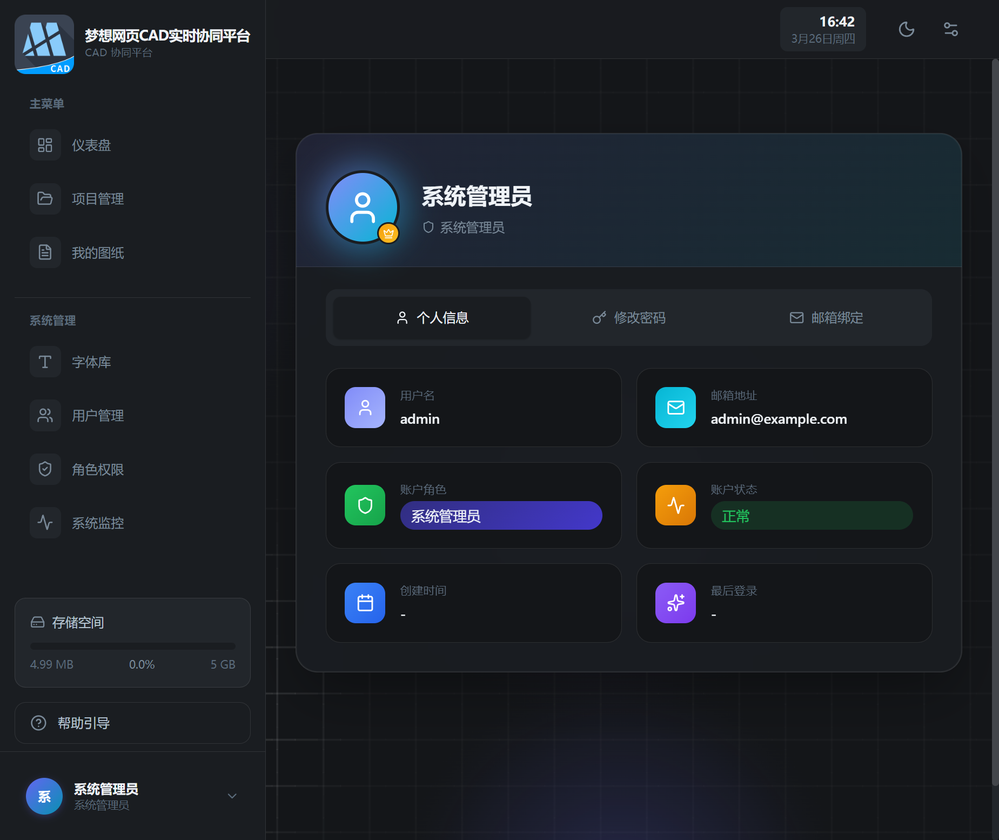

**界面说明**：
- **顶部信息卡**：显示用户头像、用户名和角色
- **标签切换**：个人信息 / 修改密码 / 邮箱绑定
- **信息展示**：
  - 用户名：登录账号
  - 邮箱地址：绑定的邮箱
  - 账户角色：系统管理员/普通用户等
  - 账户状态：正常/禁用等
  - 创建时间：账户注册时间
  - 最后登录：最近一次登录时间

### 修改密码

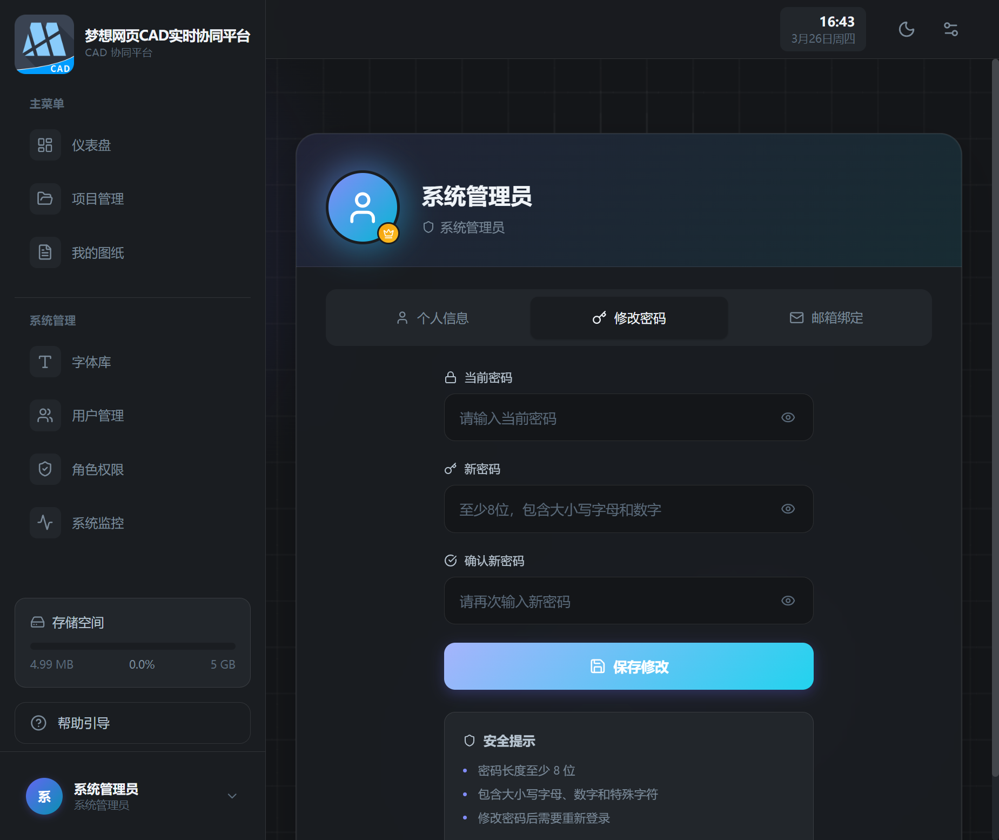

**界面说明**：
- **当前密码**：输入当前使用的密码
- **新密码**：设置新密码（至少8位，包含大小写字母和数字）
- **确认新密码**：再次输入新密码
- **保存修改**：确认修改密码
- **安全提示**：显示密码强度要求
  - 密码长度至少 8 位
  - 包含大小写字母、数字和特殊字符
  - 修改密码后需要重新登录

**修改步骤**：

1. 进入「个人资料」页面
2. 点击「修改密码」标签
3. 输入当前密码
4. 输入新密码并确认
5. 点击「保存修改」
6. 修改成功后需要重新登录

### 邮箱绑定

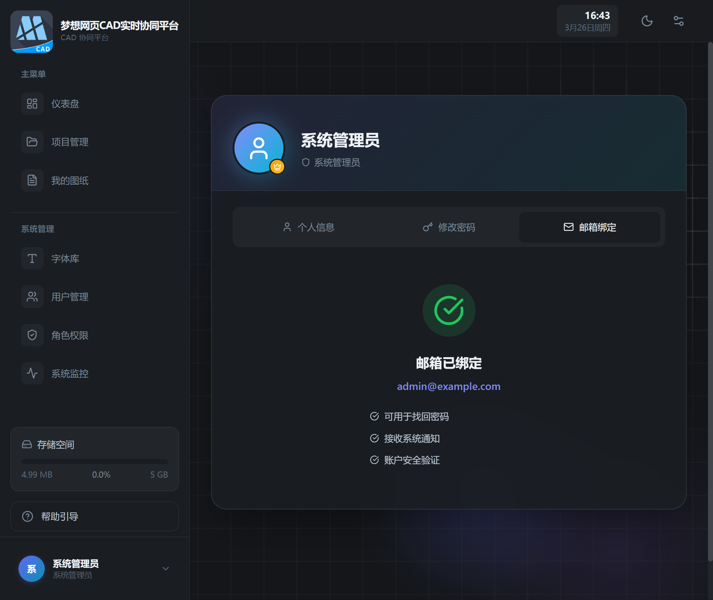

**界面说明**：
- **绑定状态**：显示邮箱是否已绑定
- **绑定邮箱**：显示已绑定的邮箱地址
- **功能说明**：
  - 可用于找回密码
  - 接收系统通知
  - 账户安全验证

### 主题设置

1. 点击右上角主题图标
2. 选择主题模式：
   - 浅色模式
   - 深色模式
   - 跟随系统

---

## 管理员功能

### 用户管理

**界面说明**：
- **添加用户**：点击右上角按钮添加新用户
- **搜索框**：可按邮箱、用户名、昵称搜索用户
- **角色筛选**：按角色筛选用户（系统管理员/用户管理员/字体管理员/普通用户）
- **排序选项**：按创建时间或用户名排序
- **用户列表**：显示用户头像、用户名、邮箱、角色、状态
- **操作按钮**：编辑、删除用户

**查看用户列表**：
1. 进入「用户管理」页面
2. 查看所有注册用户
3. 使用搜索框查找用户

**管理用户**：
- 点击「编辑」修改用户信息
- 点击「删除」删除账号

### 角色权限管理

**界面说明**：
- **角色类型切换**：项目角色 / 系统角色
- **新建角色**：点击按钮创建自定义角色
- **角色卡片**：显示角色名称、描述、拥有的权限列表
- **配置权限**：点击按钮修改角色权限

**系统角色**：
1. 进入「角色权限」页面
2. 点击「系统角色」标签
3. 查看系统预置角色
4. 点击「配置权限」修改角色权限

**项目角色**：
1. 进入「角色权限」页面
2. 点击「项目角色」标签（默认显示）
3. 管理项目内的角色定义
4. 配置各角色的操作权限

**默认项目角色**：
- **项目所有者**：拥有项目的完整管理权限
- **项目管理员**：管理项目和团队成员
- **项目成员**：可以查看和编辑项目内容
- **项目编辑者**：可以编辑项目文件
- **项目查看者**：仅能查看项目内容

### 字体库管理

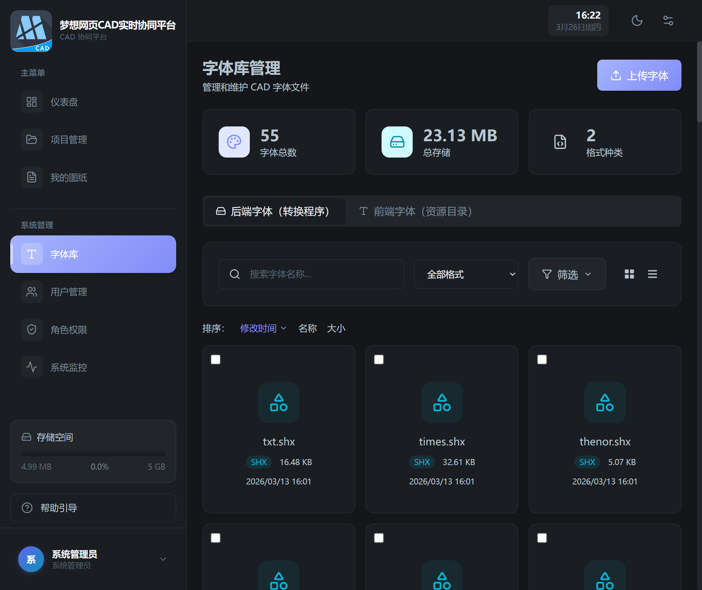

**界面说明**：
- **统计卡片**：显示字体总数、总存储大小、格式种类
- **字体类型切换**：后端字体（转换程序）/ 前端字体（资源目录）
- **搜索框**：按字体名称搜索
- **格式筛选**：按字体格式筛选（TTF/OTF/WOFF/SHX等）
- **视图切换**：网格视图 / 列表视图
- **字体列表**：显示字体名称、格式、大小、上传时间
- **批量操作**：支持多选后批量下载或删除

**上传字体**：
1. 进入「字体库」页面
2. 点击「上传字体」按钮
3. 选择字体文件（.ttf、.otf、.shx）
4. 等待上传完成

**下载/删除字体**：
- 点击单个字体右侧的下载或删除按钮
- 或使用多选功能批量操作

### 系统监控

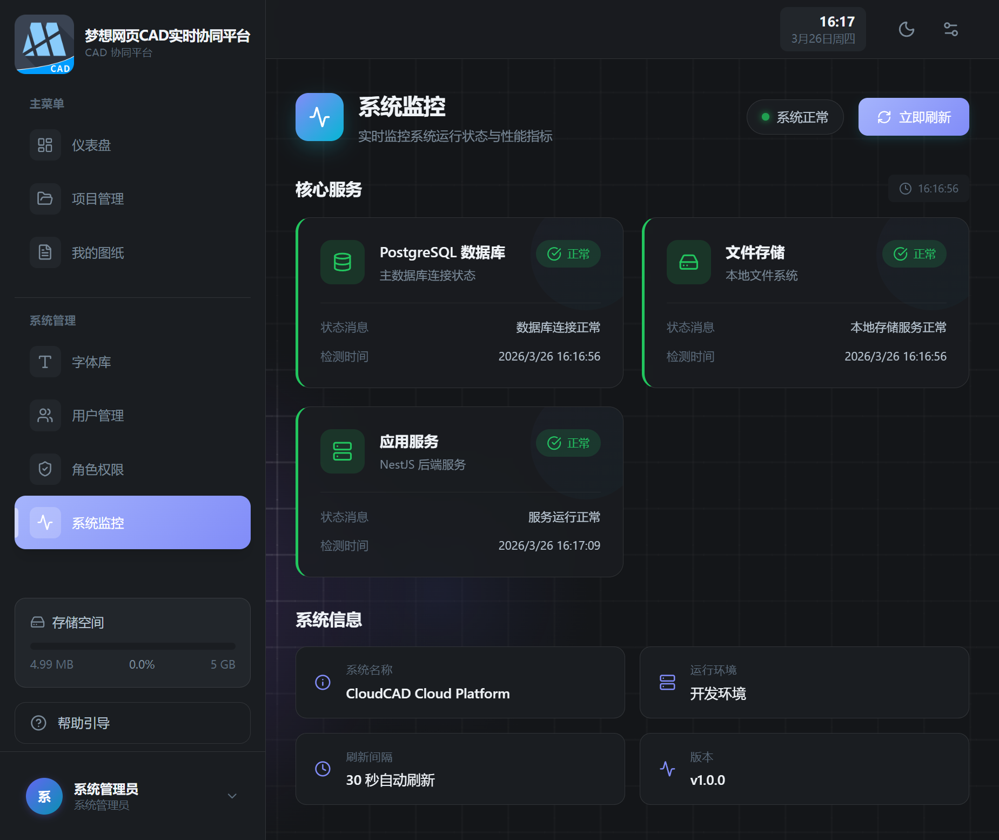

**界面说明**：
- **系统状态**：显示系统整体运行状态（正常/异常）
- **立即刷新**：手动刷新监控数据
- **核心服务**：显示各核心服务的运行状态
  - **PostgreSQL 数据库**：主数据库连接状态
  - **文件存储**：本地文件系统状态
  - **应用服务**：NestJS 后端服务状态
- **系统信息**：
  - 系统名称
  - 运行环境
  - 刷新间隔（默认30秒自动刷新）
  - 系统版本

**查看系统监控**：
1. 进入「系统监控」页面
2. 查看系统运行状态和各服务状态
3. 系统每30秒自动刷新，也可点击「立即刷新」手动更新

---
